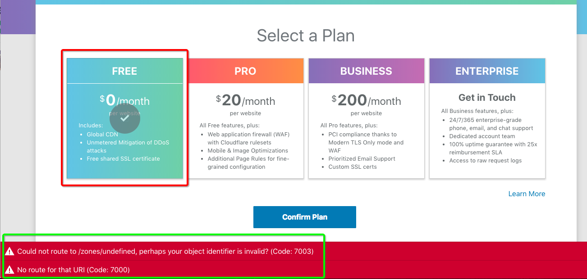
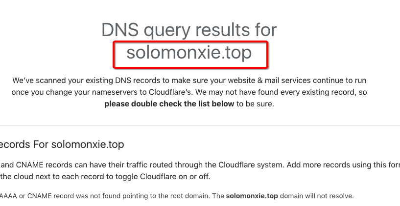
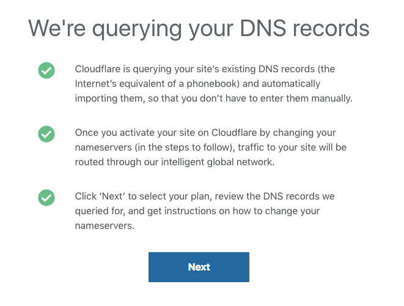
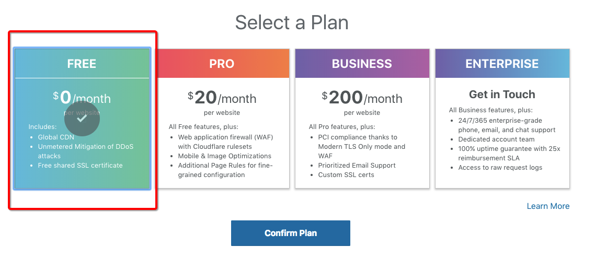
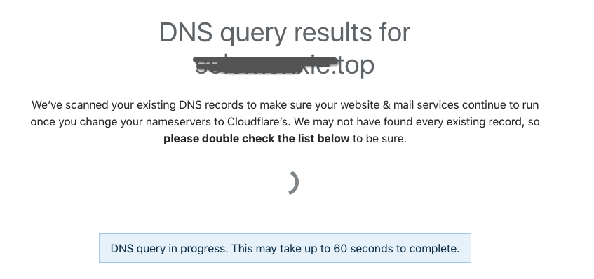
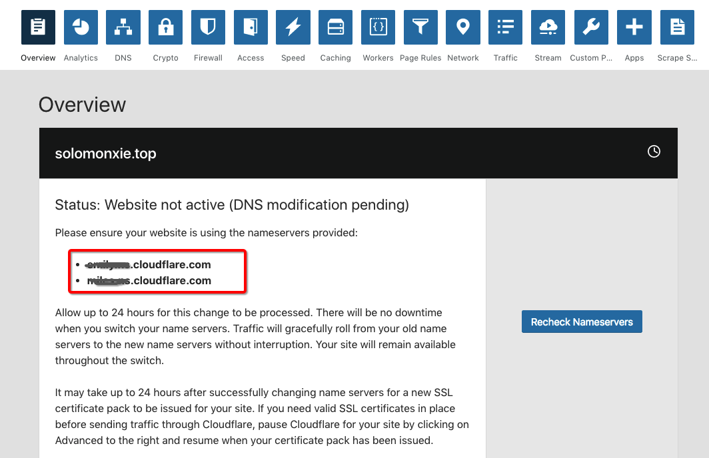
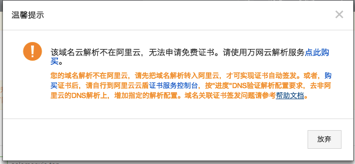

# Cloudflare 个人申请免费TLS/SSL证书

首先需要买一个域名。最简单的就是在阿里云买一个9块钱一年的域名，全程两分钟搞定。
然后要有一个自己的公网服务器，我是在AWS Lightsails买的，$3.5一个月。
然后在阿里云管理后台把域名指向服务器的IP地址。
以上这几步都不详解了，因为做到HTTPS这一步基本上已经有了一定基础。

现在国际上比较知名的免费SSL证书有:
- [Cloudflare](https://www.cloudflare.com/)
- [Let's Encrypt](https://letsencrypt.org/)

这里主要讲`Cloudflare`.

添加后出错：

这种情况一般是刚注册域名没多久，还没有生效才产生的。耐心等一等再重试即可。一般24小时是要等的。

### 注册步骤

