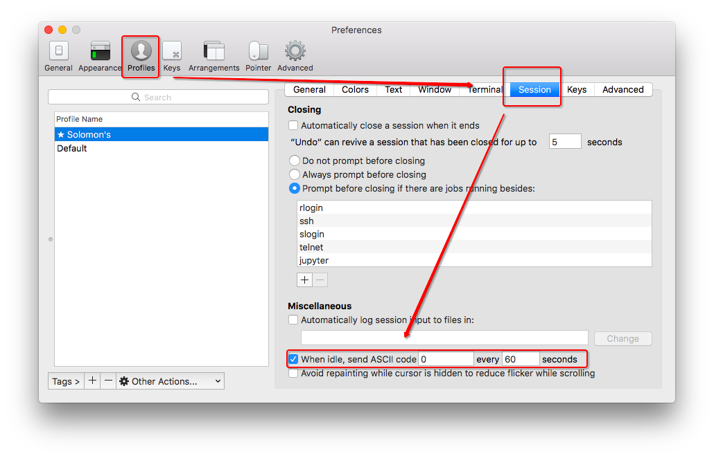

# SSH 保持连接

[参考：iTerm2中ssh保持连接不断开](http://bluebiu.com/blog/iterm2-ssh-session-idle.html)
[参考：Linux使用ssh超时断开连接的真正原因](http://bluebiu.com/blog/linux-ssh-session-alive.html)
[参考：SSH 保持连接 （解决Broken pipe）](https://blog.csdn.net/Earl_yuan/article/details/50454032)


简单说，有这么两类方法：
- 让服务器向客户端定期发送信号，来保持连接（打破沉默）
- 让客户端向服务器定期发送信号

服务器端修改很简单，直接修改`/etc/ssh/sshd_config`即可：
```
ClientAliveInterval 60
ClientAliveCountMax 1
```
对于跨墙服务器来说，不需要太多考虑，直接改服务器即可。

但是对于服务器安全有更多要求或者没有服务器权限的，也可以改本地客户端达到同样效果。

对于客户端定期发送信号，方法非常非常多。

比如直接在终端里改，比如iTerm2：




本地还可以通过修改ssh配置来实现。可以修改`/etc/ssh/ssh_config`系统级配置，或者`~/.ssh/ssh_config`用户级配置，都可以：
```
TCPKeepAlive yes
ServerAliveInterval 300
```

再或者，客户端进行SSH连接时，直接在命令里加上这个参数即可（推荐！）：
```sh
$ ssh -o TCPKeepAlive=yes -o ServerAliveInterval=300 <user>@<ip>
```


