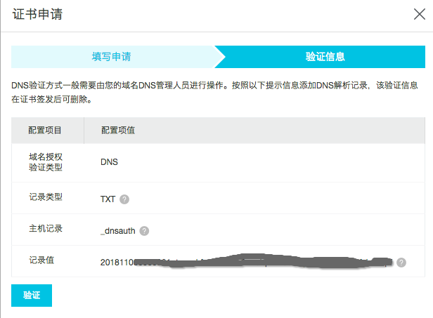
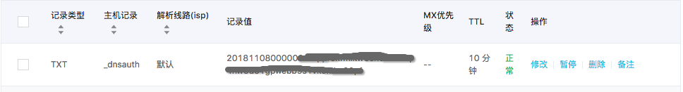
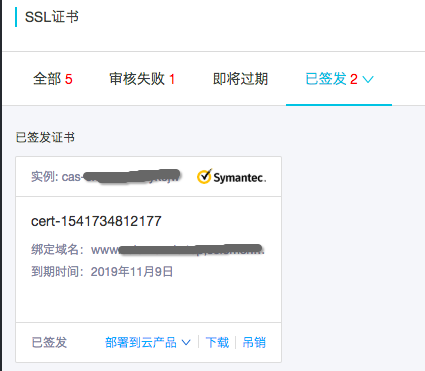

# ❖ SSL证书入门

术语解释:
`HTTPS`是在HTTP上加了一层Layer，Secure Layer，所以是HTTPS。而这个Layer，叫SSL(ayer)。
实现这个Layer，需要一个证书，就叫SSL 证书，是CA证书的一种。
`CA证书`泛指一切Key-pair数字证书对，即公钥和私钥。而遵循SSL协议的CA证书，就是SSL证书了。
而CA证书包括这几种：
- `DV`，针对个人的证书
- `OV`，针对企业的证书，需要对企业资格审核，安全
- `EV`，针对企业的增强型证书，审核最严格，最安全

目前证书制作有两种方案：
- 自己制作自己的签名证书（制作简单，部署非常麻烦）
- 花钱请第三方有公信力公司颁发证书比如阿里云（获取简单，付费太贵）

自己制作很简单也完全免费，几句命令即可完成，适用于局域网内测试玩耍。但是不被互联网信任，具体来说，不被你的Chrome浏览器信任。
第三方公司比如阿里云、赛门铁克，就完全被互联网信任（Chrome显示绿标），但是动辄几万块钱一年很难接受。不过阿里云有一种免费的个人证书也比较方便，下面会介绍。

**所以策略就是：家里测试用自签名证书，商业生产环节用第三方证书。**

因为自签名证书涉及的问题太多，比较麻烦。所以下面先只介绍第三方证书的获得方式，以及把证书部署到HTTP服务器的步骤。


## 申请阿里云CA证书（DV）

[参考：如何申请阿里云的免费 https 证书](https://juejin.im/post/5a804ed36fb9a06349129bf4)

免费阿里云CA(DV)证书地址：https://common-buy.aliyun.com/?commodityCode=cas#/buy
阿里云的个人免费CA证书（DV）比较tricky，需要如下步骤才会出现“免费”的选项：
```
进入购买页面 -> 选Symantec赛门铁克 -> 点击"增强型OV" -> 突然出现免费的选项 -> 
选择 `免费DV SSL` -> 其它选项保持默认（只有一个选项） -> 0元购买。
```

阿里云个人免费证书，是有效期1年，但每个证书只能用于一个`明细域名`，即buy.example.com,或next.buy.example.com，而不能通配。但是没问题，个人可以申请20个免费证书，够用了。

购买完成后，转到“证书控制台”页面，在刚刚0元选购的那个证书框上点击申请，填写个人信息和需要绑定的域名url地址。然后会提示你到自己的域名管理后台添加一条指定的解析记录：


这时候就按照提示，到自己的域名管理后台添加这条解析记录：


如果是阿里云的域名的话，记录会自动添加好，不用自己动手了。
然后点击刚才提示信息页面的“验证”按钮，它会验证域名的解析是否添加了刚才的记录，验证成功就会显示成功，然后点击提交审核。成功后显示，“已经成功提交到CA公司，请您保持电话畅通，并及时查阅邮箱中来自CA公司的电子邮件。”
几乎几秒钟，就会在“已签发”处看到刚刚签发的证书。



点击“下载”，就会提示下载哪种HTTP Server的证书。下载好后是一个zip压缩包，包括两个文件：
- `*.crt`，是公钥
- `*.key`，是私钥

每种服务器所用的公钥和私钥这两个文件都是一模一样的。只是Apache的证书会多一个`*.chain.crt`文件。


## 在Nginx上使用SSL证书

按照Nginx很简单，`sudo apt-get install nginx`即可。

然后将已经有的私钥-证书两个文件拷贝到`/etc/nginx/ssl/`目录下。

Example，配置nginx默认80端口：
```
server {
 listen 80;
 server_name YOUR.DOMAIN.NAME;
 return 301 https://$server_name$request_uri;
}
server {
 listen 443 ssl default_server;
 server_name YOUR.DOMAIN.NAME;
 ssl_certificate /etc/nginx/ssl/CERTIFICATE.crt;
 ssl_certificate_key /etc/nginx/ssl/PRIVATE.key;
 ssl_session_cache shared:SSL:20m;
 ssl_session_timeout 60m;
 ssl_protocols TLSv1 TLSv1.1 TLSv1.2;
 # ......
 # Other settings
 # ......
}
```
其中`return 301 https://$server\_name$request\_uri;`是自动将http请求转到https。

配置完后，重启nginx: `service nginx restart`
