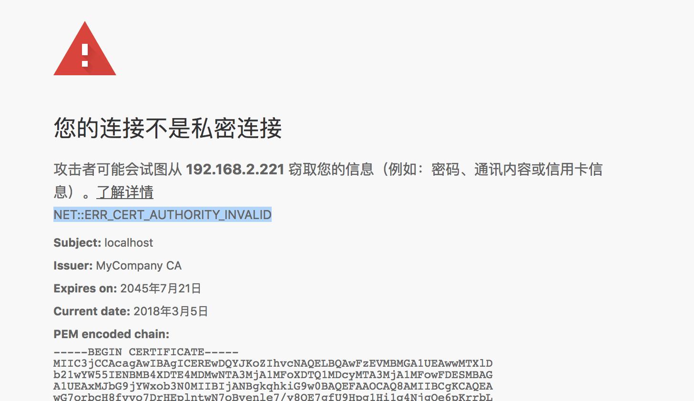
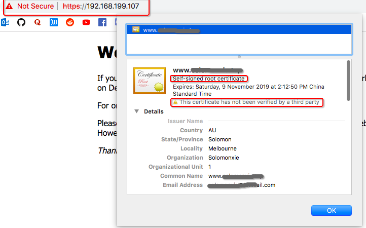

# ❖ 自签名 SSL 证书（self-signed SSL certificate）

自签名的SSL证书制作极其简单，几句openssl命令即可生成一个密钥和证书。但是：
自签名证书在网络上是不可信的，但如果只是自己家里、局域网内测试，是没有问题的。因为现在很多应用全都强制要求是https，所以自己电脑、家里服务器也都必须装配ssl证书。不愿意花钱买第三方证书，就自己本机制作一个自签名证书，也是可以的。

[参考：如何在Linux中创建SSL证书签名请求（CSR）](https://www.howtoing.com/simple-steps-to-generate-csr-on-centos)
[参考：创建并部署自签名的 SSL 证书到 Nginx](https://hinine.com/create-and-deploy-a-self-signed-ssl-certificate-to-nginx/)

制作前须知：
> 自签名证书，即使在内网，也会被Chrome标记为“不可信证书”，甚至显示“私密连接”不允许访问，需要点击“继续访问”才能看到内容。
唯一让Chrome接受的方法就是，不光服务器使用证书，每台电脑、手机客户端也要**手动导入**相同的证书，才能形成`可信连接`。
**不信任就是不信任，没什么方法绕过去！**






在本机创建一个自签名（自己给自己签名）的SSL证书，都是用`openssl`命令。一般Mac/Ubuntu等都是默认装配的，安装的话也是类似`sudo apt-get install openssl`，很简单。

生成证书分为这四步：
1. 生成一个临时的Pass key，用来创建私钥
2. 利用Pass key生成一个私钥 Private key
3. 利用私钥生成一个临时的CSR证书请求文件 Certificate Request
4. 根据CSR请求生成一个证书 Certificate

生成证书：
```sh
$ mkdir ~/.ssl
$ cd ~/.ssl

# 1. 生成长度为2048的临时RSA钥匙 Pass key
$ openssl genrsa -des3 -passout pass:x -out PASS.key 2048

# 2. 利用Pass key生成私钥 Private key
$ openssl rsa -passin pass:x -in PASS.key -out PRIVATE.key
$ rm PASS.key    # 删除临时pass key

# 3. 根据公钥生成一个CSR证书请求，进入交互，输入个人、网站等信息
# 注意，其它都随便填，唯独`Common Name`一定要按照格式填：`www.YourDomainName.com`
$ openssl req -new -key PRIVATE.key -out REQUEST.csr

# 4. 根据CSR生成证书 Certificate
$ openssl x509 -req -days 365 -in REQUEST.csr -signkey PRIVATE.key -out ~/.ssl/CERTIFICATE.crt
$ rm REQUEST.csr   # 删除临时request请求
```
此时`~/.ssl/`文件夹下只剩下两个文件，即私钥-公钥（证书）对：
- 私钥: `PRIVATE.key`
- 证书：`CERTIFICATE.crt`

然后就可以将两个文件应用到HTTPS网络连接了。

## 利用配置文件生成证书
CSR请求文件的互动过程太慢，每次手输比较麻烦，一般会用`*.cnf`配置文件来自动完成所需要输入的个人信息等内容。
比如可以建立一个`~/.ssl/CSR-Config.cnf`，内容格式如下：
```
[ req ]
distinguished_name  = req_distinguished_name
x509_extensions     = root_ca

[ req_distinguished_name ]

# 以下内容可随意填写
countryName             = AU (2 letter code)
countryName_min         = 2
countryName_max         = 2
stateOrProvinceName     = VICTORIA
localityName            = MELBOURNE
0.organizationName      = ACOMPANY
organizationalUnitName  = TECH 
commonName              = www.dev.lan
commonName_max          = 64
emailAddress            = email@gmail.com 
emailAddress_max        = 64

[ root_ca ]
basicConstraints            = critical, CA:true
```
生成CSR请求文件时候，就可以用`-config`参数引用这个配置文件而不用进入交互环节了，命令如下：
```sh
$ openssl req ....... -config MyCompanyCA.cnf ....."
```

另外，由于上面是指定的域名为`www.dev.lan`，随便写的。为了让本地能正常访问局域网内的服务器，需要在本地的`/etc/hosts`中将`www.dev.lan`指定为一个ip地址，如`192.168.1.101`

## 客户端导入自签名证书

**无论如何，自签名证书都是不会被自动信任的。**
所以服务器的证书，必须在每台客户端设备上手动导入或信任才行。

Chrome信任自签名证书：
打开：chrome://flags/#allow-insecure-localhost，然后enable本地不安全证书。

Mac本机信任自签名证书：
从Chrome的红色警告图标上，直接拖拽到桌面，就把证书保存到桌面了。
然后双击，启动证书管理器，打开证书，点击上面有一个`Trust`，选择`Always trust`即可。

iOS信任自签名证书：
在Safari的地址栏，点击


## 局域网使用公网第三方证书

因为自签名证书无论如何都不被信任，很麻烦。所以干脆用免费申请到的公网证书来局域网用，然后就能被Chrome完全认可。
方法就是，把第三方证书配置到nginx等服务器上。然后修改本地的`/etc/hosts`文件，将局域网内的ip映射为第三方证书所对应的网站，如`192.168.1.101 music.spotify.com`。这样的话，就完全没有报警提示了。
但是，也需要每台客户端都修改hosts才行。（iOS不能改）

所有客户端都改还是比较麻烦的，如果可以配置路由器的话，直接修改路由器的hosts，或者路由器上的转发，就能达到所有局域网内客户端都能访问了。
但是缺点是，局域网上配置的映射后，就不能访问那个真实网址`music.spotify.com`听歌了。
