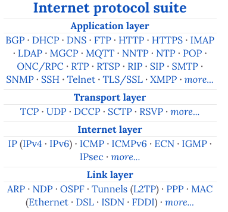
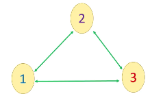
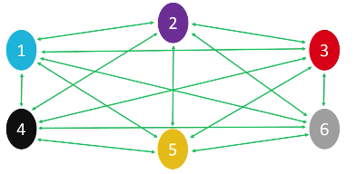
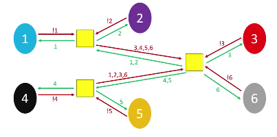
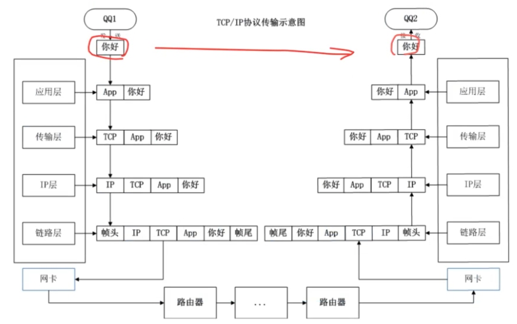
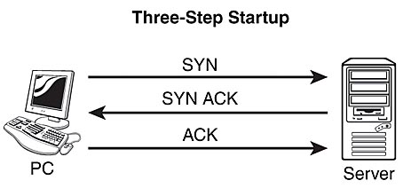
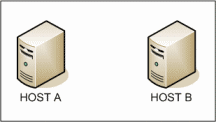
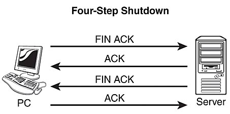

# ❖ TCP/IP 协议框架入门 [DRAFT]

[Refer to Wiki: Internet protocol suite](https://www.wikiwand.com/en/Internet_protocol_suite)

网络传输，较基础的、我们常接触的是TCP或UDP协议，其它各种高级协议如HTTP、FTP、Webdav等都是建立于这些协议之上的。

互联网协议的整体结构如下：
- Physical Layer
    - Internet Layer (IP, ICMP)
        - Transport Layer (TCP, UDP)
            - Application Layer (HTTP, FTP)




## 中低层协议 IP

> IP、IP、IP，不是`192.168.0.1`，那个是`IP地址`！`IP`是`Internet Protocol`，是个Protocol，而不是个地址。

`IP`协议只关注于一点到另一点怎么走。

### 理解IP协议：A Hitchiker's Travel from A to B [DRAFT]

要理解IP协议，完全可以想像成一个背包客，怎么从自己家一路搭车到跨省的另一个地方的。

有几个点：
- **他是个盲人**
- 他不需要知道全国的所有地址
- 他只需要知道自己的目标地址：`四川省,成都市,成华区,昭觉寺北路,234号,成都动物园,大熊猫馆`。
- 他是像中国人一样从大区域到小区域逐个去找的，而不是像英国人地址一样从小往大写。

现在这个背包客人在北京，但他是个路盲，除了北京之外哪都不认识。
他的计划就是，先搭车到四川省，然后再搭车到成都市，进了城市再搭车到成华区....一路到大熊猫馆。

只是，北京离四川太远了，不可能搭一辆车到四川，必须要搭好多次车才能到。
但问题是他是个路盲，除了目标地址外其它地方都不知道。


....


每个`Router`路由器就相当于一个区域单位的政府。
具体来讲是这样的：
全世界：
- ["十三大洲" (Root name server)](https://www.iana.org/domains/root/servers) 域名根服务器全球13台不是每个国家都有
    - 中国政府 (Name Server)
        - 四川省的省政府 (大路由：四川DNS)
            - 成都市的市政府 (大路由：成都DNS)
                - 成华区的区政府 (大路由：成华DNS)
                    - 成都动物园的售票处 (小路由：动物园DNS)
                        - * 大熊猫馆 (目的地)


### 超多节点网络的构建 [DRAFT]

对于IP协议的网络节点组件，我们要讨论更多的是**`硬件问题`**。
一定要记住，这里不是讨论抽象的软件问题了，而是要解决实际的网线耗费太多太长导致钱不够的实际问题。

对于三两台电脑，我们要让他们之间联通，那实在是太简单了。只要买三根网线即可：



但是想象下现在全世界互相联通了，不是你坐在家里几个朋友互联了，这个数量级是什么样的？亿万？百亿？万亿？你需要多少根网线？

数学公式源自[`多边形对角线公式`](https://www.mathsisfun.com/geometry/polygons-diagonals.html)：
`网线数 = n+ n(n-3)/2`，其中n为电脑数量。
怎么理解这个数量？`3... = 6`，`10.. = `

附一个小函数(Python)：
```py
diagonals = lambda n: n+n*(n-3)/2
```


哪怕是最简单的6台电脑互联，就已经变成这么复杂了：




所以为了解决这点，我们引入了`Router`路由器设备，作为中间人，极大减少网线数量：




## 中高层协议TCP与UDP


我们经常接触的主要是中高层协议。一些常用的协议和访问软件如下：
- TCP
    - HTTP /  HTTPS    <<<  `Chrome Browser`
        - Webdav   <<< `Cyberduck`
    - FTP   <<< `Filezilla`
    - SSH   <<< `Terminal`
    - SMTP (Mail)    <<< `Email client`
    - DNS
    - Shadowsocks   <<< `SS client`
    - VNC / RDP (Remote Desktop)    <<< `Remote desktop client`
- UDP
    - DHCP
    - IPTV

> `TCP`和`UDP`是较为基层的`传输层`协议，在其之下是更底层的IP网络层和Pysical物理层，而在其之上是可以发展出繁多的高级`应用层`协议：如HTTP, FTP, VNC等。




### TCP与UDP区别

理解：
- UDP：相当于`写信`的模型。只要知道对方地址，发出去就行了。能不能到就不管了。
- TCP：相当于`淘宝购物`的模型。先给商家“下订单”，然后商家发货到你的地址。如果收货时发现东西不对，就告诉商家，就再给你发一个正确的包裹。

流程区别：
- UDP只要简单的`sendto`和`receive`即可。
- TCP在`sendto`和`receive`之前，先要进行一系列的连接验证：三次握手，握手成功后，才允许你开始发送和接收数据。在数据传输完成之后，还要进行四次握手，才能关闭连接。

端口占用：
- TCP和UDP协议内：一个port端口只能被一个app占用。一个app可以用多个端口。
- TCP和UDP协议可以共用一个端口：一个TCP的app和一个UDP的app可以共用一个端口。

UDP特点：
- 简单、快：1.创建socket，2.发送。
- 丢包。
- 不安全，可以被任何中间人捕获。

TCP特点：
- 面向连接：三次握手、四次挥手
- 确立连接复杂，所以更耗时间
- 更稳定：也丢包，但是有保障措施：如果发现丢包，就再发一遍。

> **TCP规定，所有的发送都必须有回应。**

电脑里所有的`下载`，都会有相应的`上传`，而这个上传即为TCP中的应答所发送的数据（ACK），告之服务器自己已经收到。


### TCP 三次握手 Three Way Handshake

> **记住：TCP`三次握手`的目的，是为了两台电脑互相证明对方聋不聋、哑不哑。只有证明了双方都能听能说，才能进入正式的沟通。**

TCP规定，在正式传输数据之前，两台电脑必须先建立**可靠的连接**：逻辑上说，最少需要`三次握手`。



简单说就是这三步：
- @1: Client对Server说，“我想跟你说点事，你听见了吗？”
- @2: Server回复说，“我不聋，我听见了你了，你能听见我吗？”
- @3: Client对Server说，“我也听见你了，我也不聋。”

其中，
第一次握手，是Client在测试Server是不是聋子，也就是看他能不能工作。
第二次握手，是Server回复Client证明自己不聋也不哑，但也得试试Client聋不聋。
第三次握手，是Client向Server回复，证明自己也不聋也不哑。

逻辑上，至少经历过这三步，才能证明双方都不聋也不哑，都能正常沟通。
**只要证明这点，就可以正式开始沟通、传数据了。**

那么，要实现这个证明题，我们需要用编程来实现。下面是`三次握手`的编程实现方式。

三次握手的编程实现，采用了很简单的方式：
- @1: Client向Server发送一个随机数字，比如`7543`。
- @2: Server收到随机数字`7543`，为了证明自己收到了，他把这个数+1，回复给Client，即`7544`。同时，又想测试Client聋不聋，就发另一个随机数字给Client，比如`1333`。
- @3: Client收到一个`7544`和`1333`，知道其中一个是自己发的数字+1，说明Server听到了。但是为了证明自己也不聋，就把`1333`+1返还给Server。Server接到`1334`后知道对方也不聋，也就是说这道“双方都不聋不哑”的证明题完成了，可以开始正式沟通了。然后Server就开始等待Client发来的具体信息。



其中，Client先发的随机数，名叫`SYN`（Synchronize)，
Server后发的一个随机数，名叫`ACK`（Acknowledgement)。

所以三次握手分别发送了这几个包：
- Client -> Server: SYN(client) = 随机数
- Server -> Client: ACK-SYN, 其中这个ACK = SYN(client)+1，SYN(server) = 随机数
- Client -> Server: ACK，其中ACK = SYN(server)+1

注意，其中SYN**总是**重新创建的随机数，而ACK**总是**所收到的SYN+1。从语意上也能够理解这点：为了Synchronize而创建随机数，为了代表Acknoledgement而在synchronize上+1。所以，全过程产生了两个完全不同的SYN随机数，和两个基于每个SYN的ACK。


### TCP 四次挥手 Four Step Shutdown

> **记住：四次挥手的目的，是为了确保双方都释放资源，不再等待，也不再向对方电脑写入。**

TCP规定，在完成传输数据后，两台电脑必须进行四次挥手，才能关闭连接。逻辑上，也确实最少需要四步才能做到。

简单来说是这四步：
- @ 1: Client对Server说，“我不聊了，你还有什么话赶紧说。”  ——「FIN」
- @ 2: Server回复说，“听见了，知道你不想聊了。” —— 「ACK」
- @ 2.5: Server又说了一大堆，把重要的事的全说完。 —— last part of data transferring 
- @ 3: Server又对Client说，“我完事了，拜拜“
- @ 4: Client终于回复说，”知道了，拜拜“



为什么需要四次挥手？因为Client想关闭连接是随时的看心情的，但是Server之前正在发送的数据不一定发送完成了。也就是说即使Server收到Client的「FIN」码，也继续发送数据，因为数据很重要不能只传一般，只是Server在FIN上再+1返回过去代表知道了。然后在全部发送完后，再关闭连接，同时也告之Client一个「FIN」码说明自己完事了，Client再+1返回，代表自己知道了。

> 如果记住每一个Package必定对应一个「ACK」，而不是记住三次握手、四次握手，理解就方便多了。一个「SYN」发过去必定收到一个「ACK」；一个Data发过去，也必定收到一个「ACK」；一个「FIN」发过去，还是会马上收到「ACK」。TCP中的ACK相当于Recipts回执。

为什么关闭TCP连接这么麻烦？
因为socket。因为socket是两台电脑互相往对方写文件，必须要保证双方都停止往对方写入才行。这就需要四次挥手了：
- @ 1: Client往Server写入socket，内容是「FIN」，然后Client转为”半关闭“状态，即除了最后的一次应答，再也不回复任何东西了。
- @ 2: Server收到后回复一个「ACK」代表知道了。但是Server可能还在往Client电脑上写入数据，这个不能断。
- @ 3:
- @ 4: 


#### 2*MSL = 4分钟

四次挥手最后一步Client回复ACK后，关闭连接，然后等待4分钟。


