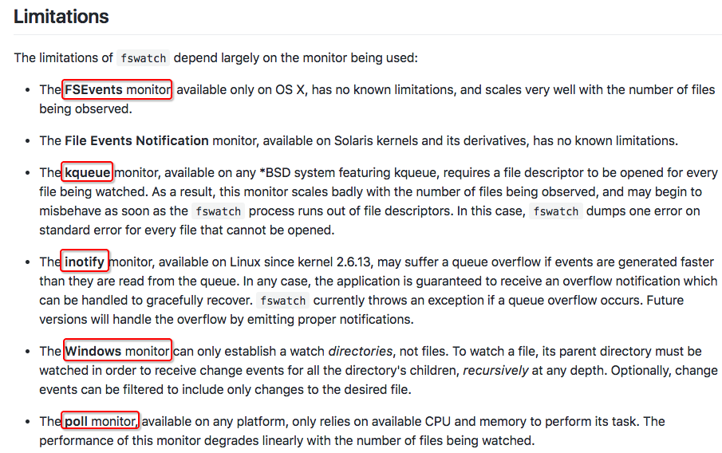

# ❖ 一文入门跨平台的fswatch+rsync同步备份

rsync是非常好用，但是只是极好的cp而已。如果要监控本地某些文件变化，自动上传，还需要配合其它监控工具。一般都叫watch, notify什么的。
最有名的是`inotify`。但是inotify是linux内核的东西，没法在Mac上运行。
Mac上的替代方案是`fswatch`，而且可以跨平台运行（但是目前发现只有mac支持的最好）。

`fswatch`意料之外的简单好用，不需要配置文件，不需要复杂的参数，几分钟的学习就能完成一个真正可行的自动备份脚本，实际上作为“替代品”，远比inotify等要好用很多。在其Github官方说明上，也例数了当前最常用的各种inotify、kqueue等的缺点。

参考GIthub官方网址：https://github.com/emcrisostomo/fswatch




安装 (Mac)：
```sh
$ brew install fswatch
```

使用，先直接输入命令试试：
```sh
# 开始监控（进入block堵塞模式，动态输出变动）
# 假设监控/tmp文件夹
fswatch -0 /tmp | while read -d "" event; do
    echo "This file ${event} has changed."
done
```

然后随意往`/tmp`文件夹创建个文件什么的: `touch /tmp/000000.txt`

这时候，刚才正在监控的shell，就会立马显示出新创建的文件名`/tmp/000000.txt`

## 利用fswatch+rsync备份

假如要监控`/path/to/source/`文件夹，那么就：
```sh
fswatch $1 | while read -d "" event; do
    rsync -rauv --delete --progress /path/to/source/ /path/to/target/
done
```

但是fswatch默认会进入`堵塞模式`，也就是一直挂在shell中。
如果我们让它后台运行，只需要在done后加一个`&`，转入后台运行即可。


## 多路径备份

虽然fswatch能够同时监控多个目录：如`fswatch [options] ... path-0 ... path-n`，但是一般我们是针对每个不同的文件夹做不同的事。
所以，最简单最方便的方法，就是`同时运行多个fswatch` 。

但是默认一个fswatch就进入堵塞模式，所以必须每次结束后转入后台，如`done &`。

直接创建一个脚本`rsync.sh`，输入代码如下：
```sh
# 任务1
fswatch $1 | while read -d "" event; do
    rsync -rauv --delete --progress /path/to/source1/ /path/to/target1/
done &

# 任务2
fswatch $1 | while read -d "" event; do
    rsync -rauv --delete --progress /path/to/source2/ /path/to/target2/
done &
```

这样一来，我们不需要利用`crontab`来定时执行了。取而代之的是`fswatch`每次监控到变化就自动执行其中的语句。

至于fswatch的实现原理，这要涉及到Kernel内核的多任务运行机制。比如`cron job`是采用定期循环式运行一个任务，但是fswatch是采用消息通知式，有变化才运行任务。

要了解更多原理，就去查`epoll`和`异步IO`等相关话题。这里，只知道怎么用就好了。
