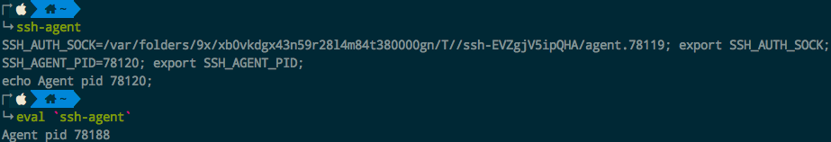

# ❖ SSH 工具集 [DRAFT]

SSH程序，如OpenSSH，都会包含一系列的工具如：
- `sshd` 服务端守护进程： 供别人登录本机
- `ssh` 客户端连接程序：用来登录连接另一台电脑
- `ssh-keygen`：密钥对生成工具
- `ssh-copy-id`：把本机公钥上传到另一台电脑
- `ssh-agent`：管理本机的私钥，并记住私钥的密码，省去每次输入的麻烦
    - `ssh-add`：把本机的私钥加入到ssh-agent的管理之中

也就是说，只要本机装了SSH，就自动包括了这些工具，无需额外安装。

## ssh-keygen

非常简单的小命令，什么参数都不用输，一路按回车就能生成一对本机的密钥对。
在默认情况下，会生成一个没有pass_phrase密码的密钥对，都在`~/.ssh/`目录下，一个`id_rsa`私钥，一个`id_rsa.pub`公钥。

如果需要对密钥对加上密码保护(pass_phrase)，在交互过程中，可以输入，很简单。

关于生成密钥对，还有一些其它选项：
...

## ssh-copy-id

是个极其方便的小命令，即把本机`~/.ssh/`目录下的所有public公钥写入到指定服务器上的`~/.ssh/authorized_keys`文件中。比起以往自己手动复制本地的公钥然后ssh进入服务器用vim打开autorized_keys粘贴，这个命令一步到位，很方便。

命令很简单：
```sh
$ ssh-copy-id 用户名@服务器地址
```

不加任何参数，命令就会把本机`~/.ssh/`目录下所有公钥上传上去。
如果要手动指定，则用`-i`指令：
```sh
$ ssh-copy-id -i /path/to/public_key
```


## ssh-agent

简而言之，ssh-agent会管理本机的私钥，并记住私钥的密码，省去每次输入的麻烦。
它不是默认启动的，如果我们启动它，就会开启一个daemon守护进程，不间断运行以帮助我们免密码并安全的登录各种远端服务器。

`ssh-agent`这个命令的本质，实际上只是修改几个环境变量，打印出一个进程ID。所以我们不能直接运行，而是要用eval命令来运行它。




主要步骤有两步：
```sh
# 开启ssh-agent守护进程 (使用反引号)
$ eval `ssh-agent`

# 将默认私钥(~/.ssh/id_rsa) 添加到agent管理之中
$ ssh-add

# 或，将指定私钥加入管理
$ ssh-add /path/to/key

# 关闭agent
pkill ssh-agent
```
这就完成了！

明明已经有了一对密钥，为什么还需要ssh-agent？

密钥对对问题是，一个不小心，把私钥的这个小文本文件泄露到不该泄露的地方，就一切防御都化为虚有了，供人随意出入。所以一般要对这个小文本文件本身再有一个加密才安全。
但是很多时候使用密钥对，就是为了省去输入密码的麻烦，这就不高兴了，所以才有了ssh-agent。
它让你只在`本机`中有个小管家，代替你输入pass_phrase密码来使用私钥。这样即使别人窃取了你的私钥小文本文件，也没用。

所以ssh-agent是个逻辑问题，程序本身倒是没什么很值得研究的。
