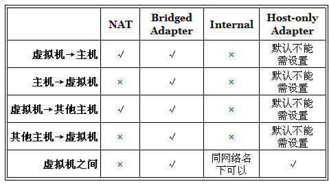
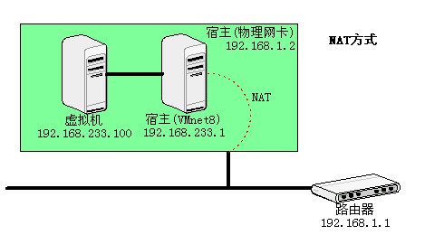
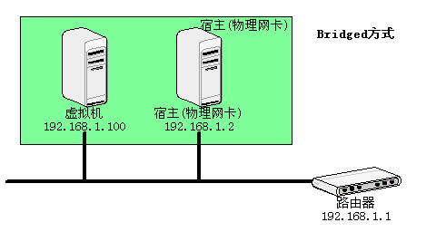
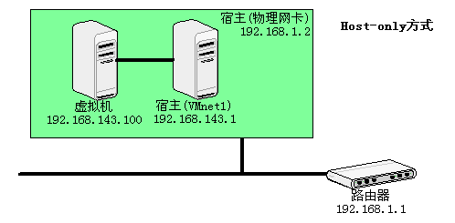

# ❖ 理解Virtualbox虚拟机的四种网络连接方式 [DRAFT]

[参考：快速理解VirtualBox的四种网络连接方式](https://www.cnblogs.com/york-hust/archive/2012/03/29/2422911.html)
[参考：VirtualBox中ubuntu的网络设置](https://www.jianshu.com/p/0736623e5806)

Virtualbox连接网络一共有四种方式（其它虚拟机也都差不多一样的称呼）:
- NAT
- Bridged Adapter
- Internal
- Host-only Adapter

> 最好用的是Bridge方式
可以满足虚拟机中的所有网络需求,通过使用host主机的网卡,直接连到host网络,此时的虚拟机就和真正的机器一样.虚拟机可以访问外网,可以访问host主机.host主机也可以访问虚拟机.

但是：

> 如果是我们使用的无线网,或者我们没有任何路由器,只是在本机无网络的情况下开发呢?我们就需要使用仅主机模式了

