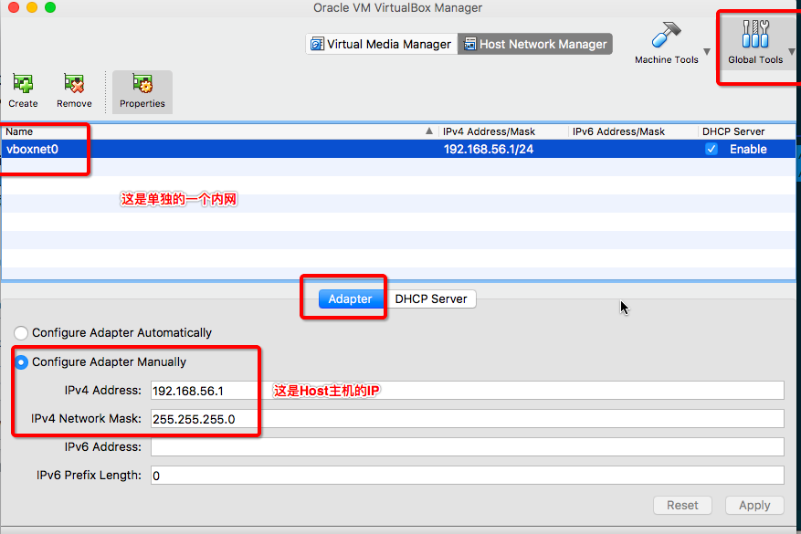
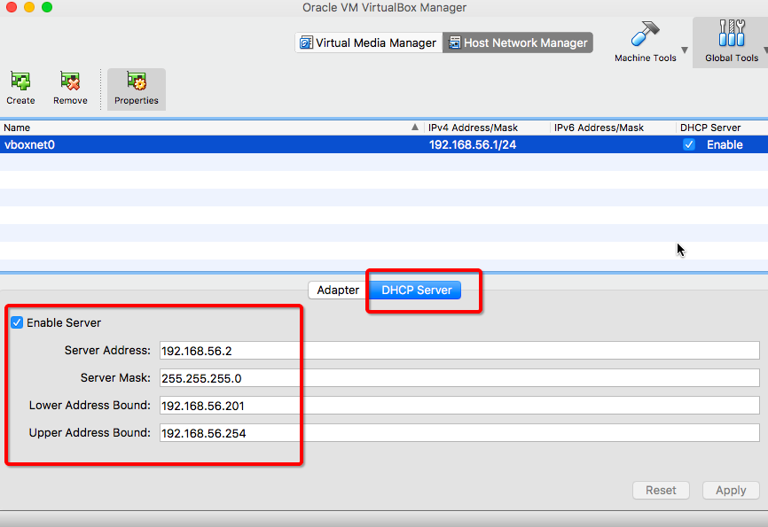
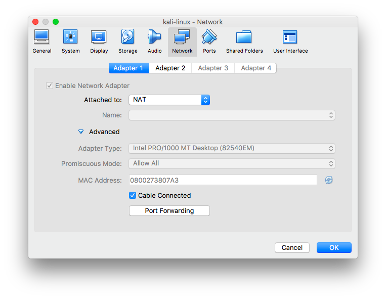
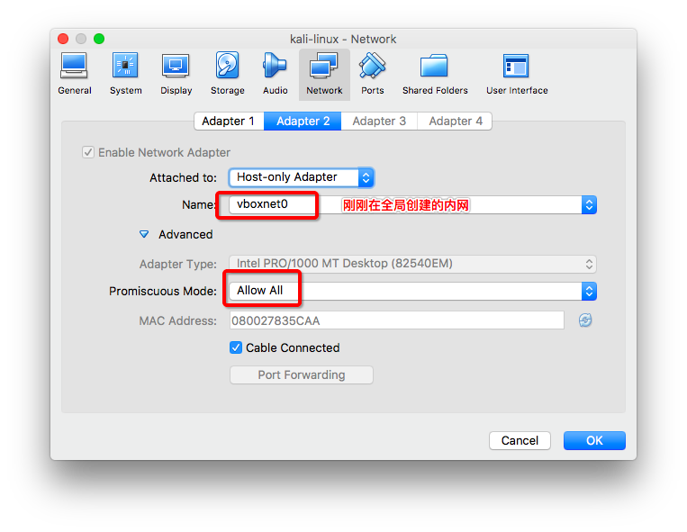
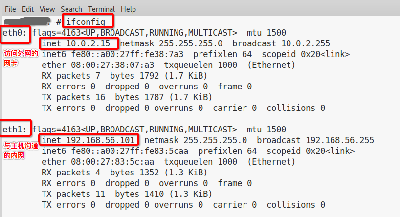
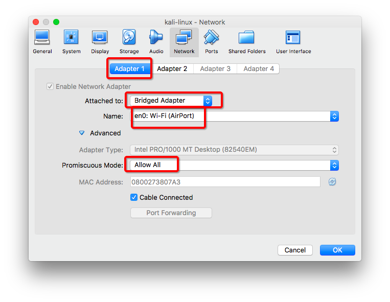
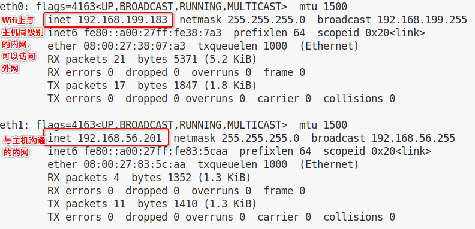

# ❖ Virtualbox连接网络设置

## 需求一：让虚拟机又能访问外网又可以与主机对话
[参考：VirtualBox: 为你的虚拟机配置静态 IP](https://huangruichang.github.io/?techniques/virtualbox-static-ip/index)

这就是需要用到Virtualbox 双网卡适配器。
因为要满足虚拟机能访问外网，又能与主机沟通，就需要两块网卡。所以我们要在Virtualbox中给它设置两个Adapter（网卡），然后设置为：

> NAT + Host-only

### 首先在Virtualbox软件的全局设置

设置DHCP（这样虚拟机就能有静态IP了）：

### 然后设置虚拟主机
首先要在虚拟主机关闭的情况下设置。

开启2个Adapter：NAT和Host-only

NAT适配器采用默认设置：

Host-only设置：

然后进入虚拟机（Linux）后，就可以通过`ifconfig`看到本机的内网IP了。

可以在自己的Host机子上ping一下这个虚拟机，发现可以ping通。

反过来，在虚拟机里ping一下Host（刚才设置全局的一个内网时候的192.168.56.1就是）。

## 需求二：让虚拟机又能访问外网又在Wifi同网段

和需求一差不多，这里只做简单的改变：
双网卡设置为：

> Bridge + Host-only

其中Bridge设置如下：

进入虚拟机后，输入命令`ifconfig`就会发现，虚拟机具有了和我的主机在Wifi里同样网段的IP地址（我的wifi网段是`192.168.199.xxx`）：

