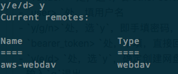
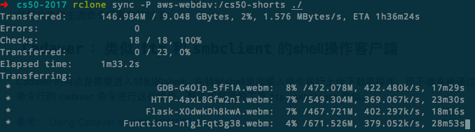
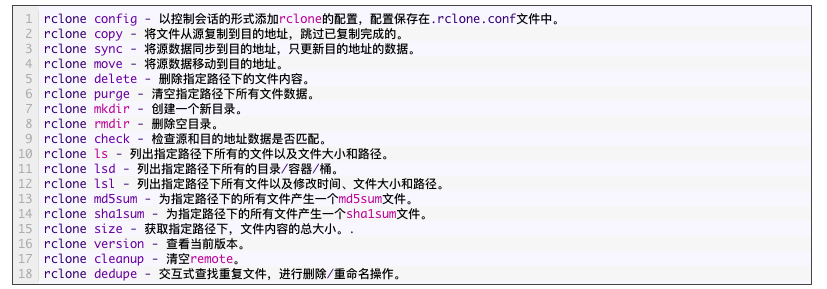

# Webdav的命令行客户端体验 [DRAFT]

支持Webdav的GUI客户端实在太多了，不说Windows和Mac的原生支持，还有各种Cybderduck等软件也支持。
但是当我们需要让远程服务器24小时运行任务同步时，GUI界面就不管用了，只能用命令行。

目前收集的主流命令行客户端如下：


## `Cadaver`：类似`ftp`和`smbclient`的shell操作客户端

Cadaver的特点是需要进入特制的shell，在特制shell里面输入命令执行上传下载等操作，而不能直接通过命令行的`cadaver`命令进行这些操作。整体和常用的工具`ftp`,`smbclient`类似。

[参考： Using Cadaver as a WebDAV Client](https://docs.oracle.com/cd/E29542_01/portal.1111/e10235/webdav007.htm#POUSR1607)
[参考：cadaver - Linux Man Pages](https://www.systutorials.com/docs/linux/man/1-cadaver/)


Ubuntu安装：
```sh
$ sudo apt-get install cadaver
```

使用：
```sh
# 连接
$ cadaver http://example/webdav/path

# 进入交互，输入用户名密码
# ...

# 进入cadaver的shell
dav:/

# 输入命令
# ...
```

常用命令：
- `ls`：显示当前路径文件
- `cd`：进入子目录
- `cd ..`：返回上层文件夹
- `get remote/path local/path`：下载远程文件至本地
- `put local/path remote/path`：上传本地文件至远程
- `mget name*`：根据匹配名称，下载多个文件


### cadaver 体验

个人不是很喜欢ftp／cadaver等这种进入shell操作的体验，不能自动补全命令，没有bash或zsh好用，而且过于手动化了，控制性不强。
速度和传输实时进程的显示还不错，只是太不方便了。


## `rclone`：超强大的网盘同步工具

`rclone`是非常强大的云盘同步工具，支持相当多种类的云盘传输同步：AWS S3, AWS Drive, Dropbox, FTP, Google Drive, Yandex Disk等等数十种。

官方标语是：

> rclone is rsync for Cloud Storage.


[参考：WebDAV - rsync for cloud storage.](https://rclone.org/webdav/)

`rclone`安装比较简单，不需要额外以来，直接到官网下载压缩包，把里面的二进制主程序`rclone`复制到本地类似`/usr/local/bin`到地方就可以运行。只是下载的时候要区分本机的OS和CPU架构。

比如Mac就下载`rclone-current-osx-amd64.zip`，Linux就下载`rclone-current-linux-amd64.zip`，树莓派就下载`rclone-current-linux-arm64.zip`。

官方下载列表：https://downloads.rclone.org/

```sh
# Download and install to sbin
wget https://downloads.rclone.org/rclone-current-linux-arm64.zip && \
unzip rclone-current-linux-*.zip && \
sudo cp rclone-*/rclone /usr/sbin/ && \
rm -r rclone-*/

# Give proper permissions
sudo chown $USER:$USER /usr/sbin/rclone
sudo chmod 755 /usr/sbin/rclone
```

测试：`rclone --version`
如果出现错误`exec format error: rclone`，则说明对应的os和架构版本没有正确下载。

以上把`rclone`这个文件放到任意`/bin`目录下就算安装完成了。直接执行`rclone`命令即可。但是使用之前还要配置具体网盘信息才行。


### 创建网盘

因为不像rsync比较单纯通过ssh传输，rclone支持各种完全不同的网盘，所以在正式传输之前，必须针对指定的网盘进行用户名密码等配置才能开始传输。

输入`rclone config`命令，进入交互式的设定。设定的主要做的就是`添加网盘`。

如果是添加Webdav网盘的话（Dropbox等这里先不讲），执行命令顺序如下：
- `n/s/q> `处，输入`n`，即添加新网盘
- `name> `处，随便起个网盘的别名，比如`my-webdav`，之后传输时候会用到
- `Storage> `处，选择网盘类型，这里选24，即webdav
- `url> `处，输入webdav的http网址，如`http://example:1234/webdav/`
- `vender> `处，选4，即other software。
- `user> `处，填用户名
- `y/g/n>`处，选`y`，即手填密码，然后输入密码2遍。
- `bearer_token> `处，不填，直接回车。
- `y/e/d> `处，选`y`，确定创建网盘。

现在创建好了网盘，就会显示出现存的所有网盘：




### rclone基本操作


列出网盘中目录(`lsd`命令)：
`rclone lsd my-webdav:/`

记住要在网盘别名后加`:/`目录路径。

列出网盘中某个子目录下的文件(`ls`命令)：
`rclone ls my-webdav:/sub/sub/`

注意：`ls`命令会用`递归`显示处所有子目录和子子目录中的文件。


### rclone传输

传输主要是用了rclone的`sync`子命令。

远程与本地：
```sh
# 下载
$ rclone sync my-webdav:/folder /home/me/folder

# 上传
$ rclone sync /home/me/folder my-webdav:/folder
```

两个网盘之间互传：
```sh
$ rclone sync my-webdav:/folder my-dropbox:/folder
```

注意：默认传输是没有任何进度显示的。如果文件量大，会导致数个小时毫无任何信息输出，以为程序卡住了。所以要加上`-P`参数带实时进度传输：

```sh
$ rclone sync -P src:/ dst:/
```




### rclone的命令

[参考：Rclone Commands](https://rclone.org/commands/)
[参考：Rclone: 超好用的网盘 / VPS 数据同步、备份工具，支持 Google Drive](https://www.zrj96.com/post-520.html)


除了`ls`和`sync`外，还有支持所有基本的命令。

- `rsync delete remote:/path`，删除
- `rsync move remote:/path`，移动
- `rsync copy src:/path dst:/path`，复制
- `rsync purge  remote:/path`，清空目录下所有文件
- `rsync mkdir remote:/path`，创建文件夹
- `rsync check src:/path dst:/path`，检查两个网盘间的目录是否完全相同
- `rsync size remote:/path`，计算占用大小




### rclone的持久化配置


### rclone的体验

体验如下：
- 网盘添加及其简单
- 如cp／mv一样简单的上传下载同步
- 直接的网盘间互传
- 实时速度显示
- 传输速度比davfs2快很多倍
- 不像其它FUSE文件系统映射一样影响系统运行

光这几点，就已经超过了很多GUI客户端应用了。
无论从各方面来看，`rclone`已经可以达到或超越桌面GUI客户端`Cyberduck`的使用体验了。
