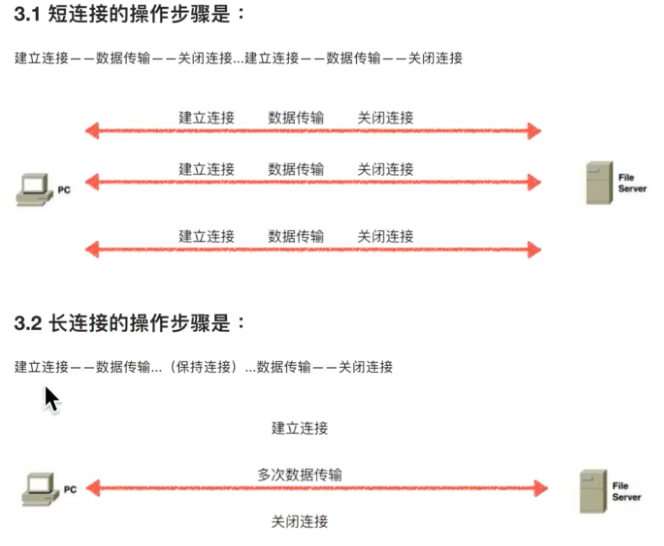

# ❖ HTTP协议入门 [DRAFT]

注意事项：
- Browser区分Response回复的Header和Body的方法：Header各个值之间是紧凑的，一旦遇到空行，则视为开始Body内容。所以Body一定要与Header内容空开一行！

## HTTP协议的1.0与1.1的版本对比

- HTTP/1.0: 采用`短连接`，即Client的每次请求都需要建立一次连接，即每次都重新三次握手、四次挥手，才能提出请求、得到数据。
- HTTP/1.1: 采用`长连接`，即Client在一定时间内，只建立一次连接，完成三次握手后可以进行多次请求和数据传输。

短连接、长连接，指的是一次连接的时长、或一次连接能完成的请求次数多少。

一个网站页面往往包括HTML、多张图片等资源，如果仍然使用`短连接`，那么光一个网页加载就需要占用服务器多条进程或多条线程或协程，那么对服务器的开销就太大了。

如何做到长连接？很简单，只要在`HTTP headers`中设定请求`HTTP/1.1`即可。这样服务器在发送完数据后，不会马上断开连接，而是等待下一个请求，直到超时或客户端主动发来断开连接的请求。

