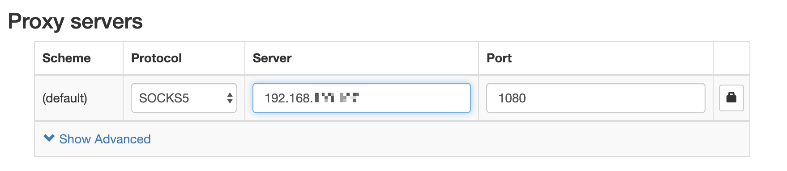
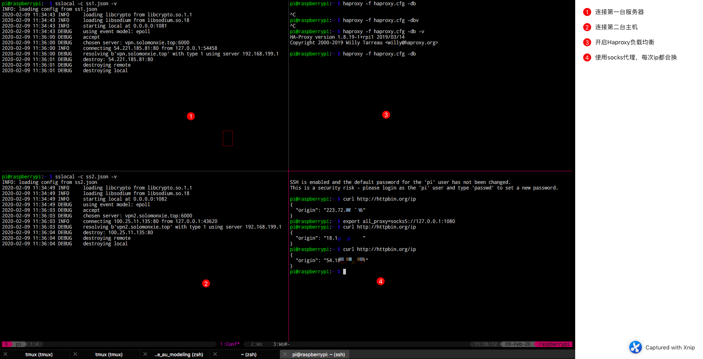
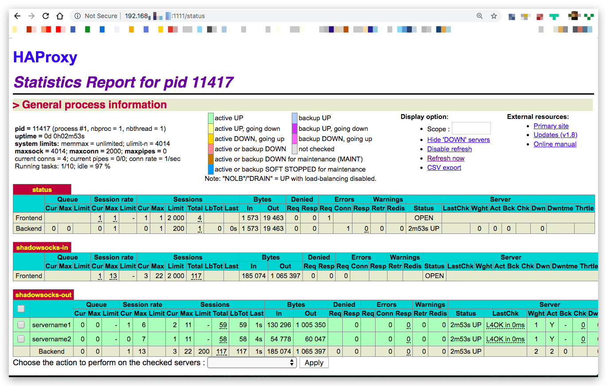

# 利用Haproxy实现Shadowsocks负载均衡 [DRAFT]

- 在家里树莓派上安装Haproxy作为前端入口，然后把流量分发给各个后端SS主机


## 树莓派本地Shadowsocks-client客户端安装与配置

```sh
# 这样可以安装到最新版本，有更多的加密算法。直接用pip装可能只支持很低的版本
$ sudo pip install https://github.com/shadowsocks/shadowsocks/archive/master.zip

# 创建客户端配置文件(自行操作）
$ touch ~/ss-local.json
$ vim ~/ss-local.json
```

客户端配置（注意local地址必须是0.0.0.0这样才能收到来自局域网的请求）：
```json
{
    "server":"服务器公网地址",
    "server_port": "服务器端口",
    "local_address":"0.0.0.0",
    "local_port":1080,
    "password":"ss密码",
    "timeout":600,
    "method":"加密方式"
}
```

开启客户端，也就是允许转发：
```sh
# 手动启动客户端
# 在未确定是否能联通之前，最好先用这种方式，显示输出连接信息

$ sslocal -c ~/ss-local.json -v

# 在命令行中验证
$ export all_proxy=socks5://0.0.0.0:1080
$ curl http://httpbin.org/ip
{
  "origin": "此处如果显示的是服务器地址就对了，如果是本机地址就没生效"
}
```

### sslocal报错：Unsupported SOCKS protocol version 71

在调试期间，我们倾向于让`sslocal`在前台运行并加上`-v`参数输出所有连接信息。
这时候如果我们用curl去测试连接，会报出`unsupported SOCKS protocol version 71`这个错误。
如果用`wget`或浏览器等方式去连接，后面的version数字会不一样。

这个问题的本质不是ss的问题，而是连接一方的错误：
- 如果在命令行连接，那么环境变量`all_proxy`应该设置为`socks5://xxxxxx` 而不是`http://xxxx`
- 如果用浏览器或系统连接，那么protocol也应该设置为`socks5`而不是http
- 如果想用http连接代理，那么应该用第三方软件去转发




### sslocal 报错：libsodium not found

参考：https://github.com/RubyCrypto/rbnacl/wiki/Installing-libsodium
```sh
sudo apt-get install libsodium18
```


### 本地开启多个sslocal实例用来连接多台服务器

```

```


## Haproxy安装与配置

参考：https://tianws.github.io/skill/2019/07/11/gfw/

```sh
$ sudo apt install haproxy -y
$ sudo mv /etc/haproxy/haproxy.cfg /etc/haproxy/haproxy.cfg.bak # 备份
$ sudo vim /etc/haproxy/haproxy.cfg # 编辑配置文件
```

配置文件设置：
```ini
global
    log /dev/log local0
    log /dev/log local1 notice
    user root
    group root
    daemon

defaults
    log global
    mode tcp
    timeout connect 5s
    timeout client 5s
    timeout server 5s
    option      dontlognull
    option      redispatch
    retries     3

listen status
  bind *:1111
  mode  http
  stats refresh 30s
  stats uri /status
  stats realm Haproxy  
  stats auth admin:admin
  stats hide-version
  stats admin if TRUE

frontend shadowsocks-in
    mode tcp
    bind *:8388
    default_backend shadowsocks-out

backend shadowsocks-out
    mode tcp
    option      tcp-check
    balance roundrobin
    server  servername1    xxxxx1.com:8088  check
    server  servername2    xxxxx2.net:8080  check
    server  servername3    12.34.56.78:9999  check
    server  servername4    123.234.234.123:443  check
```

使用Haproxy:
```sh
sudo service haproxy start|stop|status|reload|restart|force-reload # 控制 haproxy 的运行
```

为了让haproxy更自由启动停止，我们可以屏蔽掉haproxy的service服务，这样就不会自动开机启动它：
```
sudo systemctl disable haproxy
```

### Haproxy启动失败

```sh
# 启动
$ sudo service haproxy start
Job for haproxy.service failed because the control process exited with error code.
See "systemctl status haproxy.service" and "journalctl -xe" for details.

#检查日志
● haproxy.service - HAProxy Load Balancer
Feb 09 09:37:50 raspberrypi systemd[1]: haproxy.service: Unit entered failed state.
Feb 09 09:37:50 raspberrypi systemd[1]: haproxy.service: Failed with result 'exit-code'.
Feb 09 09:37:50 raspberrypi systemd[1]: haproxy.service: Service hold-off time over, scheduling restart.
```

从这里看不出什么，那就停止haproxy服务，然后用前台运行的方式来看看哪里出的问题：
```sh
$ sudo service haproxy stop
# -d表示debug模式，前台运行，-V表示增强输出信息
$ haproxy -f /etc/haproxy/haproxy.cfg -d -V
[ALERT] 039/093841 (4776) : Starting frontend shadowsocks-in: cannot bind socket [0.0.0.0:8388]
```

然后根据问题各种改配置就好了，比如端口被占用，就换端口，用户名不对，就改用户名等等。



Haproxy正常启动后，就会产生一个主页显示统计信息，可以从局域网访问`本地IP地址:1111/status`：


（端口号和登录页面的用户名密码都是刚刚在配置文件里面配置的）


###  可选的负载均衡策略

```
balance roundrobin
balance url_param userid
balance url_param session_id check_post 64
balance hdr(User-Agent)
balance hdr(host)
balance hdr(Host) use_domain_only
```

但是这都不能保证`可用性`，即某一个节点掉线了的问题。这时候就需要再安装一个工具来进行`健康检查`。


## 结合Keepalive做健康检查


```

```


## 将sock5流量转发为Http流量

即使很多程序直接连接socks5代理协议的端口，但还是没有Http协议的支持范围广，所以为了方便我们可以建立一个接收Http代理请求的转发器，把接收到的流量转发到sock5的端口。

最常用的转发器就是`Privoxy`.

参考：http://einverne.github.io/post/2018/03/privoxy-forward-socks-to-http.html

```sh
sudo apt-get install privoxy -y
# 修改配置文件
sudo vim /etc/privoxy/config

#/etc/privoxy/config
forward-socks5t / 127.0.0.1:1080 .
listen-address 0.0.0.0:1090
# 上面一定要用0.0.0.0，这样就可以接收局域网Http请求。然后把请求转发到本地的socks5接口

#停止后台自动启动的privoxy服务
sudo systemctl stop privoxy

#手动指定配置文件，并在前台启动 (利于debug和监测)
privoxy --no-daemon /etc/privoxy/config
```

尝试是否成功：
```
export http_proxy=http://127.0.0.1:1090
curl http://httpbin.org/ip
```
如果显示的IP地址，是之前为1080的socks5端口设置的IP地址，则正确完成了转发。

为了让Privoxy更自由启动停止，我们可以屏蔽掉Privoxy的service服务，这样就不会自动开机启动它：
```
sudo systemctl disable privoxy
```


## 使用Nginx代替Haproxy作为高可用负载均衡

> Nginx比Haproxy具有更高的稳定性和功能扩展性。

实战证明：虽然Haproxy更容易配置，但是如果backend服务器都不是很稳定的情况下，丢包率严重（一个网页只能加载部分内容）。而且Haproxy对轮训的策略支持有限，对地理位置的访问限制也不支持。
另一方面，Haproxy的timeout设置非常tricky，所以导致可用的backend服务器不能有效利用，不可用的服务器反而被轮到。而Nginx会只连接一个backend可用的服务器来满足所有要求，当它不可用时候才断开连接使用另一个服务器。

```sh
sudo apt-get install nginx -y
# 查看nginx信息，确保具备 with-stream功能
nginx -V |grep with-stream

# 关掉默认开启启动的nginx服务，因为之后我们要手动在前台启动
sudo systemctl stop nginx
sudo systemctl disable nginx

# 备份nginx配置
cd /etc/nginx
sudo cp -a nginx.conf{,_$(date +%F)}

# 创建自定义配置（文件名必须一致）
sudo mkdir /etc/nginx/tcp.d
sudo touch /etc/nginx/tcp.d/openldap.conf

# 让Nginx主配置引用我们自定义的配置
sudo echo "include /etc/nginx/tcp.d/*.conf;" >> /etc/nginx/nginx.conf

# 编辑自定义配置
sudo vim /etc/nginx/tcp.d/openldap.conf
```

添加如下内容:
```config
stream {
    upstream backend {
        hash $remote_addr;  #hash只是轮训的其中一种策略
        server 127.0.0.1:1081 max_fails=3 fail_timeout=10s;
        server 127.0.0.1:1082 max_fails=3 fail_timeout=10s;
        server 127.0.0.1:1083 max_fails=3 fail_timeout=10s;
        server 127.0.0.1:1084 max_fails=3 fail_timeout=10s;
    }
    server {
        listen 0.0.0.0:1070;  #对外暴露前台端口，必须是0.0.0.0才能接受本机之外的访问
        proxy_timeout 20s;
        proxy_pass backend;
    }
}
```

然后重启：
```sh
#重启前检查配置是否有写错的地方：
sudo nginx -t -c /etc/nginx/nginx.conf

#重启nginx
# sudo systemctl restart nginx

# 单独开一个shell，在前台运行nginx：
sudo nginx -c /etc/nginx/nginx.conf -g 'daemon off;'

#测试
telnet 0.0.0.0 1070

#正确的显示：
Trying 0.0.0.0...
Connected to 0.0.0.0.
Escape character is '^]'.

# 按Ctrl-] 推出telnet
```


### 能不能使用Nginx对某些地域IP进行屏蔽？

> Nginx确实可以结合GeoIP来达到地域block屏蔽的效果，但是目前只针对HTTP一类的请求。对于tcp流量转发、反向代理这种，则无法做到。

如果真的在这个层面有屏蔽需求，那么可以直接用`iptables`和`firewalld`在最底层进行拦截。
