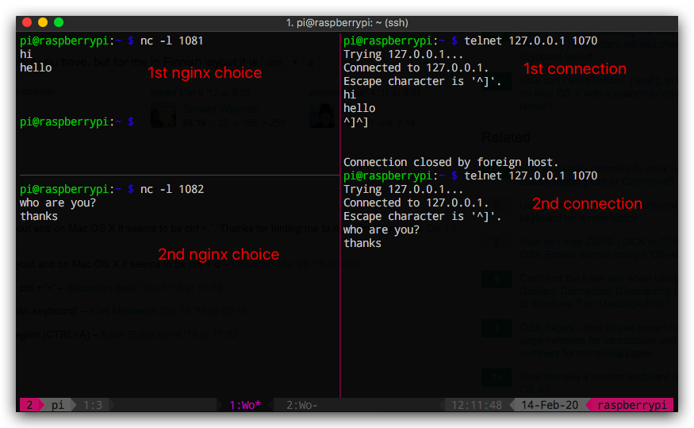

# 简单方法理解Nginx反向代理

参考：https://www.zybuluo.com/orangleliu/note/478334

安装Nginx略过（要求版本1.9以上）。
配置：
```sh
sudo echo "include /etc/nginx/tcp.d/*.conf;" >> /etc/nginx/nginx.conf
sudo vim /etc/nginx/tcp.d/openldap.conf
```

配置里，我们将要让Nginx把7777端口作为对外暴露的前台端口，然后选用两个让后台服务器：即bash小程序`nc`制作的史上最简单的服务器。图例摘抄自上面的参考文章：
```
                          / nc -l 7773
telnet--> nginx(30003) -->
                          \ nc -l 7774
```

`/etc/nginx/tcp.d/openldap.conf`的内容是：
```config
stream {
    upstream backend {
        server 127.0.0.1:7001;
        server 127.0.0.1:7002;
    }
    server {
        listen 0.0.0.0:7777;
        proxy_timeout 10s;
        proxy_pass backend;
    }
}
```
配置内容可以直接从字面理解。参考图例：
```
                       / host2(ss)
client --> host1(nginx) 
                       \ host3(ss)
```

重启nginx，让配置生效： `sudo systemctl restart nginx`

这时候，Nginx还没有接到任何请求，我们必须先把那两个“史上最简单服务器”建立起来以应付将来的请求：
```sh
# 单独开启一个shell来创建这个服务器：
nc -l 7001

# 再单独开启另一个shell作为第二台服务器：
nc -l 7002
```

然后用`telnet`假装一个外界来的访客，给Nginx暴露的前台端口建立连接、发请求：
```sh
telnet 127.0.0.1 7777
```
然后我们可以看到，第一个服务器7001先响应了。这时候可以假装在服务端(telnet)和客户端(nc)之间互相发消息了。

由于我们之前把前台端口暴露到`0.0.0.0`上了，如果想测试局域网或公网上是否生效，可以这样来发请求：
```sh
telnet 服务器公网IP地址:777
```

如果我们把telnet断开，再连一遍，会发现这时候7002响应了。也就是说Nginx把另一个连接自动配给下一个请求。



