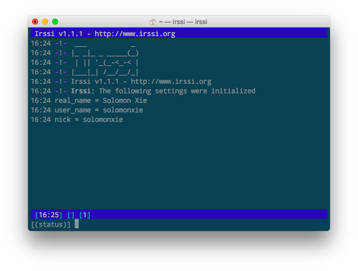
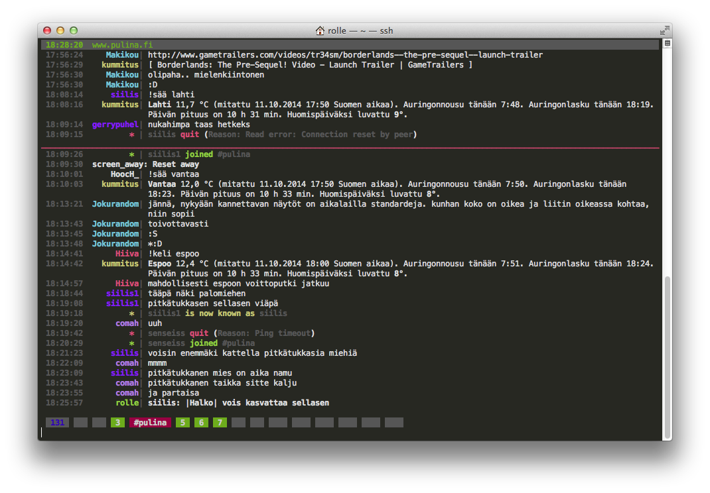

# ❖ 进入IRC的世界
` Feb 8, 2019`

`IRC`是人类古代时期的聊天工具，比QQ还早。但是IRC因为实现简单，让人与人之间聊天变得方便很多。我们可以在桌面上打开软件和对方聊，可以从网页里和对方聊，更可以在终端命令行里和对方聊。
IRC不用复杂的注册验证，简单到给自己起个昵称就能开聊。
只是IRC缘起就是给Geek用的，需要学会很多命令和流程。对程序员来说都是毛毛雨，对麻瓜来说，有些设计就有点反人类了。当然，是针对QQ、微信之类的聊天工具来说。

为什么要用IRC？
其实这个不是那么方便，要说什么小巧、容易之类都是自欺欺人。真正想玩IRC的人，都是有着对技术的强烈好奇心。就像放着IDE不用而非要用Vim，放着好好的邮件客户端不用而非用Mutt一样。就是一种探索精神，一种探索新“魔法”的精神。

GUI版和网页版的IRC客户端就不多说了。这里说说命令行里的客户端。
实际上，很多IRC的GUI客户端都很丑，还不如直接在命令行里安装使用来的方便。

目前最流行都CLI版本IRC客户端是这两个：
- [Irssi](https://irssi.org/download/), 轻量级流行客户端
- [WeeChat](https://weechat.org/about/), 重量级客户端，配置文件超多，运行速度卡顿。

这里我们讲`Irssi`。

## Irssi: 命令行版的IRC Client客户端 

安装：
```sh
# Mac
brew install irssi

# Ubuntu
apt install irssi
```

命令行输入`irssi`即进入了聊天室。



和一般Linux程序的一般命令、格式都不同，IRC客户端一般有自己的命令。

下方`[(status)]`是输入命令的地方。

一般命令(不区分大小写)：
- `/quit`，退出程序。一般的ctrl-c, ctrl-d, esc, q之类的都不管用
- `/help`，帮助
- `/network list` 查看已保存的服务器列表
- `/connect xxx.xxx.xxx` 连接某服务器
- `/join xxx` 加入某channel
- `/leave`或`/part` 离开当前channel
- `/normal`或`/n` 查看当前channel的人数
- `/list -YES` 查看当前服务器的所有chennels (慎用)
- `/nick NewNickName` 更改当前昵称
- `/msg NickName Content` 给某人发送消息，一般都是给`/msg nickserv`管理人NPC发送消息

尝试一下完整流程：
```
/connect irc.dal.net
/join #lobby

[#lobby] hello there!

/part
```

常用快捷键：
- `Alt + 1/2/3/4...`，切换window窗口，一般一个channel一个窗口
- `Alt + n/p`，上下滚动屏幕


### 配置IRSSI

如果想长期保存、备份一个固定的程序配置，那么就需要修改配置文件。
`irssi`默认的配置文件为`~/.irssi/config`。

配置中，会在第一次运行时就自动设置了一些，包括根据当前电脑账户的用户名设置`nickname`等。
整个配置，是一直“类似”JSON的格式。

配置中包含的常用内容：
- `settings` 记录自己的名字：nick, real_name, user_name
- `servers` 不要误会，这是指的Network而不是具体某台server，如freenode, dal, esper等大型网络
- `chatnets` 记录各个网络的登录信息，也可以作为“别名”，这样每次`/connect`不用输入全路径了
- `channels` 记录自己收藏的频道名

界面美化的设置：
- `statusbar`


## 常用服务器列表

首先要区分一些概念：
- Networks：是指的互相隔离的网络，如Freenode和DALnet这些是世界知名的网络，但互相隔离，频道不共享
- Servers：Network网络中的某一台电脑服务器，你加入世界上任何一个server都能加入这个Network

全球常用的服务器，就那么几个：
- Freenode
- Dal
- ESPer
- EFnet

配置案例：
```
servers = (
  { address = "irc.dal.net"; chatnet = "DALnet"; port = "6667"; },
  {
      address = "路径";
      chatnet = "下面chatnet对应的名称";
      port = "端口";
      autoconnect = true;
      use_ssl = "yes";
      password = "用户名:密码";
  }
);
```

配置完每个服务器后，相应的还要配置`chatnets`，每一条的名称都要与`servers`中的对应。
配置案例：
```
chatnets = {
    DALnet = {
        type = "IRC";
        max_kicks = "4"; max_msgs = "20";max_whois = "30";
    };
    Freenode = {
        type = "IRC";
        max_kicks = "4"; max_msgs = "20";max_whois = "30";
        autosendcmd = "/msg nickserv identify MyName MyPassword";
    };
};
```

## 常用频道列表

IRC的频道不是用URL之类很复杂的东西，全都是用`#tag`这种简单一个标签来区分的，非常好记。

配置案例：
```
channels = (
  { name = "#lobby"; chatnet = "EsperNet"; autojoin = "No"; },
  { name = "#freenode"; chatnet = "Freenode"; autojoin = "No"; },
);
```


## 注册流程

一般大一点的服务器，都是必须要注册的，流程比较麻烦。以往传说里的各种匿名聊天，再也没有了。不注册，就不让你connect服务器。

每个大服务器的流程都不一样，一般是要跟服务器管家机器人`nickserv`对话，遵从指示才能正确完成注册。
不过大概流程相似：
- 先确认自己当前的昵称：`/nick`
- 连接服务器: `/connect Freenode`
- 连接上后，再发送消息给机器人管家，如`/msg nickserv register 我的密码 我的邮箱`
- 然后机器人会发送注册流程到你的邮箱
- 查收邮件后按指示，在程序里切换到跟nickserv私聊的页面
- 复制邮件里的验证命令，给它发过去，如`/msg NickServ VERIFY REGISTER 我的名字 验证码`

验证成功后，就会出现`NickServ(NickServ@services.)- Thank you for verifying your e-mail address! You have taken steps in ensuring that your registrations are not exploited.`

下次再登录，只需要每次在connect服务器后输入这个命令即可登录：
```
/msg nickserv identify MyName MyPassword
```

但是每次登录都这样输命令太麻烦。在配置文件里面我们可以在chatnet中配置登录后自动执行这个命令：
```
chatnet={
    Freenode = {
        #.....
        autosendcmd = "/msg nickserv identify MyName MyPassword";
    };
}
```

如果用的是手机客户端或GUI客户端的话，一般设置里面都有自动登录的用户名密码选项，效果是一样的。


## TMUX颜色问题

如果在Tmux里运行，那么有可能会显示这个错误：
```
Irssi: warning You seem to be running Irssi inside tmux, but the TERM environment variable is set to 'xterm-256color', which can cause display glitches.
Irssi: Consider changing TERM to 'tmux' or 'tmux-256color' instead.
```

根据提示在`~/.zshrc`或`~/.bash_profile`里面（而不是tmuxrc里），添加这个：
```sh
export TERM="tmux-256color"
```
发现zsh找不到这个color，而且无法启动程序。


## 色彩主题

目前IRSSI的世界里，唯一知名的主题只有[`weed`](https://github.com/ronilaukkarinen/weed)。

按照方法很简单，clone整个项目，把内容全部复制到`~/.irssi/`目录下。
**注意：记得备份自己的`~/.irssi/config`文件，因为会被覆盖！**

但是这个主题需要自己进入客户端后，手动输入命令加载script脚本才能生效: `/script load awl`。

当然，官方有更方便的方法，进入客户端后自动加载指定的脚本，只要在`~/.irssi/scripts/`目录下创建一个`autorun`目录，然后把脚本复制到里面即可。

```sh
mkdir ~/.irssi/scripts/autorun/
cp ~/.irssi/scripts/awl.pl ~/.irssi/scripts/autorun/
```

然后再次打开irssi就会看到更现代化的主题了。



