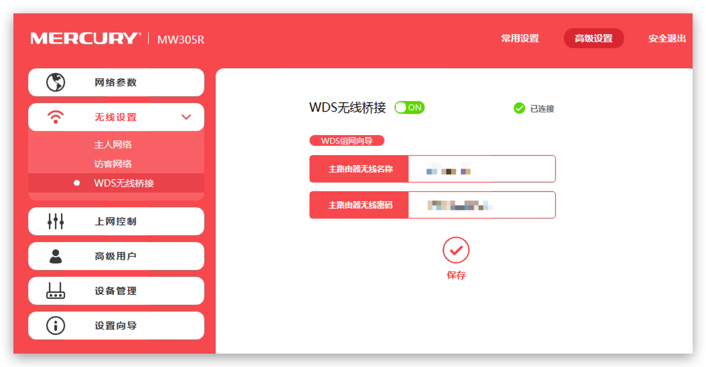
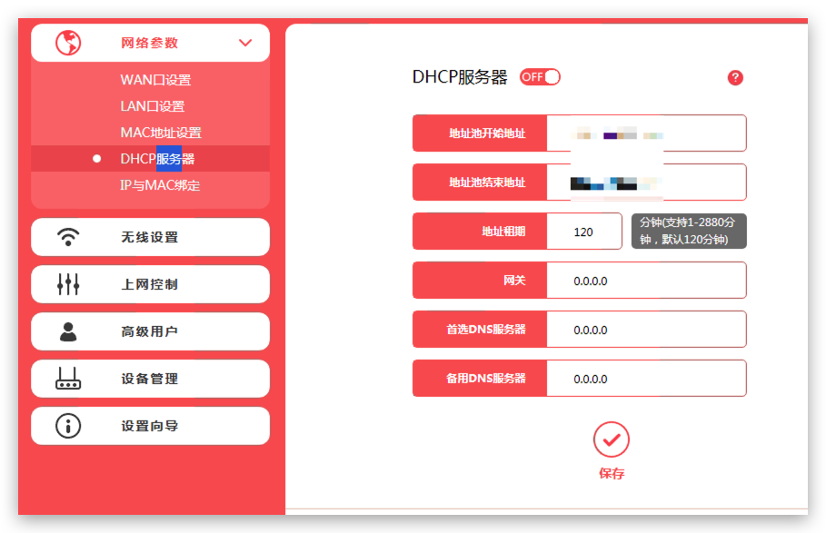
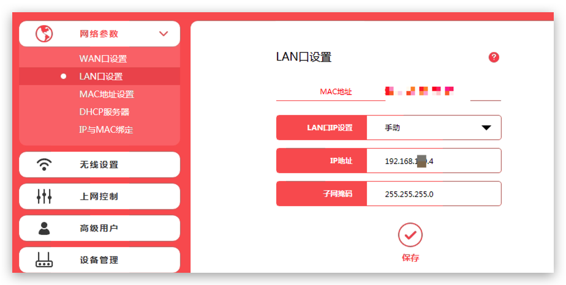

# 多台路由器组成WDS无线桥接 [DRAFT]

背景：家里有一台主路由器放在大厅用来连接外网。另外多出来几台老路由器，还有几台老台式机，上面配有Linux系统作为服务器，想做到把台式机放在别的房间，再用老路由器通过网线连接把服务器连接到主网络里。然后要求能够在同一网段，可以ssh或远程桌面访问。

路由器组网有几种模式：
- AP (Access Point) 接入点
- Wireless Extension 无线中继
- Wireless Bridge 无线桥接

无线中继设置很方便，几乎所有路由器都能支持。但是这只能做到副路由器能够正常访问外网，没法做到局域网内互通，因为网段不一样。
无线桥接，有时候也称为WDS，可以保证既能连接外围，又让副路由器在同一网段，但是只有副路由器具有WDS功能才行。

下面介绍几种家里的副路由器设置方法。

开始之前需要说明的是，
> **不需要主路由器做任何设置！全部设置都在副路由器。**

## 极路由器1代 作为副路由
花了最长的时间研究、尝试，结果没成功。

## TP-Link WR847N v2 作为副路由
花了很长时间不断尝试、重启，结果没成功。

参考标准的官方WDS文档，说的非常简单明了：
[TL-WR847N V1 ~V3 无线桥接（WDS）如何设置](https://service.tp-link.com.cn/detail_article_698.html)

## 华为HG255D作为副路由
这个著名的华为HG255D，是从淘宝买的二手，花了30块钱。知名是因为它是这个价位可以装OpenWRT的很好选择。

## Mercury MW305R 水星作为副路由

为了组WDS网，特意在淘宝上买了一个崭新的Mercury路由，49块钱，没想到设置WDS如此轻松，没看教程，全程只用了十几分钟。

- 首先恢复出厂值
- 随便找个Windows笔记本或台式机，把网线插在路由器Lan口上，不要查不一样颜色的WAN口
- 输入192.168.1.1进入路由器主页
- 跳过设置向导，进入高级设置
- 进入`无线设置 -> WDS无线桥接 -> 开启`

- 选择主路由，输入密码，连接
- 打开  `网络参数 -> DHCP服务器 -> 关闭` 一般来讲WDS组网都是要关闭副路由的DHCP自动分配IP地址的，因为这个工作要交给主路由来分配

- 打开 `网络参数 -> LAN口设置 -> 手动` ，这里是要设置副路由器在主网络里的IP地址，这里最重要！一定要把它设置在主路由的网段里，如果主路由是 `192.168.1.1`， 那这里可以设置 `192.168.1.2`等等，只要不和别的设备冲突就行。

- 保存后理论上就已经完成了。
- 这时候还可以到 `无限设置 -> 主人网络` 来确定下所连接主路由的WiFi是否正确。
- 打开任意网站，看看是不是可以联网
- 打开cmd命令行，输入 `ipconfig` 查看自己是否和主路由在同一网段
- ping 主路由和局域网内其它设备的地址
