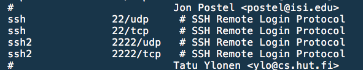
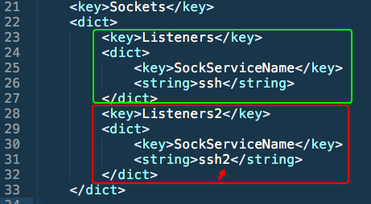
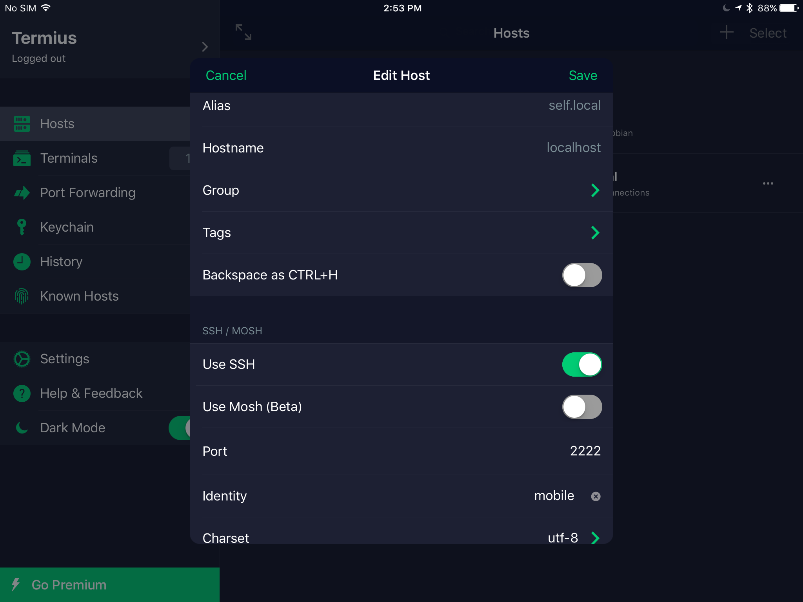

# iOS越狱设备SSH localhost

如果想在iPad上真正本地编程，而不是ssh到别的设备，就需要一个像样的终端。
Cydia可以下载好几种Terminal，可以连接到本机的BSD系统。但是都太次了，相比2018这种环境来说简直没法用。

相对来讲，AppStore已经有很多很优秀的终端，如我用的Termius，还有付费的Prompt2，Blink等都是相当不错用起来非常爽的。但是一般来讲他们只会让你去SSH别人，很少人SSH自己。

iOS装了Cydia后，会默认安装好了OpenSSH和OpenSSL，一般就可以正常从外界SSH进来操作了。
但是如果要利用AppStore的Termius等终端来访问自己，就需要设置些东西了。

可以在本机用iFile直接编辑文件，更方便的话是从别的电脑ssh进来修改文本文件。

首先是添加新的ssh监听端口（22端口不能被iOS用来访问自己）：
打开修改`/etc/services`文件，找到ssh处，添加两句一样的，只是名字改了：



```
ssh2             2222/udp   # SSH Remote Login Protocol
ssh2             2222/tcp   # SSH Remote Login Protocol
```

然后打开修改`/Library/LaunchDaemons/com.openssh.sshd.plist`文件，找到`Sockets`，然后在它的`<dict>`里面增加一个和ssh一样的Listener，只不过把ssh名字改成ssh2:



整个Socket的定义如下：
```xml
    <key>Sockets</key>
    <dict>
        <key>Listeners</key>
        <dict>
            <key>SockServiceName</key>
            <string>ssh</string>
        </dict>
        <key>Listeners2</key>
        <dict>
            <key>SockServiceName</key>
            <string>ssh2</string>
        </dict>
    </dict>
```

保存以后就算完成了，然后重启iPad。

**重启后，Cydia会闪退，几乎回到了未越狱状态。**

然后再用iPad本地的越狱工具，如我的iOS 9.3.5用的是Phoenix，再次越狱即可，过程很快，无需在连电脑装Cydia。

再次安装好后，就可以用任意iPad的本地Terminal终端访问自己了，连接方法是：
```sh
# 刚才定义的端口2222
ssh -p 2222 root@localhost
# 或(不同的用户，相同的地址)
ssh -p 2222 mobile@127.0.0.1
```



