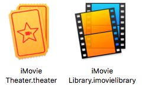

# ❖ Mac 如何扩大存储空间

## 部分大应用占用空间统计

GB级：
- `Xcode`: 5G-10G+
- `iMovie`: 2.8G
- `Microsoft Word`: 2.3G
- `Microsoft Excel`: 1.8G
- `Microsoft PowerPoint`: 1.6G
- `Microsoft OneNote`
- `Docker`: 

500MB级：
- `Parallels Desktop`: 560M
- `GitKraken`: 520M
- `MongoDB Compass`: 500M
- `Keynote`: 500M
- `Chrome`: 400M

## 大杀器：移动app到SD卡
如果本机长期插着SD卡，那么就可以考虑把大应用移动到SD卡上，这样可以节省几十个G的空间。
无论你是怎么安装的，只要安装好了可以正常使用，那么就可以直接把`/Applications`文件夹下的各种应用直接移动到SD卡上，删除本机的，然后再用`ln -s`建立软连接，这样就几乎没有区别了。

> 缺点是，如果app对SD卡的磁盘读写要求很高的话，速度会下降很多。所以我们要有选择的移动。
而且，`.app`实际上是一个文件夹，一个app有数千个文件在里面。实际上，我只存了几个app，就让我的SD卡读取速度极速下降，就是因为突然多了几万个小文件造成的。

为什么这样也可以运行？
因为安装app时候，它们已经把该安装的东西（比如数据库、缓存等）都安装到了系统的各个位置了，剩下的`.app`文件只是个只读、调用程序，它调用的东西位置没变就不影响。

## 部分内容移动到SD卡
Macbook Air自带SD读卡槽，所以可以长期插在里面一张128G或256G的SD卡作为存储扩充。然后把一些不常用的、无需保密的、不需要放到本地固态硬盘上占地方的东西放到SD卡上，比如：
- 电影
- 网络图片（非个人相册）
- iMovie库
- 图书库（PDF等）
- 音乐库（iTunes)

### Move your iMovie for Mac library
[Refer to official: Move your iMovie for Mac library](https://support.apple.com/en-sg/HT203049)

直接把`~/Movies/`目录中的iMovie库复制到任何SD卡上，然后在SD卡上双击打开这个库，弹出iMovie，现在用的就是这个SD卡上的库了。然后在本地的iMovie库删掉就OK了。下次打开iMovie就会自动打开SD卡上的这个库。

## 清除缓存

### 清除Xcode缓存（很大）

### 清除Spotify缓存（很大）

