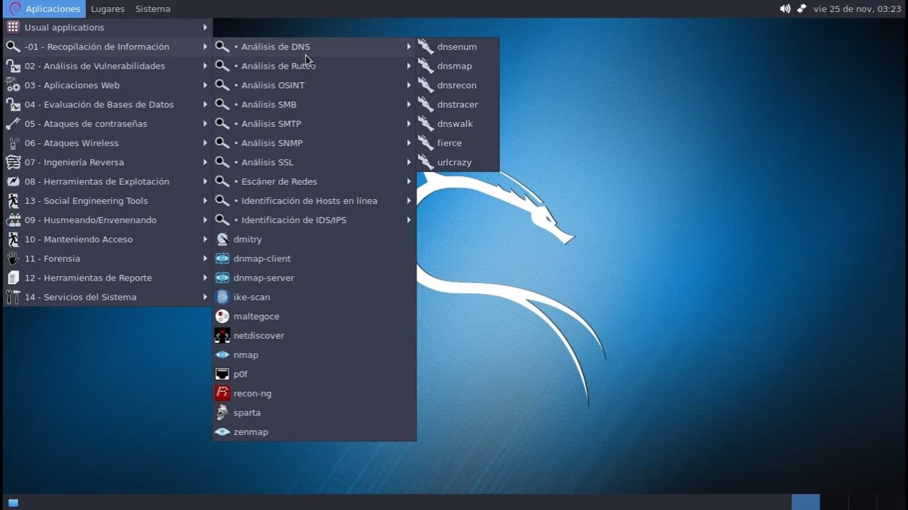
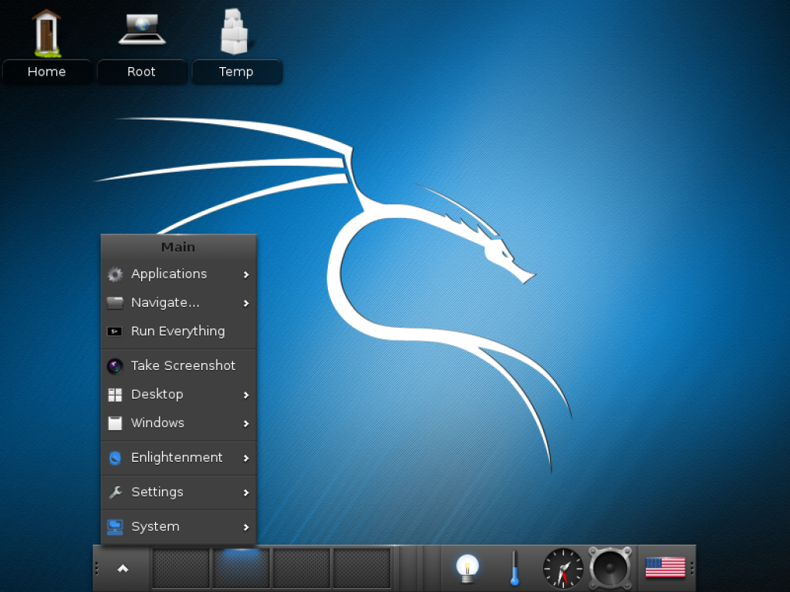
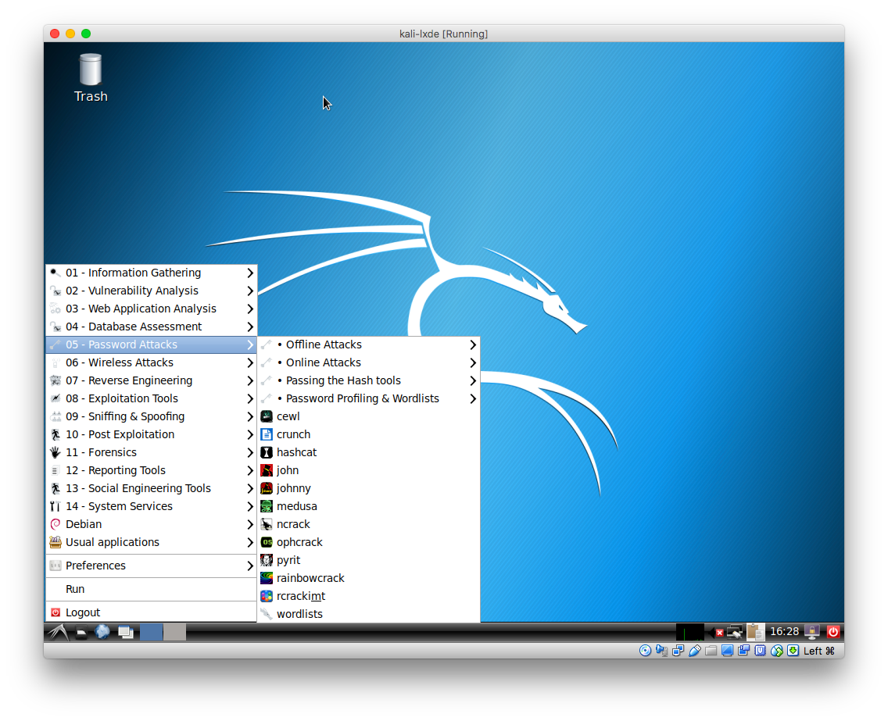
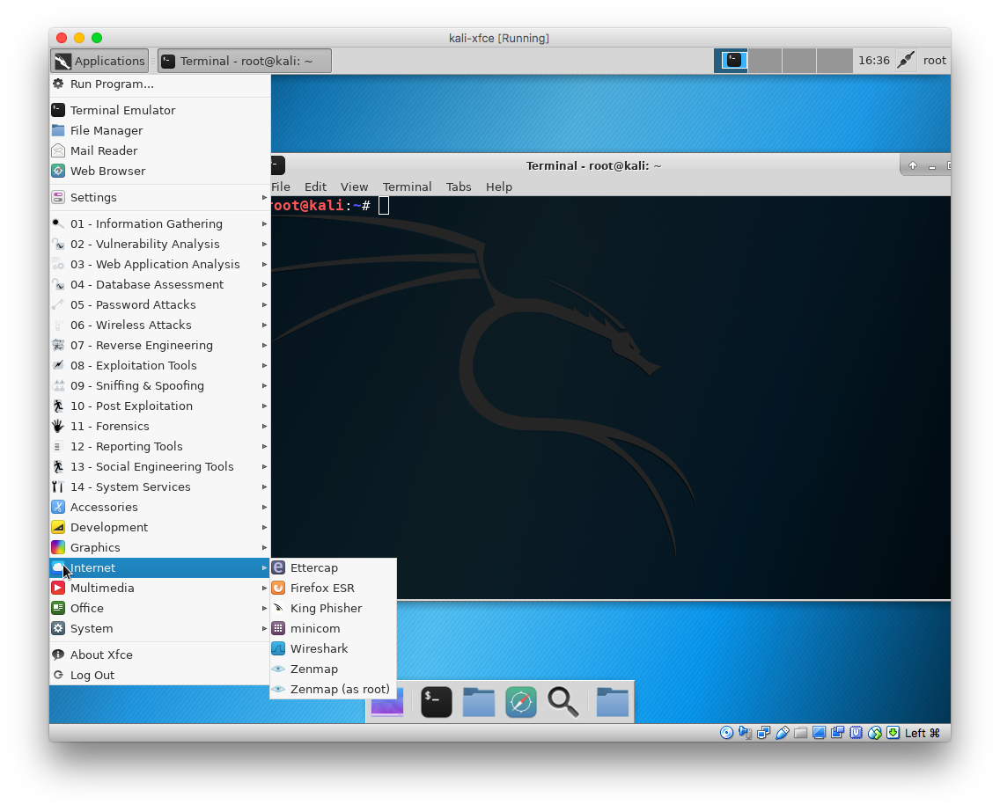
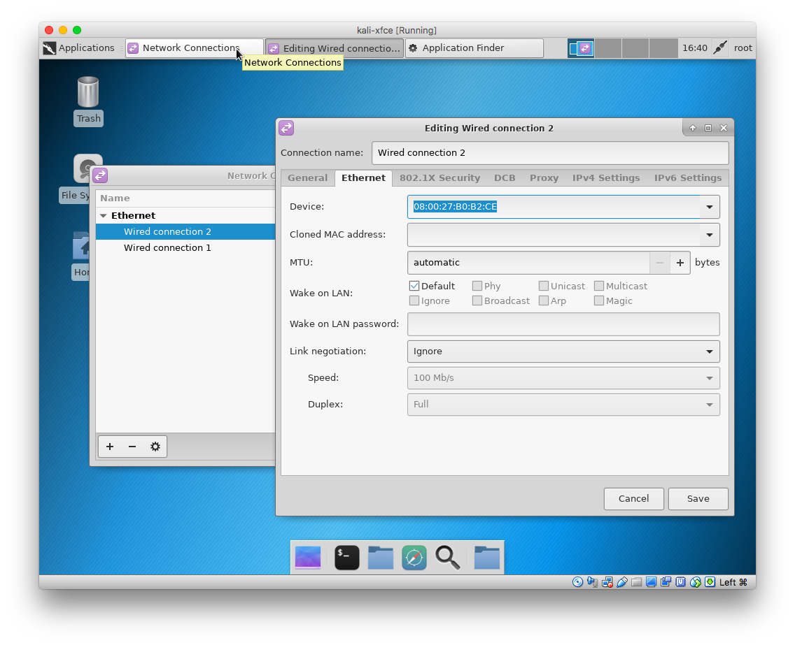

# ❖ Kali-linux 初识

## 基本
我发现Kali-linux其实不用安装，直接在光盘里运行也能很好的完成几乎所有需要的任务。

Kali默认账户就直接是`root`，默认密码是`toor`，反过来罢了。
Kali默认SSH都开启的，只是端口没开启。所以想从别的地方ssh进来，需要改一下sshd的配置`/etc/ssh/ssd_config`，只需把端口22那一行取消注释即可。
Kali主要就方便在默认就安装好了一系列常用的程序，相当于一个“精装修”的房子，拎包入住。所以才说即使用CD live不安装系统，也能"get the most out of it".

## 桌面版本

### `Mate`
界面清爽，而且菜单非常清楚的的把所有的程序列出来，终端默认也很好看。几乎没什么需要自己去定制的，就已经全配置好了。
对了，无需登录。
快捷键也都支持，设计的是传统的ubuntu式快捷键。

### `e17`
e17连CD live版都要每次先选择一大堆语言、键盘等东西，跟正式安装似的，才能进去。然后进入了桌面发现，真的没什么东西。
Kali e17在桌面菜单里找不到提供的hack程序，也许都在终端里了吧。

### `lxde`
lxde的精髓就是：极简。速度效率最高，一切画面都不重要——全都很丑。桌面丑、终端丑，而且还没什么定制的余地。但是能感觉到比较稳定。
不过实际上，lxde版本的kali大小和其他版本都是一样，2G+。所以这样看来还真没什么优势。

### `xfce`
xfce比lxde还要极简，但是稍微好看那么一点点。终端稍微好一点点，可以定制。

另外，xfce最突出的，其实是网络设置的GUI非常方便和详尽，别的版本桌面可能都要从终端才能设置了。

## Virtualbox中的Kali

在虚拟机中，无论怎么设置网络，都没法用到主机的Wifi，只能在自家路由器里面各种联通，连不到别的Wifi。因为虚拟机中的linux，用的网络相当于插了一根网线，而不具备搜索外界wifi信号的功能。
所以想要用wifi，必须单独买一个USB无线网卡，然后让虚拟机读取这个无线网卡，来获取外界wifi信号。

[参考：kali linux上如何挂载无线网卡？](https://www.zhihu.com/question/40871402)

至于在Virtualbox中使用Kali-linux和网络设置：
[参考之前的笔记：Virtualbox连接网络](https://github.com/solomonxie/solomonxie.github.io/issues/33#issuecomment-420975874)

简单说，就是给虚拟机设置双网卡：NAT+Host-only或者Bridge+Host-only
