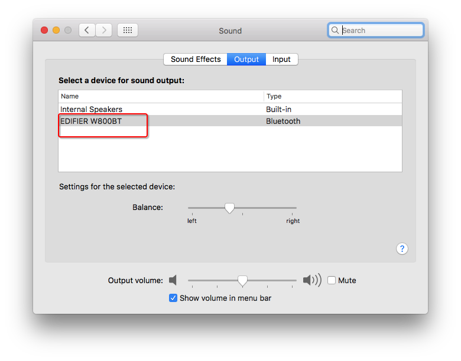
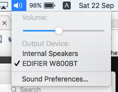

# Mac上Bluetooth蓝牙失常

[参考：修复Mac OS蓝牙异常](https://eliyar.biz/fix_mac_os_bluetooth_error/)

## 蓝牙耳机连接不正常

无法连接的情况很少，但是连接上了后，无法正常识别蓝牙耳机的输入或输出比较常见。

我的问题是，这个Output有时候会显示一个，即本机的声道，但是显示不出蓝牙耳机的。即使蓝牙耳机连上了也能听。

解决方法很简单：删除Mac的蓝牙配置文件，然后关机，再重启（直接重启不行）

找到`/Library/Preferences/com.apple.Bluetooth.plist`，删除（或移动到别的地方），然后关机、启动电脑即可。

```sh
sudo mv /Library/Preferences/com.apple.Bluetooth.plist /tmp/
sudo reboot
```

以下是连接上蓝牙耳机后正常的显示内容：





