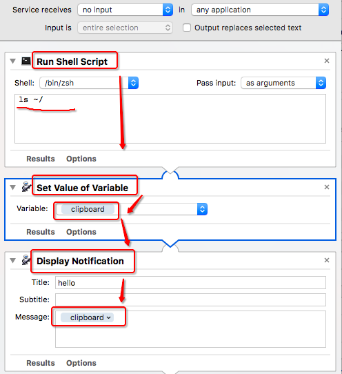
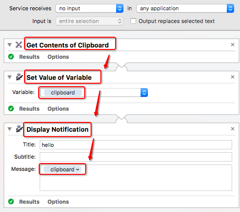

# ❖ Mac: Automator自动化学习

> Mac上想要实现各种自动化，光靠Python是不够的，还需要很多系统底层的支持。其实如果不是企业级应用，而是小工具的话，反而直接使用Automator要快得很多。只要功能实现了就好嘛

## Automator特点
- 几乎没有什么官方文档和全面的教程，最好的方式是自己一个一个试，或看看别人的事例。
- 单纯的Automator是没有Conditional条件控制的，也就是没法if-then-else这样的流程控制，只能单线发展。如果需要条件控制、循环等，就只能用applescript写了。
- 基于Automator单线流程，每个item命令都只接受上一个item的输出作为自己的输入，然后把自己的输出作为下一个item的输入。没有选择接受什么样的内容和输出哪些内容的权利。
- Automator没有界面设计（不像VB），最多是一些自带的输入框、确认框等。
- 如果是创建的Application应用，那么就会生成.app的程序，可以像其他所有独立程序一样单独运行和设立快捷键。
- Workflow等文件，只能保存到`~/Library/Services/`中，不能选择位置。

## 将shell script输出弹出为系统通知

## 获取剪切板文字，保存到变量，并弹出通知显示

