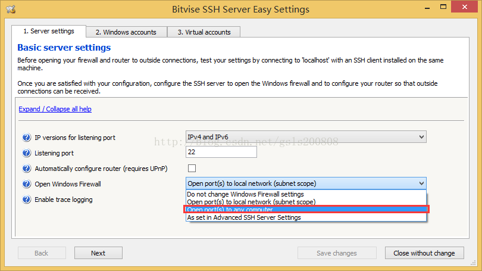
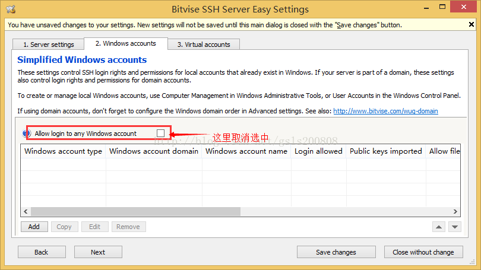
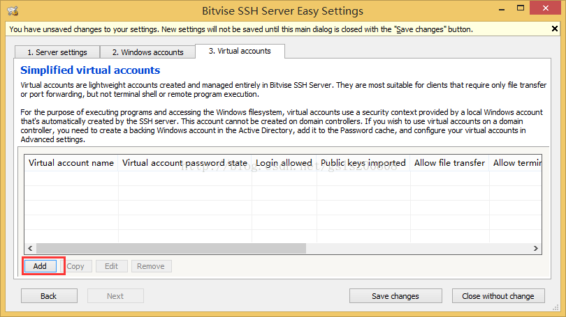
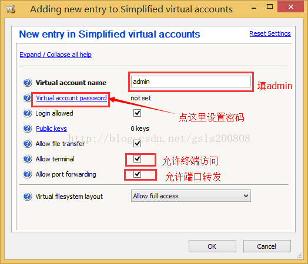
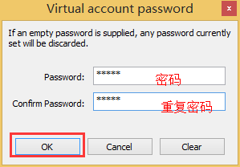
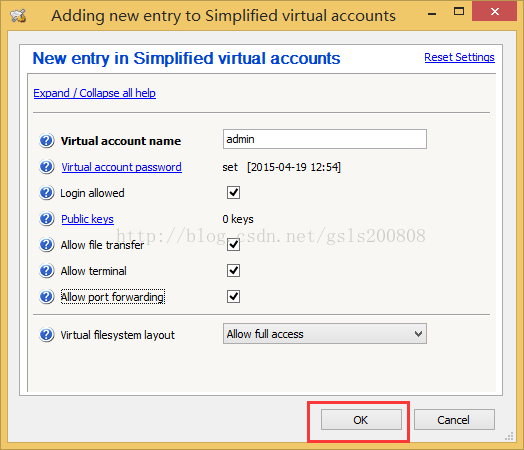
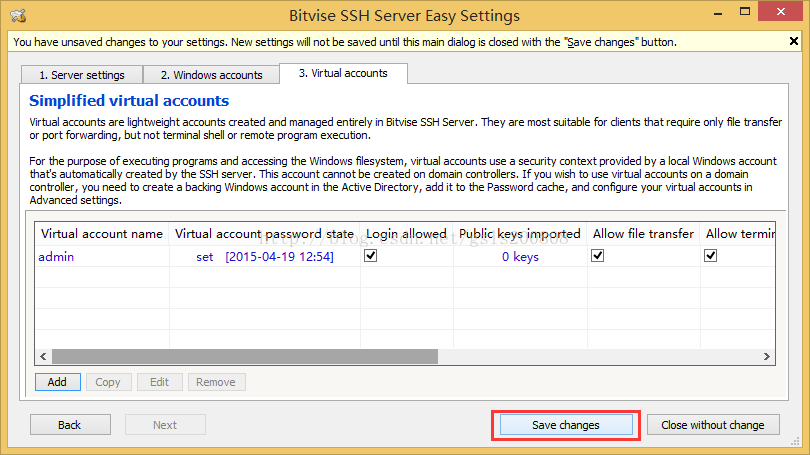

# ❖ Windows安装SSH服务器

## FreeSSHD (不推荐）
这个应该是搜索关键字时给出的第一个建议吧。
但是其实这个软件并不好用，配置不是那么先进，bug也多。

经常遇到各种`Permision Denied`的情况。


## Bitvise SSH
重点推荐。

配置全面，也有简单模式，条理清晰，而且软件比较新。连接情况也有动态log显示给你看。

[安装参考：在win8.1上用Bitvise SSH Server 6.24(原名winsshd)搭建SSH2服务器](https://blog.csdn.net/gsls200808/article/details/45127781)

主要步骤就是：
- 官网下载exe安装文件并安装（选Personal个人免费版）
- 配置页面选择`Open easy settings`
- 设置port端口（注意22虽是ssh默认接口但是经常被占用）

- 切换到Windows account选项卡，取消真实windows用户账户

- 切换到Virtual account虚拟账户选项卡，建立虚拟登录用户账户

- 输入用户名，或者导入PublicKey公钥。方法是把你自己客户端电脑上的`~/.ssh/id_rsa.pub`文件复制到这个服务器上，然后点击import导入，成为这个虚拟账户的publickey。这样就可以免密码登录了。




- 回到主界面，Start开启服务

这时候就可以开始连接了。

到自己的Linux或Mac上命令行里，输入：
```sh
# 根据自己的IP、用户名和port端口来输入
$ ssh admin@192.168.1.111 -p 26
```

关于Shell：
新版本的BitviseShell，是可以自定义Shell的，默认是BvShell。不是很好用，命令极少几乎没什么用处。
还可以选择Bash、Powershell等。
不过经过测试，选择Bash需要自己指定bash的路径，我用的是Git_bash，无法使用。
所以还是老老实实选择Powershell或CMD吧。
设置位置在：
`Open easy settings -> 3.Virtual accounts -> Edit -> Shell access type`
