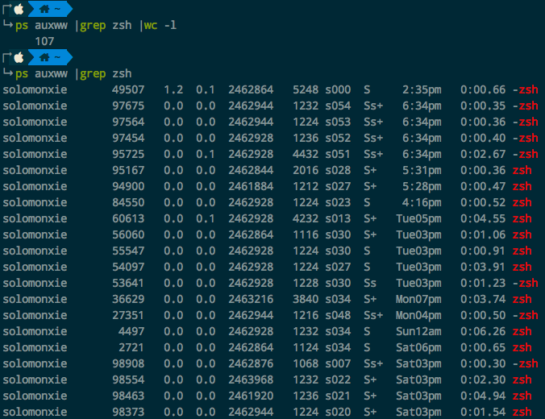

# Mac进程中有100+个zsh进程

非常非常奇怪，我一开始以为是自己在Tmux里面开的每个Pane都开启一个zsh。可是亲自数了一下，发现竟然有一百多个！不可能是我在Tmux里面建的。



于是退出Tmux，关闭所有zsh：
```sh
$ pkill -9 zsh
```

然后重启Tmux，发现session会话丢失了。只能用Resurrect恢复。

再数一数有多少启动了：
```sh
$ ps auxww |grep zsh |wc -l 
     25
```

这个就比较正常，是我自己新建pane的数量。
