# iOS 9.3.5越狱

这个版本只能用Phoenix越。
[参考官网：Phoenix](https://phoenixpwn.com/)
[参考youtube：Fix Cydia & Phoenix Crashing On 32-Bit Devices (iOS 9.3.5)](https://www.youtube.com/watch?v=zY9TwqFvTK8)

下载好两个文件后：
- iPad用USB连接到电脑
- 本地打开`Cydia Impacter`, Windows或Mac都行
- 如果看到软件上显示设备的名字，则可以正常连接
- 在软件上选择菜单 - Device - Install Package - 选择刚刚下载的`Phoenix4.ipa`文件
- 程序弹出页面后输入Apple ID，即iTunes下载用的登录邮箱
- 弹出密码时候，需要输入苹果的App专用密码，不是登录密码。如果没有，需要到官网注册
- 打开[苹果官网](https://appleid.apple.com/account/manage)
- 找到Security，找到`APP-SPECIFIC PASSWORDS`，点击Generate生成
- 输入密码标签，回车后就会自动弹出一串密码，保存，然后在本地备份一下
- 回到`Cydia Impacter`软件，输入刚才得到的密码，回车
- 等待运行，成功后，回到iPad上会看到桌面多处一个红色Phoenix图标
- 打开iPad设置 - General - Device Management，看到一个device是自己的邮箱名，点进去，点Trust信任
- 回到桌面，打开红色Phoenix图标，按提示操作安装
- 安装成功后，桌面会多一个Cydia图标，说明越狱成功。

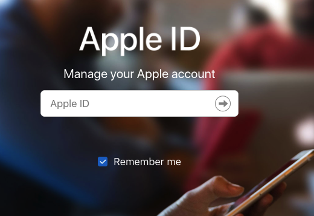
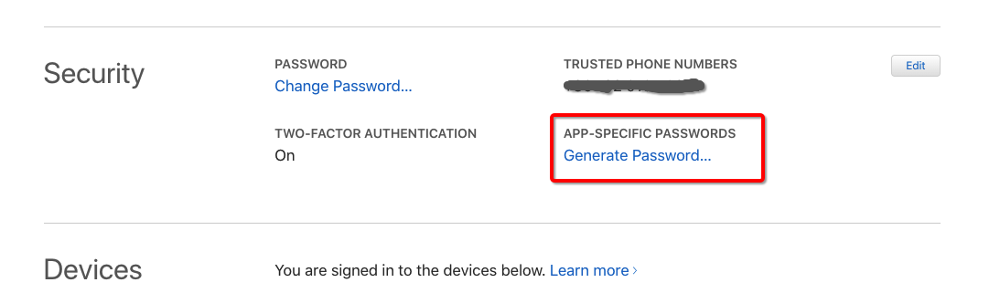
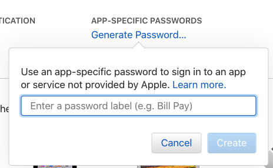
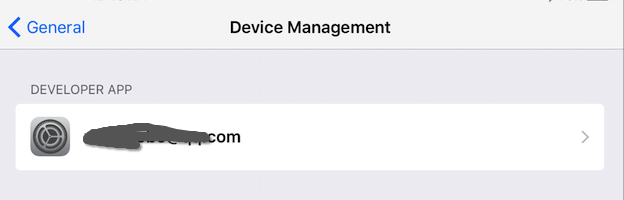
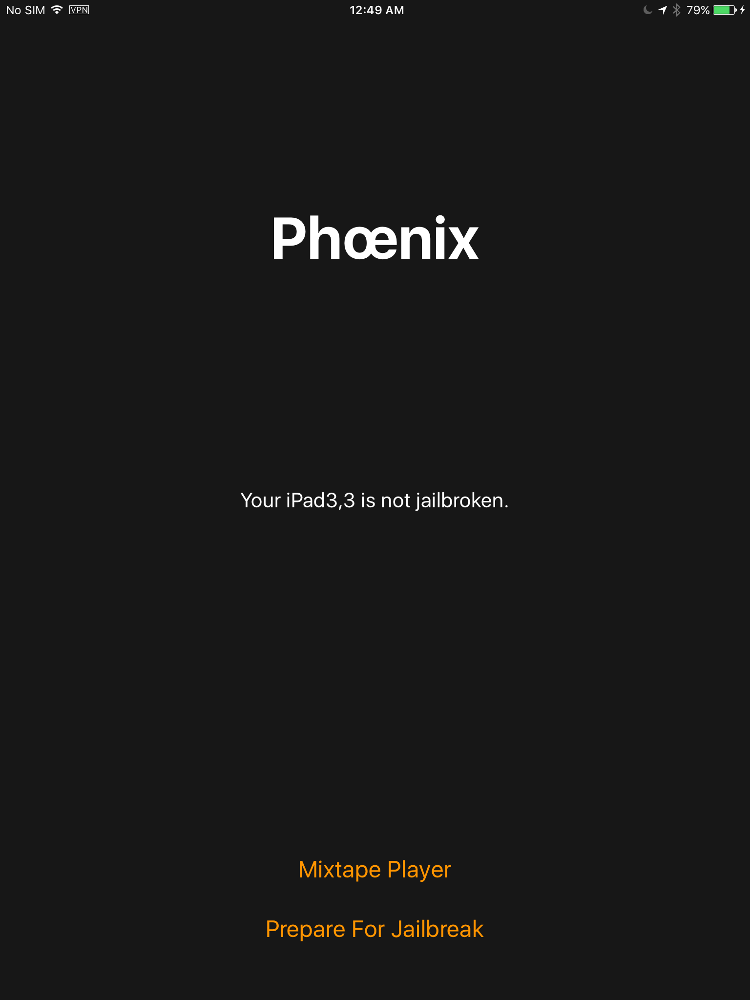
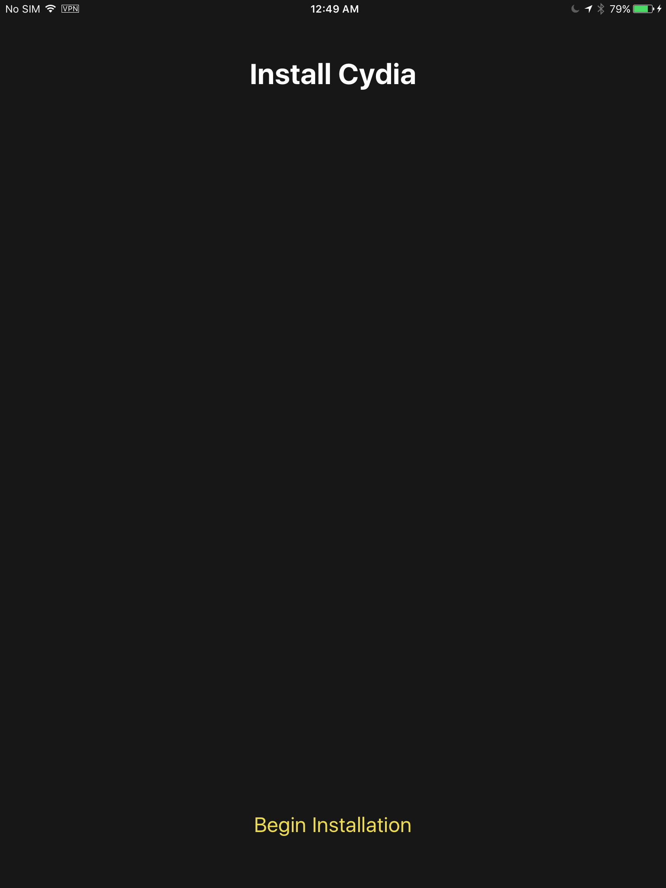
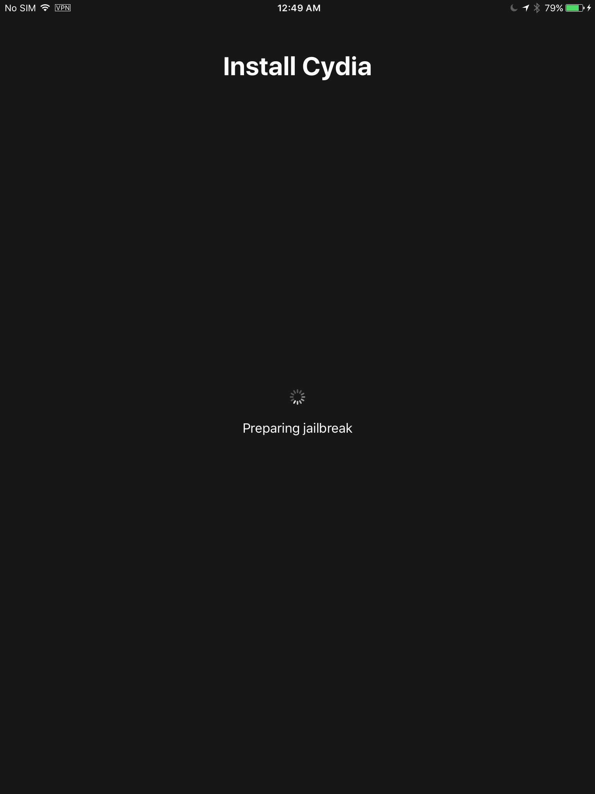
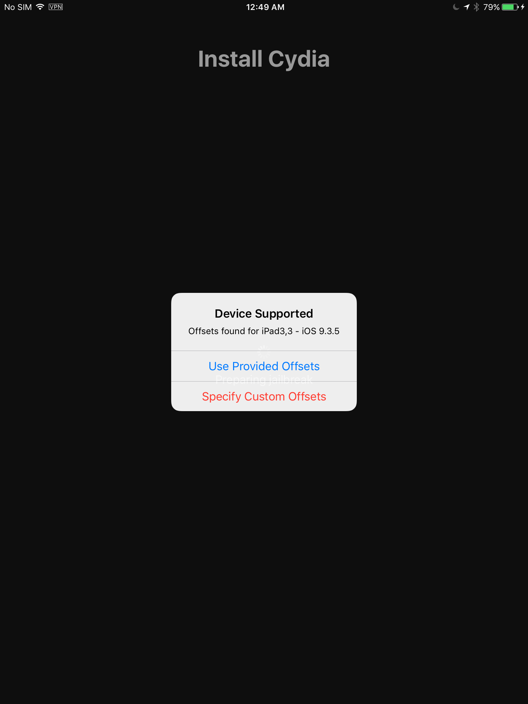
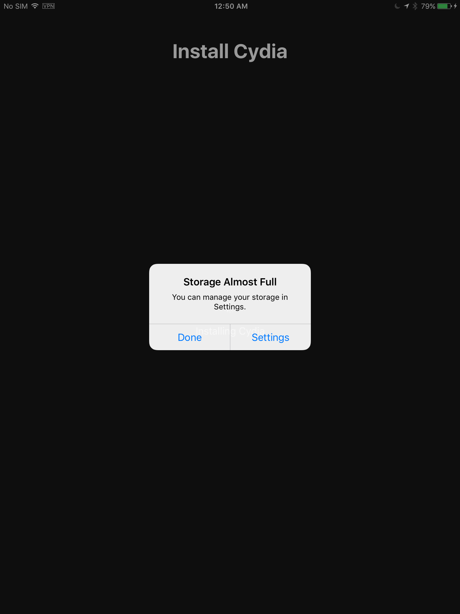
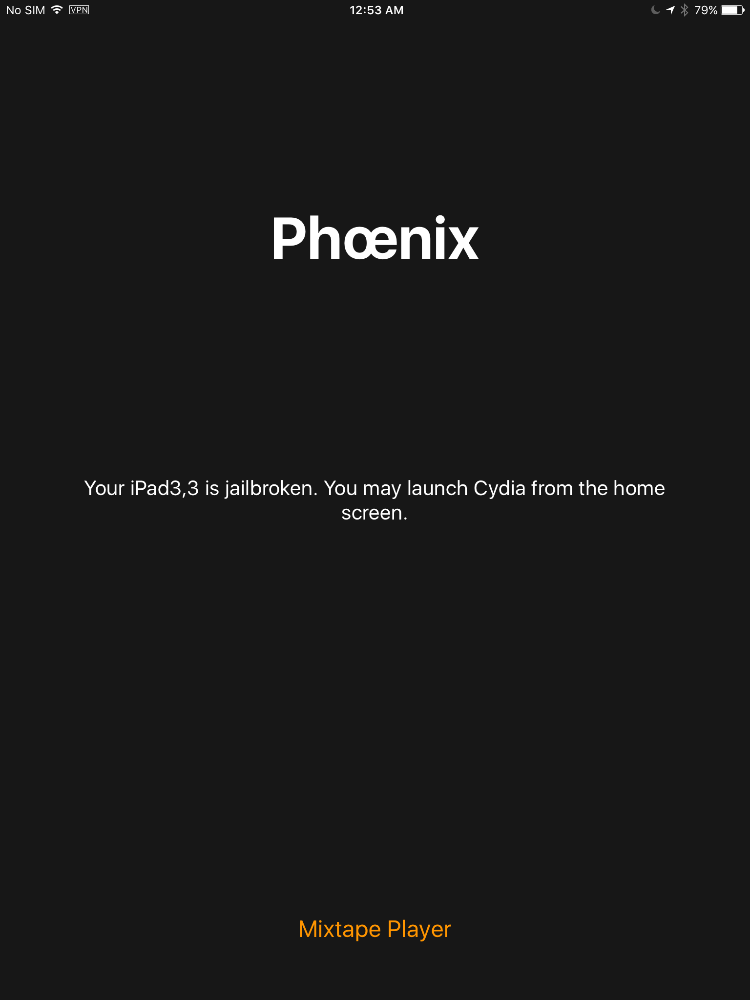

## 常见问题
### Cydia Impactor 安装时候报错81 9391 说要求开发者账号才可以
其实不是开发者账号的事，不需要开发者账号。
这是因为没有正常把`Phoenix4.ipa`选中，或者这个文件有问题，或者型号不匹配。
选中方法：
    - 直接拖拽，或者
    - 在软件上选择菜单 - Device - Install Package - 选择刚刚下载的`Phoenix4.ipa`文件

### 173 密码错误
一般肯定是输入了登录密码。
注意这里不是输入登录密码，而是专门的`APP-SPECIFIC PASSWORDS`，需要自己去苹果账号管理网页专门生成，很方便。

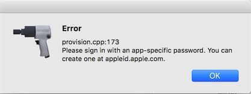

### 每次重启后越狱都失效
每次重启，或者每隔7天，cyndia和安装的插件都失效。这时候需要点桌面上的Phoenix图标再次越狱，很方便，不用连电脑也不用联网就可以。
但是有时候桌面上的Phoenix也无法打开。这就需要连电脑从头再来过一遍了。
这是因为针对iOS9.3.5的Phoenix是“半越狱”产品。

[参考：How to Re-Enable a Semi-Tethered Jailbreak](https://ios.gadgethacks.com/how-to/cydia-101-re-enable-semi-tethered-jailbreak-0180461/)

### 其它问题
[参考：Cydia Impactor 安裝 IPA檔案時 錯誤碼處理方式](http://bearnear.com/2017/11/cydia-impactor-%E5%AE%89%E8%A3%9D-ipa%E6%AA%94%E6%A1%88%E6%99%82-%E9%8C%AF%E8%AA%A4%E7%A2%BC%E8%99%95%E7%90%86%E6%96%B9%E5%BC%8F/)

