# Parallel Desktop (Mac虚拟机) 安装Windows

## 安装Ghost版Win7系统

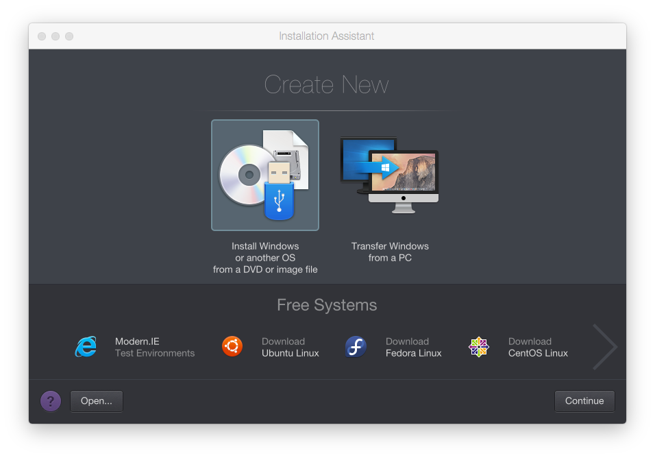

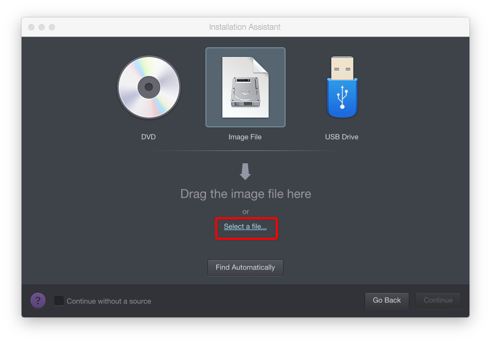

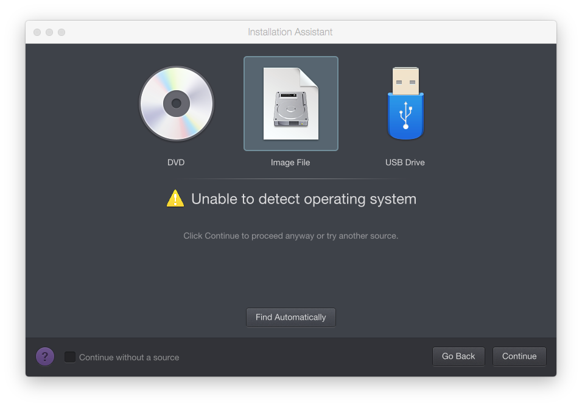

无法检测到系统没关系，可以自己手动选：

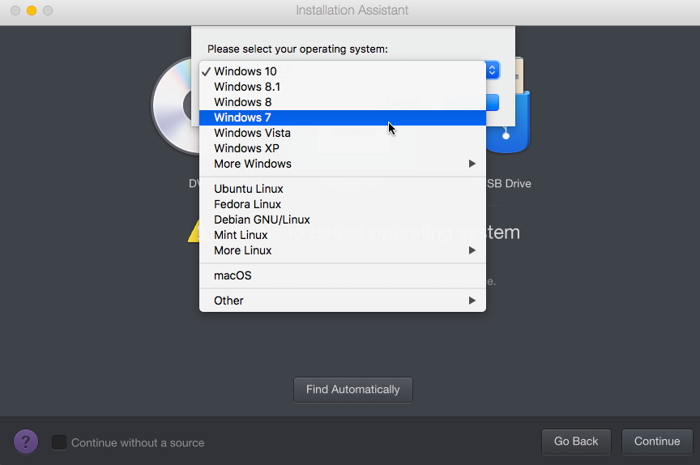

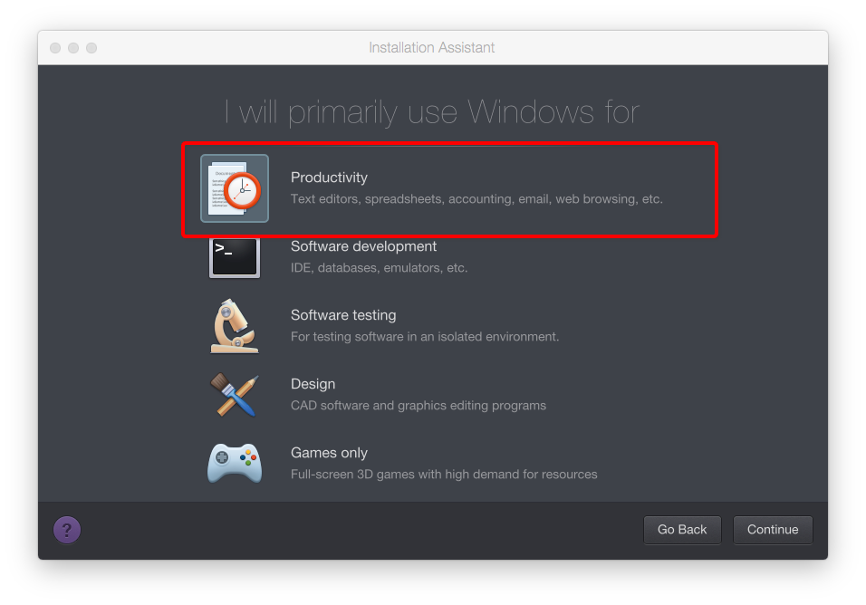

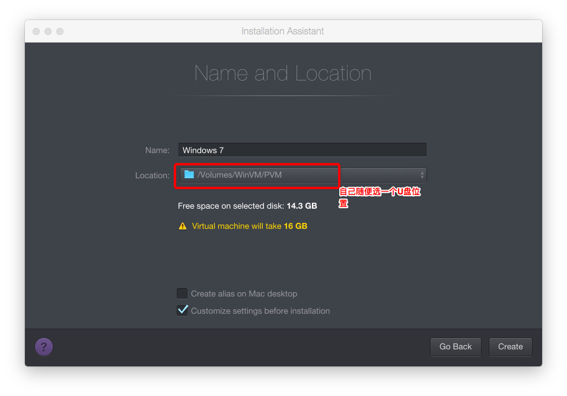

设置自己想要的硬件等配置：

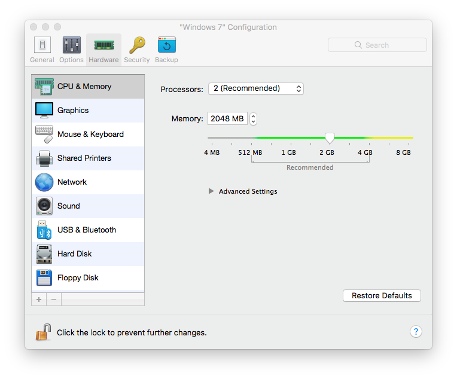

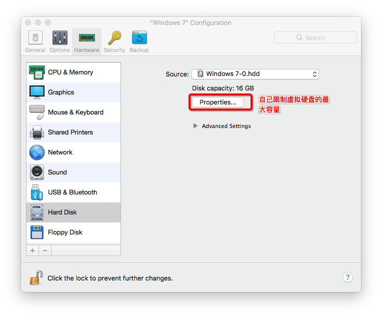

记得调整好开机的读取顺序，相当于设置主机的BIOS了：

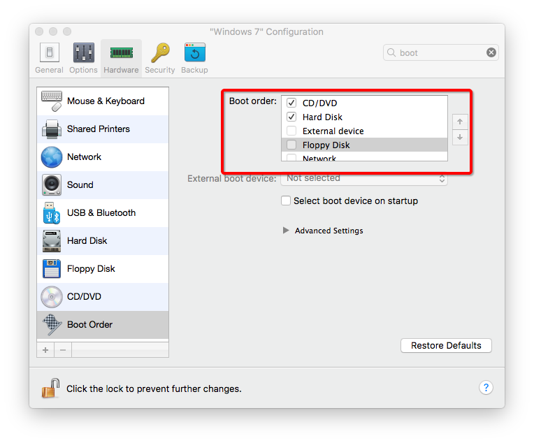

开始正常安装：

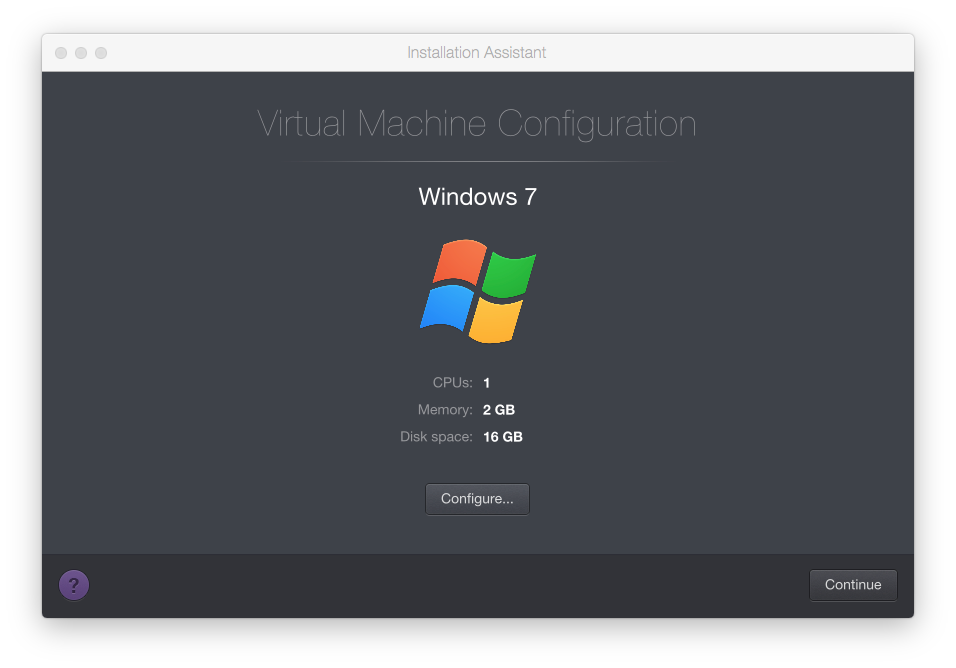

进入了光盘或USB的安装界面，选择WinPE系统：

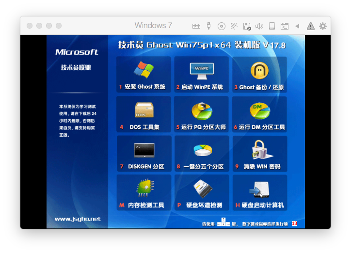

进到WinPE系统中会看到，本地没有磁盘。
实际上是虚拟机分配了，但没有格式化的原因。
打开分区软件，手动格式化：

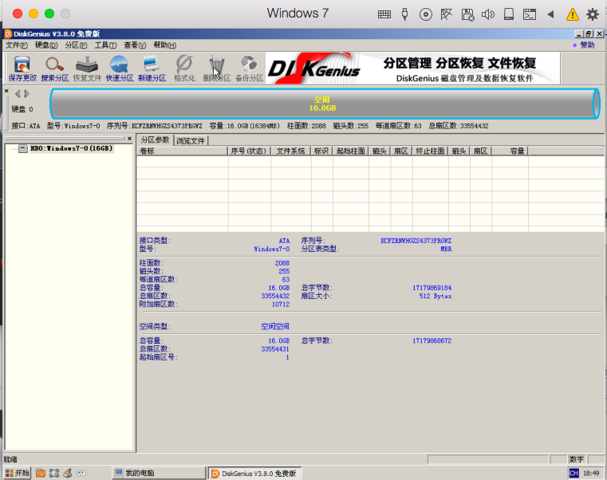

之后就是常规的Ghost安装了。

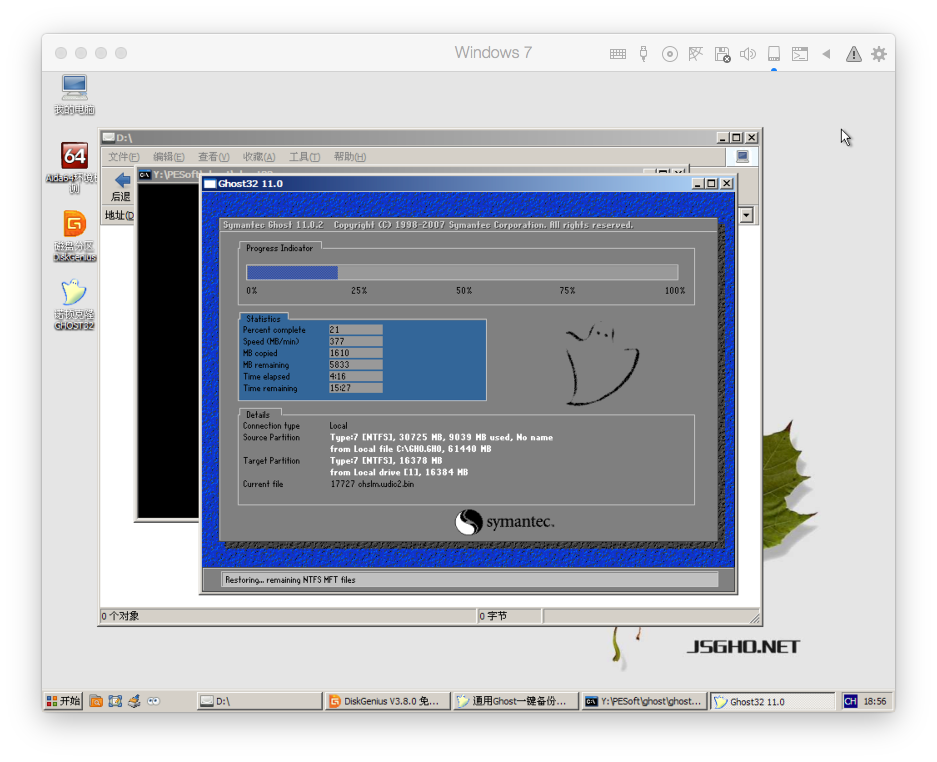

## 安装正常安装版Win7系统

直接连接ISO光盘文件，正常安装，比Ghost简单的多。

## Reclaim
安装好后，肯定有很多不喜欢的软件，比如Office等。
想方设法把不需要用的软件全部删除，然后用电脑管理软件如模仿、360安全卫士等，清除各种缓存、没用的东西。
然后磁盘会减少几个G的空间，这时候STOP虚拟机，然后在控制页面里面选择`Reclaim`，就可以给U盘节省几个G的空间了。
