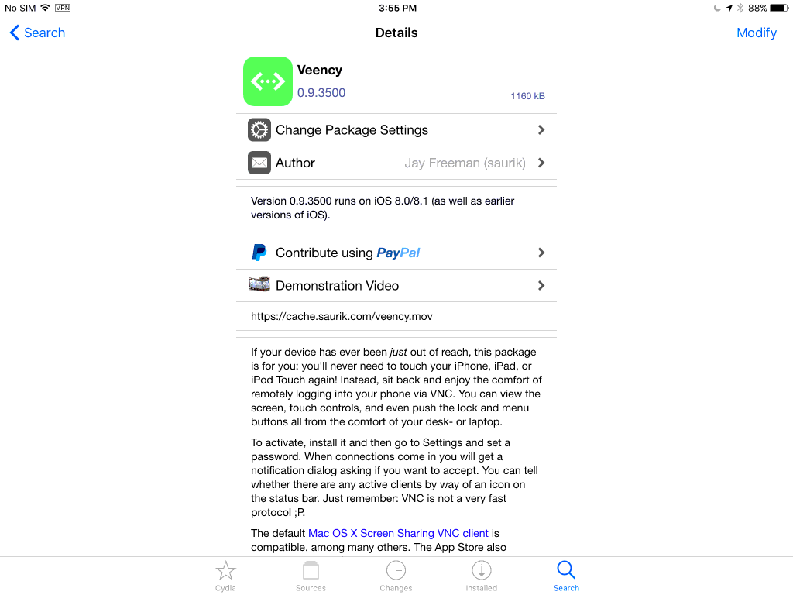
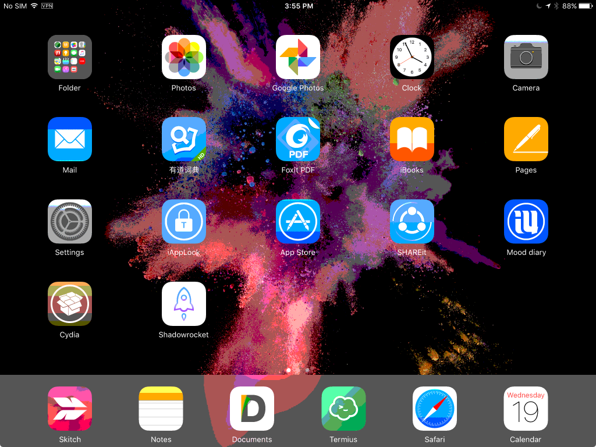
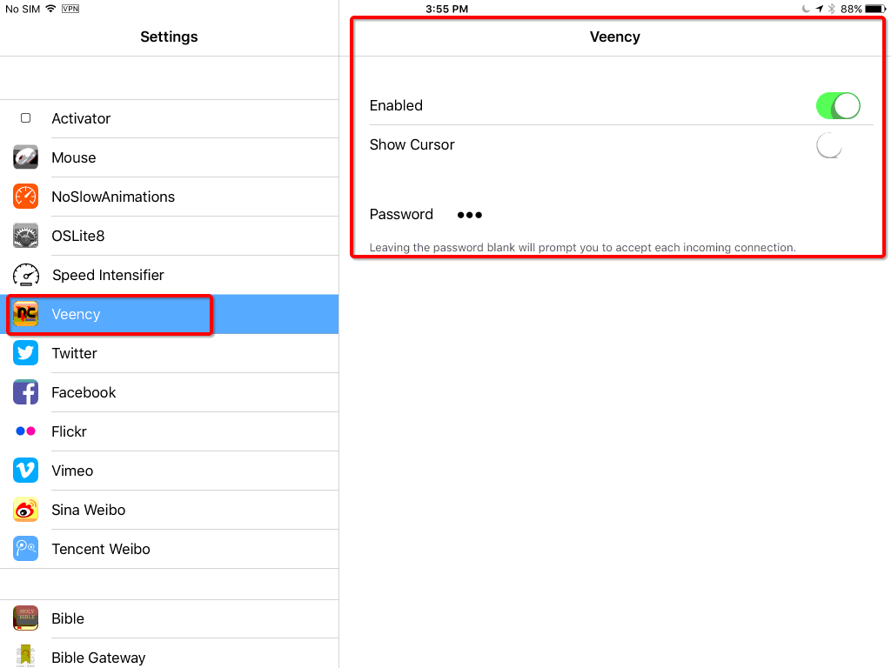

# 在电脑上远程控制iPad/iPhone （已越狱）
`#远程桌面 #remotedesktop #vnc`

原理很简单，就是在iOS设备上安装VNC服务，然后在任意电脑上通过VNC客户端访问设备的桌面。可以通过鼠标控制和键盘输入。

很简单，直接到Cydia商店里，找到`Veency`，然后下载安装。
安装好后，在系统Setting里面，找到Veency，然后设置一个密码，这样客户端访问的时候就可以用密码登录。如果不设置密码，那么每次客户端访问，都需要手动在iOS设备上点击确认，才能访问。
另外，最好取消鼠标指针，非常慢且容易出问题。

目前`Veency`只支持iOS8以上。

缺点就是：速度太慢，想玩游戏或看视频的话，还是很难满足要求的。这也是所有VNC的问题。

