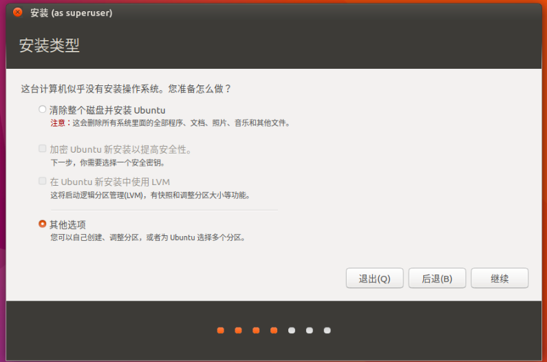
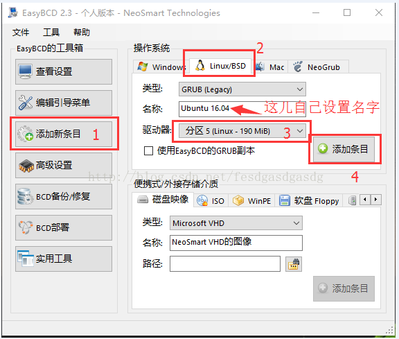
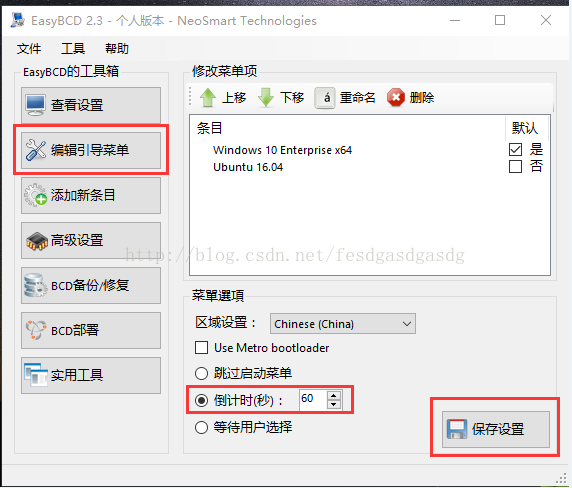

# PC上装Windows+Linux双系统

双系统，涉及到MBR(Master Boot Record)问题。也就是决定系统从哪里启动、怎么启动等的配置。

只安装一个系统的话，这个MBR是自动配置好的。但是如果装了双系统或多系统，就会有冲突（只能启动一个），那么就需要一个软件管理这个冲突（生成一个菜单，让你选择进入哪个系统）。

配置这个东西需要一种叫`Boot Manager`启动管理的软件。Windows有很多这样的软件，如`EasyBCD`等。但是Mac上就少很多，也不是很好用。Linux上也没有那么方便的软件。
所以，既然是Windows+Linux系统，那么就可以安装好Windows后，在Windows里面用这个软件即可。

这里以`EasyBCD`软件为例。

大概步骤是：
- 安装Windows系统
- 在Windows上或任意方式，给硬盘分区多分出一个地方来（不会丢失数据），最少7G以上。这时不需要格式化，安装Linux时会有格式化的选项。
- 下载喜欢的Linux系统（ISO格式文件）
- 随便用什么软件(Windows的`Rufus`，Mac的`Etcher`)，把Linux的ISO烧录到U盘上，
- 插入U盘重启电脑，从U盘启动
- 进入Linux安装程序
- 正常安装Linux，然后重启
- 没有Linux选项，正常进入Windows
- 下载安装，打开`EasyBCD`启动管理软件，设置启动系统的MBR
- 重启，能看到多出来一个菜单，选择进入哪个系统

下面是具体的步骤，安装双系统，多系统，步骤都一样。

现在本机已经有了Windows系统。然后用`DiskGenius`进行分区（用Win自带的硬盘管理也行）。
记住，分出来必须是空白的，不能格式化。因为之后Linux安装时候需要挂载分区，挂载后它再自动帮你格式化。

然后下载Linux的镜像ISO文件。
然后打开Windows的`Rufus`或是Mac的`Etcher`烧录软件，把ISO文件烧录到U盘上即可。软件都很小巧，选项也极少，就略过了。

烧录好后，重启电脑，从U盘启动，进入Linux安装程序。
其中最重要的一步就是，选择分区的问题——一定不能选清楚整个硬盘一类的，要选择有兼容别的系统的那个选项：

然后就进入了分区的环节。说实话，我不想讲一个一个给某些个“文件夹”分一个区的问题，最方便的就是像树莓派一样，所有东西都在一个区，以后有需要再改都行。
这里记住把刚才分出来的磁盘空间，都配给`/`主分区。这样`/`下面的乱七八糟的`/boot`, `/home`, `/tmp`之类的就都放到主分区下了。
具体做法是：再Free空白分区上，点+号，新加一个分区，挂载点输入`/`，格式默认是Ext4即可。然后点确认，点Install安装，就行了。如果弹出什么警告，跟着感觉走。

除此之外，其它都是跟着感觉选就行，没什么大不了的。

安装好了就重启，会发现没有Linux系统的选项，还是照旧进入Windows。
这是因为MBR启动项还没设置。

> 如果是Ubuntu的话，其实会自动帮你创建一个启动系统的选择菜单，这样就省了之后的步骤了。但是不能改，这样没有个性。如果我们要再加系统，就还是要自定义MBR菜单。

然后就在Windows里，打开`EasyBCD`软件，开始设置MBR。

> 最后注意的事情。
经过上面的引导设置步骤后，在你的windows系统盘根目录中，会出现NST目录。
切记：有强迫症的朋友，不要删除这个目录，这是linux的引导文件数据。
删除了就无法启动linux了，需要再次使用EasyBCD软件重新添加引导。
