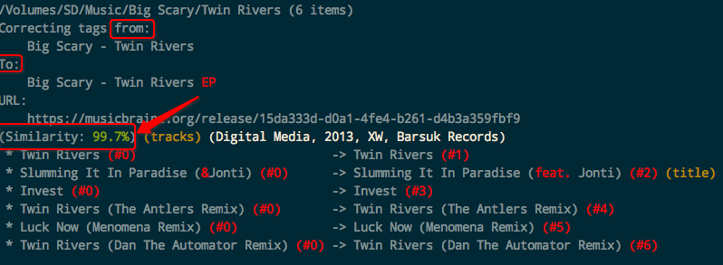
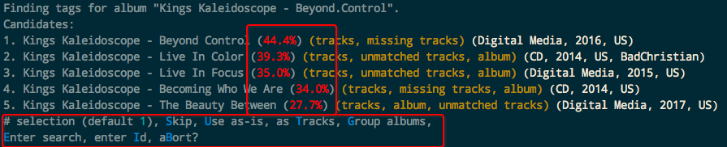

# 音乐管理 [DRAFT]

## beets 命令行音乐管理工具 超全功能

安装：
```sh
$ pip install beets
```

查看配置文件位置：`beet config -p`. 一般默认是`~/.config/beets/config.yaml`。

可以这样配置：
```yml
directory: ~/Music
library: ~/Music/BeetsMusicLibrary.db
import:
    copy: no
```

然后在任意位置执行导入命令：`beet import /path/to/music`。程序就会安装Config里的配置，自动读取directory里面的所有音乐文件，并且自动开始tagging。执行过程中需要交互，一个album一个album的选。虽然有点麻烦，但也是合理的。太过于自动反而会产生很多标错而不知情的情况。

匹配率非常高的（98%）以上，就会自动修正文件的tag了，无需你手动确认。


如果匹配率很低的话（如30%），就需要人工来判断了。beets会弹出交互，让你选择：



