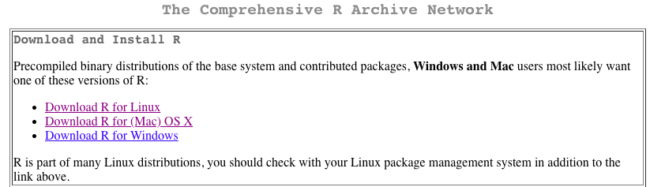
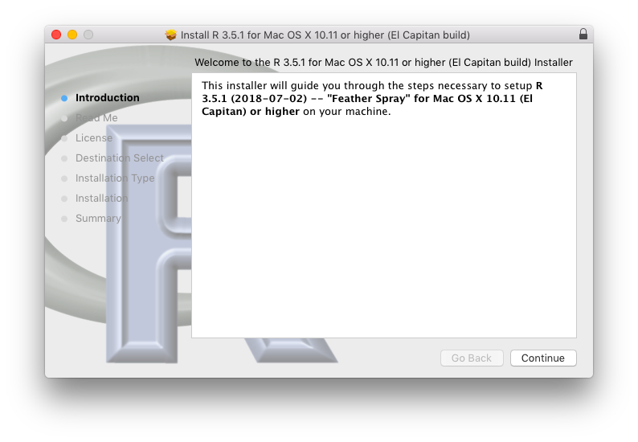
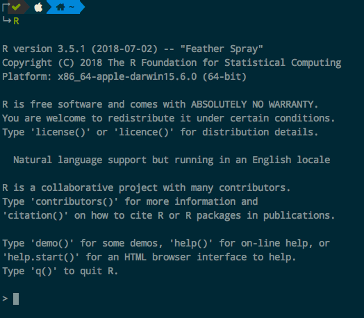
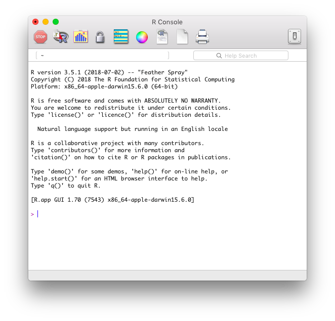
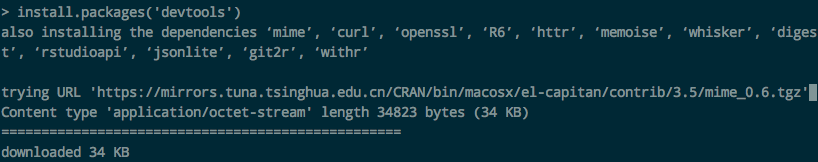
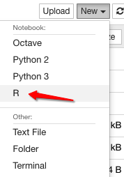

# ❖ R语言入门

> 因为R语言在Data science领域也是个非常流行的编程语言，所以很多优秀的教程、教材都是以R为例。虽然我喜欢Python，但是也不想放弃了那么多的优秀教材。所以就小小的花一点点的时间，最起码了解点R基础，这样就可以看懂很多教材了。

## 安装R语言

全球各镜像站列表：https://mirrors.ustc.edu.cn/CRAN/
中国站下载存档：https://mirrors.ustc.edu.cn/CRAN/




版本 `R 3.5.1`下载链接:
- Mac：https://mirrors.ustc.edu.cn/CRAN/bin/macosx/R-3.5.1.pkg

Mac上是用pkg包安装，一路按下一步后完成安装。



安装好后，直接在命令行里输入命令**大写**`R`即可进入R语言的shell。



同时，Mac上也会装好一个GUI客户端，直接在菜单里找到打开：




## 更换安装源（镜像）
国内比较好用的镜像有：
- 清华CRAN镜像：https://mirrors.tuna.tsinghua.edu.cn/CRAN/
- 同济CRAN镜像：https://mirrors.tongji.edu.cn/CRAN
- 北交大CRAN镜像：http://mirror.bjtu.edu.cn/cran

在GUI里面，进入软件的偏好设置，打开`Startup`选项卡，然后在CRAN mirror处填上镜像地址即可。也可以点开select选择全球的各个镜像。

创建一个`~/.Rprofile`文件，输入如下内容：
```
## Default repo
local({r <- getOption("repos")
       r["CRAN"] <- "https://mirrors.tuna.tsinghua.edu.cn/CRAN/" 
       options(repos=r)
})
```
保存后退出，然后每次R安装下载包时候，就会从这个镜像下载。


## 安装package包
进入R-shell后，输入:
```r
install.packages('NAME')
```
即可完成下载安装包。




## Jupyter notebook R-kernel
R语言用于Jupyter的kernel，主要是`IRkernel`项目。
参考IRkernel github官网：https://github.com/IRkernel/IRkernel

安装方法：
首先，进入Jupyter所在的环境：如果是Python的虚拟环境，则要进入虚拟环境中。
然后进入R-shell，输入命令：
```r
# 安装必要的开发工具
install.packages('devtools')

# 安装Github上的IRkernel项目
devtools::install_github('IRkernel/IRkernel', force=TRUE)

# 将当前的R安装信息注册到Jupyter的kernel中
IRkernel::installspec()
```

进入Jupyter所在的环境：如果是Python的虚拟环境，则要进入虚拟环境中。

然后在命令行里（不是R-shell）执行命令：
```sh
jupyter console --kernel=ir
```
进入命令行版的jupyter，如果成功了，则说明注册成功，这时候再打开网页版的Jupyter就可以看到R的kernel了。




## R语言常用命令

[参考：A short list of the most useful R commands](http://personality-project.org/r/r.commands.html)


