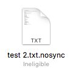

# iCloud怎么禁止某些文件或文件夹的同步

## 方法一：`.nosync`文件

这种方法只适用于文件夹。

iCloud中，如果不希望哪个文件夹被同步，只希望它在本地存在，那么就在文件夹里创建一个`.nosync`文件。iCloud就会把它从云上删除了。

为什么不希望同步某些文件？
场景如下：
- `.git`文件夹是你不需要同步的
- NodeJS里下载的模块是你不需要同步的

## 方法二：更改文件名`xxx.nosync`

这种方法适用于文件和文件夹。

直接把不希望同步的文件或文件夹名字改为`xxx.nosync`即可。比如文件名为`test.txt`，那么就改为`test.txt.nosync`。

但如果改的是文件的话，未免太不方便，因为扩展名改了，文件打开会很麻烦。
