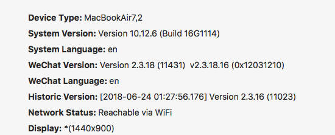
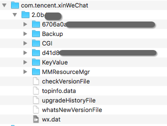
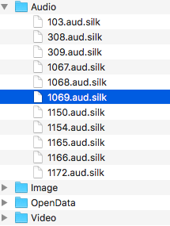

# Mac版微信的数据解析 [DRAFT]

## Mac版微信备份的存储位置

Mac 10.12 Sierra中Wechat版本如下：

这个环境下的存储位置为：`~/Library/Containers/com.tencent.xinWeChat/Data/Library/Application Support/com.tencent.xinWeChat`

打开后，子文件夹是一个类似wechat版本号的文件夹，下面包括每个账号的`Runtime文件夹`（名称类似UUID）。然后还有`Backup`文件夹，是保存我们手动从手机备份到PC的文件，其中`Backup.db`就是保存所有备份的结构信息数据库，文件比较小；而`BAK_0_MEDIA`是保存媒体数据的，包括图片语音等，所以文件比较大。

这个`Backup.db`，不是Sqlite数据库。有人说是`sqlcipher`数据库。

## 音频解析

[参考：从微信中提取语音文件，并转换成文字的全自动化解决方案](http://iosre.com/t/topic/3199)
[参考：微信语音文件的解析](https://zhuanlan.zhihu.com/p/21783890)

