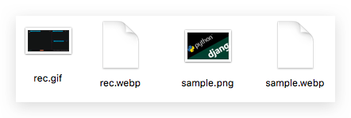

# ❖ 帮谷歌推广Webp图片格式之：Webp的格式转换

[参考谷歌官网：Webp: A new image format for the Web](https://developers.google.com/speed/webp/)

`Webp`是Google强推的新一代网络图片格式，特点就是：高质量压缩。
能压缩多少呢？5MB的原图，不降低效果，转换成webp格式后大小是几百KB。100KB的图，转换后是9KB。

虽然目前所有主流浏览器都支持这种图片格式，但不幸的是所有主流系统如Mac、Win等都还没有默认支持打开它的程序，更无法显示它的预览、缩略图。



如果想查看，最简单的方法是把`*.webp`文件的打开方式设定为Chrome等浏览器，双击打开在浏览器中查看。

还有很多时候我们需要对这种文件进行转换。

Google提供了一组工具集合，叫`libwebp`，其中包括各种webp相关转换的命令：
- cwebp -- 将其它图片转为webp格式图片 (不包括GIF)
- dwebp -- 将webp格式图片转为其它格式图片
- vwebp -- webp图片浏览器
- webpmux -- WebP muxing tool
- gif2webp -- 将GIF转换为webp图片

[下载安装参考官网：Downloading and Installing WebP](https://developers.google.com/speed/webp/download)

Ubuntu安装libweb库：
```sh
$ sudo apt-get install webp
```

Mac安装libwebp库：
```sh
$ brew install webp
```
注意：Homebrew安装的webp并不包括上面所有的工具，而只有`cwebp`和`dwebp`。

如果我们想要所有的工具，有两种方法：
- 到官网找到自己OS对应版本的二进制包，直接运行使用
- 自己编译

最简单就是到官网下载列表里找到自己的OS对应版本的二进制包，下载下来解压缩直接使用。
官方下载列表：https://storage.googleapis.com/downloads.webmproject.org/releases/webp/index.html

比如我的系统是Mac 10.12，那么就找到`libwebp-0.6.0-mac-10.12.tar.gz`这个压缩包下载：
```sh
cd /tmp
wget https://storage.googleapis.com/downloads.webmproject.org/releases/webp/libwebp-0.6.0-mac-10.12.tar.gz
tar xvzf libwebp-*.tar.gz
cd libweb-*
```
然后在`~/.zshrc`或`~/.bash_profile`中的PATH环境变量中加入刚才二进制文件包中的bin目录，或者直接设置alias，即可开始像别的命令开始用了。

如果没有自己所用系统的二进制包，那么就只能自己编译了。每种平台的编译方法不一样，需要按照官网方法一步一步安装。

[编译方法参考官方：Compiling the Utilities](https://developers.google.com/speed/webp/docs/compiling)


## 将各种图片转换为Webp格式

参考：https://developers.google.com/speed/webp/docs/cwebp

目前输入格式支持：png, jpg

```sh
$ cwebp INPUT.png -o OUTPUT.webp
```


## 将Webp图片转换为其它格式图片

参考：https://developers.google.com/speed/webp/docs/dwebp

```sh
$ dwebp INPUT.webp -o OUTPUT.png
```


## 将GIF转换为Webp格式

参考：https://developers.google.com/speed/webp/docs/gif2webp

```sh
$ gif2webp INPUT.gif -o OUTPUT.webp
```


## 浏览webp图片

这个命令不是在命令行终端里浏览图片，而是在桌面上弹出一个GUI窗口显示图片，所以需要依赖本地电脑的GUI桌面。

```sh
$ vwebp INPUT.webp
```
