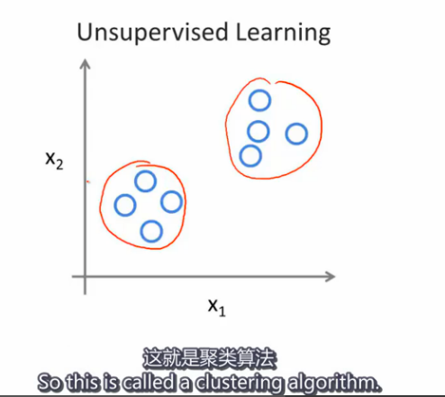

# Types of learning (ML) - Note on Andrew Ng's course

### `Supervised learning`
feeding algorithm data with right answers, so it can predict more accurately.

To be more terminology, it’s also called `REGRESSION`: Predict continues value output.
 
### `CLASSIFICATION`
Depends on each result of the features comparison. A classification could have infinite features for comparing.

### `FEATURES`
A simple question for the data, like is it red or blue? Is its size ranged in large or small? It always falls into a simple output, 0 or 1, or 2,3,4 etc.

### `REGRESSION` problem VS. `CLASSIFICATION` problem?
?

### `UNSUPERVISED LEARNING`
giving an unsupervised algorithm a bunch of data without any label, for instance it don’t know it’s right answer or wrong, but let the machine itself to decide what’s the pattern in it. Simple one is, a CLUSTERING ALGORITHM can help to seperate data set to different clusters, group them, label them.



## Example of `Clustering Algorithm`
`Google News page`, it recognises all similar news and gather to a story board.

Other examples like genes, marketing, social networks etc., also could be having high demands on `CLUSTERING ALGORITHM`, aka `UNSUPERVISED LEARNING ALGORITHM`.

### `Octave`
a programming language, an alternative to Matlab. Aiming to build a Machine Learning prototype in a few lines of code. Highly recommended by Andrew Ng.

