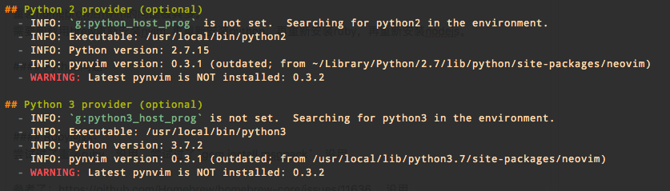
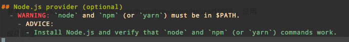
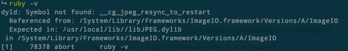

# Mac开发环境之：不要乱删Homebrew [DRAFT]

删除Homebrew之痛:
删除Homebrew后，所有用brew安装过的软件都没了！而且众多依赖插件也都要在brew重新安装对应软件后才能使用。

比如：
- vim回到了7.4，重新用安装vim8可以，但是要手动把vim8的路径加到PATH。
- pip2, pip3, python3都要重装。
- 依赖python的应用，也都需要重新安装，因为找不到python具体位置（可能版本号变了）
- nvim的checkHealth不通过，很多插件失效。
- tmux重装了竟然启动不了，原因是reattach-to-user-namespace插件也要用homebrew安装才行。

## nvim的一系列问题

重装homebrew后nvim的问题极其多。
需要卸载用brew重新安装nvim. 再重新安装python，再重新安装ruby，再重新安装nodejs。

### Python问题：



解决方法：
```sh
pip2 install pynvim --upgrade
pip3 install pynvim --upgrade
```

### Ruby问题：
尝试过了重装ruby，没用。尝试过了`gem install msgpack`，没用。

参考了：https://github.com/Homebrew/homebrew-core/issues/11636 。没用

成功过程：
```sh
brew doctor

# 然后解决所有问题
#...

brew reinstall ruby
brew reinstall neovim
brew link --overwrite link neovim
gem install msgpack
gem install neovim
```
成功。


### Node.js问题


解决方案就是：
```sh
brew install nodejs
npm install -g npm
npm install -g neovim
```


## dyld: Symbol not found: __cg_jpeg_resync_to_restart

从Homebrew安装的Vim8和ruby等(其它的没问题)，无论使用哪个，都会弹出这个错误：
```
dyld: Symbol not found: __cg_jpeg_resync_to_restart
  Referenced from: /System/Library/Frameworks/ImageIO.framework/Versions/A/ImageIO
  Expected in: /usr/local/lib//libJPEG.dylib
 in /System/Library/Frameworks/ImageIO.framework/Versions/A/ImageIO
```



解决方法是，参考：https://stackoverflow.com/questions/35509731/dyld-symbol-not-found-cg-jpeg-resync-to-restart
```sh
cd /System/Library/Frameworks/ImageIO.framework/Versions/A/Resources
sudo ln -sf libJPEG.dylib /usr/local/lib/libJPEG.dylib
sudo ln -sf libPng.dylib /usr/local/lib/libPng.dylib
sudo ln -sf libTIFF.dylib /usr/local/lib/libTIFF.dylib
sudo ln -sf libGIF.dylib /usr/local/lib/libGIF.dylib
```
然后再打开vim和ruby就修复了。
