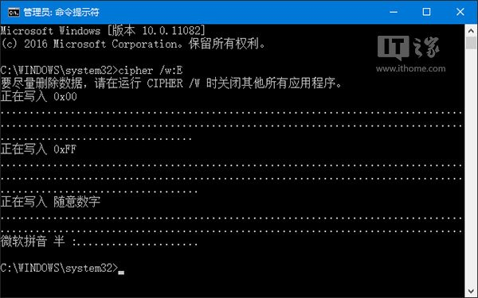

# Windows磁盘擦写 彻底清除数据残留

一般不用安装软件，直接有内置的程序可以做到。

打开CMD，执行命令：
```cmd
cd C:\Windows\System32
cipher /w:C
```
其中`/w:C`指清理C盘空间，不会影响硬盘上的存在的数据，只会各种擦写曾经删除过的文件。

参考：https://www.ithome.com/html/win10/198182.htm



