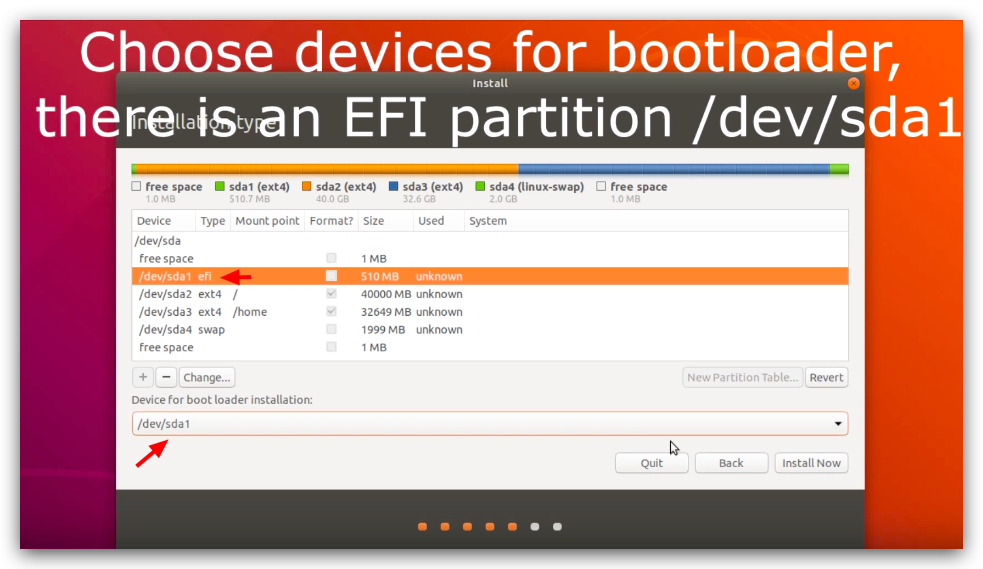

# 蜗牛星际安装Ubuntu指南

蜗牛星际的CPU是：Intel J1900
主板是带有UEFI的。

分区时候要先创建EFI分区，然后才是`/`等其它分区。

然后`启动选择`上，必须要选EFI类型的分区：

- 必须要插着网线：因为系统镜像中有很多缺失文件需要在线获取，否则安装会不成功
- 最好是Ubuntu18.04及以上版本，要不然老版本系统里记录的用来下载系统缺失文件的网址链接都太旧了会下载不到。

主要讲解分这几大大步：硬盘的选择、操作系统的选择、BIOS设置、制作系统安装U盘、安装Ubuntu操作系统

## 硬盘的选择

蜗牛星际自带16GB的MSATA固态硬盘，即像内存卡一样插在主板上的小“芯片固态硬盘”。
虽然可以在主板的SATA口直接连上自己的大存储硬盘来装系统，但是作为24小时运行的小服务器，没必要大动干戈。就把Linux系统装在上面就足够了。

## 操作系统的选择

一般人会选择在蜗牛星际上装群晖系统，但其实用了后就发现，功能太受限了。还不如自己装一个完整的Linux系统，什么功能和定制都自己来（需要对Linux系统有一定了解）。

因为我比较喜欢直接在完整的Ubuntu上玩耍，所以决定在MSATA这个16GB硬盘上安装Ubuntu，然后在另一块接出来的固态硬盘上装Windows（以备不时之需）。

Win+Linux 双系统肯定是最明智的选择，问题是：
- 选择两个系统放在一块硬盘上？
- 还是两个系统分别放在两块硬盘上？

我的答案是：两块硬盘，各自放一个系统。

这样一来，他们互相隔离，互不干扰，对以后对维护是非常方便的。

因为Linux体积小，所以选择直接放在MSATA固态硬盘上；
而Windows要求比较高体积比较大，所以放在大容量的硬盘上。

## BIOS设置
蜗牛星际的BIOS是有UEFI功能的。

`OS Selection`最好选`Windows 7`。这样Linux也能启动。

## 制作系统安装U盘

推荐在Windows上用`Rufus`来制作`系统U盘`，因为可以有很多高级选项，比如UEFI特制版的系统U盘。
在Mac的Etcher上就没有这些高级设置功能。

## 安装Ubuntu

[参考：How to Install Ubuntu 18.04 LTS / 18.10 UEFI Mode (2019)](https://www.youtube.com/watch?v=BwXRtJ6eC7I)

其中最重要的一步就是硬盘分区和启动位置的选择。

硬盘分区一定要先分出一块的EFI类型分区，大小设置为512MB就好。然后在启动位置上，也一定要选这个EFI分区才行。**否则系统安装完后，打开电脑会发现一直在黑屏状态，进不去系统。**

### 关于网络的问题

如果选择来`LiveCD`版本，因为是"live"，就意味着必须要联网，所以这个版本体积才会这么小。
如果不想要联网下载，那么就用`Standard`版本，这样的话ISO镜像里就包括了所有必须的文件，完全无需联网下载。

