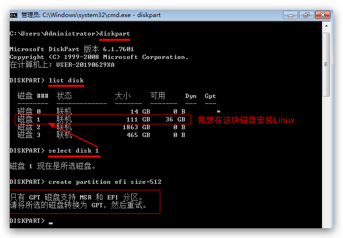
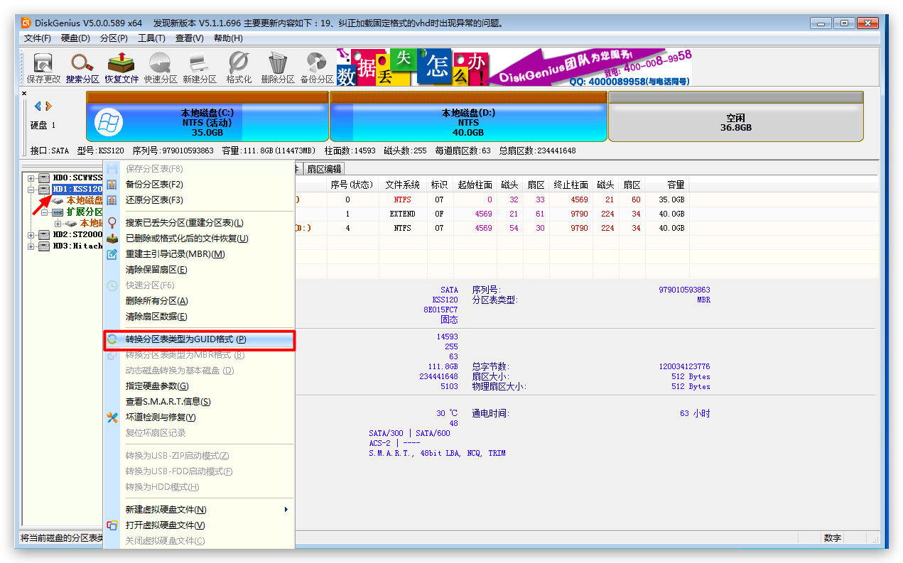
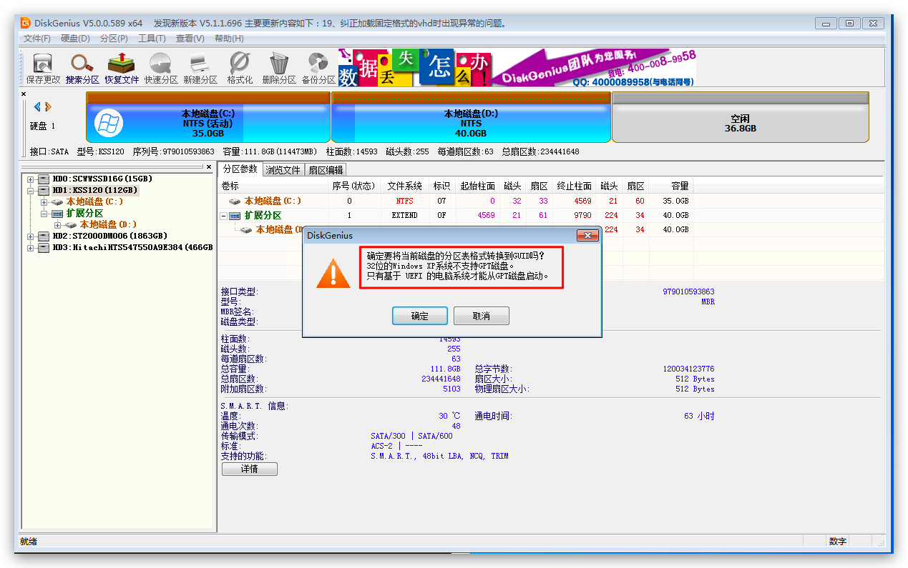

# 在UEFI主板上的单硬盘安装Win+Linux双系统

如果主板是UEFI的，实际上很难不用UEFI安装系统。

安装Linux必须要先准备一个单独的`EFI`格式分区才行。
如果是使用Ubuntu桌面系统，那么在安装的时候就能创建。
如果是使用`Ubuntu Server`，那么就没有GUI安装界面，只有终端安装界面，且没法创建EFI分区。
那么这时候就可以先切进windows系统，在CMD终端里，用`diskpart`命令创建EFI分区：
```cmd

```

但是报错，说必须把磁盘转换为GPT格式才能创建EFI分区。




于是用DiskGenius来转换整块磁盘的格式为GPT。注意后果：
- Windows系统启动失败
- 2

右键点击需要安装Linux的磁盘，然后选转换为GUID格式:


然后会弹出提示：


转换后，立马蓝屏，然后重启后系统也进不去了。因为启动方式不对了。

### 用DiskGenius直接创建EFI分区

DiskGenius支持直接创建EFI分区，非常方便。
在磁盘的第一个位置，比如C盘之前，创建一个`EFI System Partition`格式分区。

注意创建EFI分区之后再安装系统的话，比如Ghost安装系统，启动磁盘选择上就不能选择存放Windows系统的位置了（比如C盘），而是选择EFI分区的位置（比如H盘）。
