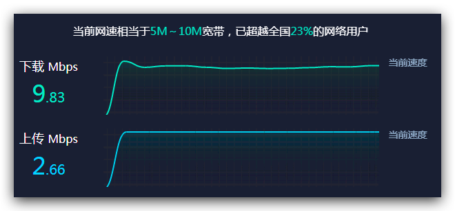
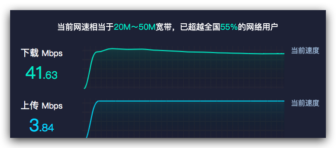
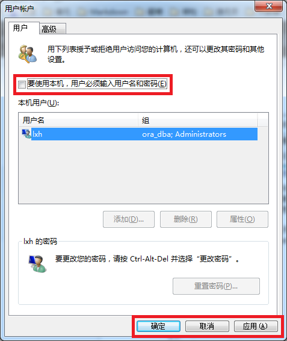

# 家庭Windows-NAS指南

## 解决噪音问题

- ~换机箱风扇~
    - 没有解决问题，依然吵
- ~换电源或电源风扇~
    - 不能保证绝对安静
- ✅ (终极解决方案) **把整个主机扔到厨房、阳台、仓库或任何听不到声音的地方。**

## 解决WiFi信号增强问题

既然决定把服务器扔到别的地方，就要解决WiFi问题。网线直连肯定不考虑，因为会很远。

解决方案：
- ~多个路由器桥接~
    - 桥接本身的配置复杂，为了跨网段访问的配置就更是tricky
- ✅ 买个小米WiFi信号增强器
    - 本质上也是路由桥接
    - 省去了很多麻烦配置
    - 默认在同一网段，方便ssh或远程桌面。即使WiFi不同名，也会出现在同一网段中
    - （重要）**一定不能设置roaming！即与主路由同名，这样会出现全网速度都受影响。要设置新名字，让服务器单独连接这个名字，不影响其它人。**

## 测网速

即使是在家里局域网进行远程桌面访问，速度也有可能受限制，比如用远程桌面连接时候可以感受到明显的延迟、卡顿。所以一定要确保局域网内两台机器相连的网速。一方面是WiFi连接的速度，另一方面是互联网的速度。

查看与WiFi连接的速度：
- <Win-r> 打开运行
- 打开cmd
- 输入命令：`netsh show wlan interface`

查看连接互联网的速度：
- 通过远程登录服务器，在百度里随便搜一个网页测速工具，测出上传下载速度
- 在host主机上进行同样的测速
- 对比主机的网速，和服务器的网速
- 如果服务器的网速慢很多，那么就说明：即使服务器与它附近的WiFi增强器连接满格，但是增强器与主路由的连接依然有很大损耗。

比如：

NAS服务器网速：

Host主机网速：

可以看到服务器的网速和主机差一个量级。即使是同一个局域网，竟然有这么大差距，这就是WiFi的损耗。

## Windows设置自动登录
为什么？
- 因为如果不是自动登录，那么系统没完全加载前，无线网模块很难完全运行，很有可能影响联网，也就影响了远程登录
- 即使本机不需要密码登录，远程还是需要密码登录

参考：https://blog.csdn.net/liuxinghao/article/details/41675377

- 打开`运行`
- 输入`control userpasswords2` 打开用户控制
- 取消`用户密码登录`
- 点击确定
- 输入自动登录的账户和密码
- 完成。

