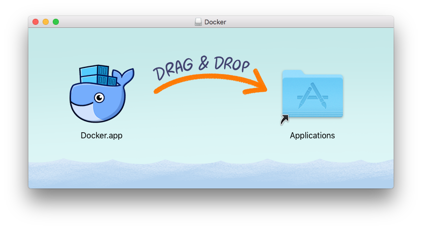
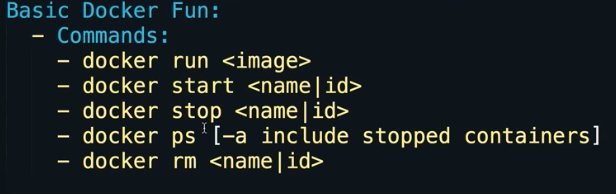
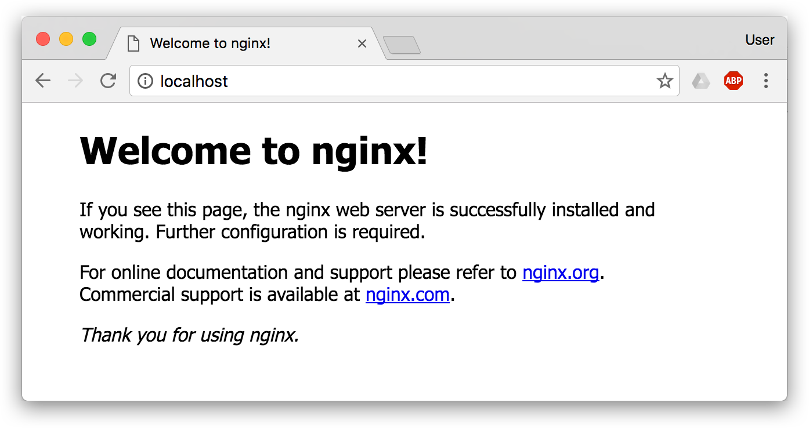

# ❖ 进入「docker」的世界 [DRAFT]

> 最近学习Machine Learning发现好多人都用docker，之前一直听说但是感觉和自己无关。但是现在发现原来docker是个这么方便的东西，可以跨平台（不分什么版本的linux，甚至mac和windows也行）运行。所以这里开一篇来记录学习感受。

[参考：Docker 完全指南](https://wdxtub.com/2017/05/01/docker-guide/)
[参考: Gitbook - Docker — 从入门到实践](https://yeasy.gitbooks.io/docker_practice/content/)

不提那些难懂的术语，大白话就是：
**一个Docker就是一个Linux的Live CD系统，跟USB系统一样，有完整的系统文件目录和程序。**

我们可以在这个与外界隔离的便携系统里随便读写操作，只是每次进入它时候，都会恢复最开始的样子，像什么事都没发生一样。
我们可以像定制Live CD或WinPE一样，定制这个小系统里面默认装什么软件。一旦定制好了，就是不可更改的，非常稳定。

## 理解Docker的逻辑

一开始发现很乱很难理解，觉得所有人都把它说的太复杂了。直到后来发现，其实它的运行逻辑很简单。
实际上，可以把Docker看成是给电脑安装Linux系统时的`Live CD`，或者是给Windows用USB安装系统时的`WinPE`。这样会方便理解一点。

> 回想下自己在给PC或是虚拟机上安装Linux系统时，都会有个Live CD选项。也是就是你可以什么都不安装，直接进入系统，所有的工具都能用，所有的软件都能安装，所有的配置也可以改。只不过你重启过后，一切修改的地方都恢复原样了。

每篇攻略都会提到这三个基本概念：
- `镜像 Image`
相当于一个系统光盘的ISO镜像文件，是只读的。你可以直接进入image中各种操作没有障碍，感觉就像进入_Live CD_系统了。只是所有操作都会在退出时消失，下次进image时候还是初始的样子。
- `容器 Container`
就像给"ISO文件"加了一层可读写的外衣，所有的变动都会保存在`Container`里，而image还是image，不会变。就像你可以随便换衣服，但是身体不会变。
- `仓库 Repo`
一般指的`Dockerhub`，就是一个像Github的网站，只不过不是收集代码，而是收集各种image镜像。你可以随意上传下载各大厂商或个人制作的镜像。


## 安装Docker

> Docker分CE和EE两个版本，一个社区公开免费，一个商业付费。

[参考官方：About Docker CE](https://docs.docker.com/install/)

### Ubuntu上安装Docker

[参考官方安装步骤：Get Docker CE for Ubuntu](https://docs.docker.com/install/linux/docker-ce/ubuntu/#install-docker-ce)

准备工作：
```sh
#安装SSL相关，让apt通过HTTPS下载：
sudo apt-get install apt-transport-https ca-certificates curl software-properties-common
# 添加docker的GPG key
curl -fsSL https://download.docker.com/linux/ubuntu/gpg | sudo apt-key add -
#检查key是否相符（9DC8 5822 9FC7 DD38 854A  E2D8 8D81 803C 0EBF CD88）
sudo apt-key fingerprint 0EBFCD88

#添加docker的apt下载源
sudo add-apt-repository  "deb [arch=amd64] https://download.docker.com/linux/ubuntu $(lsb_release -cs) stable"

#更新源
sudo apt-get update
```


安装docker：
```sh
$ sudo apt-get install docker-ce
```


卸载Docker：
```sh
$ sudo apt-get remove docker docker-engine docker.io
```

### Mac上安装Docker
直接下载app：




### 树莓派上安装Docker

> 树莓派是基于ARM架构的，和PC不同。所以即使树莓派上能做一些docker镜像，也不能在别的PC上运行。反过来别的PC上的docker镜像，也不能在树莓派上运行。
如果需要找树莓派专用的镜像，那就在`Dockerhub`上搜索`ARM`或`Rpi`相关就能找到了。
有一个叫[`Hypriot`](https://hub.docker.com/u/hypriot/)的仓库制作了非常多树莓派专用docker，可以参考下。

树莓派安装Docker，最难的在于正确的选择源和添加GPG-key，才能找到版本适合的docker并下载。这个过程是非常繁琐且很难有统一方案的。
另外：官方的一键安装版本已经失效了。必须手动操作。

[参考另一篇笔记：树莓派安装Docker](https://github.com/solomonxie/solomonxie.github.io/issues/27#issuecomment-422244201)


## 运行Docker




从Image镜像创建一个Container容器：
```sh
# 新建一个Container容器（如果本地有image则直接从它创建，如果没有则从网上下载）
# 进入docke的shell -t，即进入虚拟的一个系统，有自己的/root文件系统结构

$ docker run -it <repo>:<tag> <CMD>

#如：
$ docker run -it jekyll/jekyll:latest bash

# 为container指定名称（而不是只用ID来引用）
$ docker run -it --name <NAME> <image-ID>
```

查看已有的：
```sh
# 查看已有的images
$ docker images

# 查看已创建的containers
$ docker container ls -a
```

运行一个已有的Container：
```sh
# 先启动container
$ docker container <ID> start

# 运行（挂载）container，挂载后自动进入容器里的shell
$ docker attach <ID>

# 或者一句话完成(--attach)
$ docker start -a<ID> 
```

删除已有的：
```sh
# 删除image
$ docker rm <Image-ID>

# 删除container
$ docker rm <Container-ID>
```

## 无需sudo执行docker

为了每次执行`docker`不需要总是输入`sudo`，我们需要为docker创建一个用户组，并授予权限才行：
```sh
# 创建docker用户组
sudo groupadd docker

# 把当前用户加入到docker用户组
sudo gpasswd -a $USER docker

# 更新当前用户组变动（就不用退出并重新登录了）
newgrp docker
```


## 挂载Host主机上的文件夹

> 我们肯定不会满足于docker只访问自己的小世界里的文件系统（什么数据都没有），所以有必要让它能访问外界Host主机上的一些文件夹。比如我有一个docker是作为下载机用的，那么我肯定得让它把下载好的东西存到我的主机上，要不然就白下载了。

[参考：Docker学习---挂载本地目录](https://my.oschina.net/piorcn/blog/324202)

挂载文件夹是在docker运行镜像的命令里就指定的(利用-v参数)：
```sh
$ docker run -it -v <HOST-PATH>:<DOCKER-PATH> ubuntu64 /bin/bash

#或者作为只读挂载 (:ro)
$ docker run -it -v <HOST-PATH>:<DOCKER-PATH>:ro ubuntu64 /bin/bash
```

注意，挂载的双方都必须是绝对路径。


## 映射Docker里的端口到Host主机上的端口

> 如果Docker里运行的是Web服务比如Nginx，里面有一个网站，那你必须得把”虚拟机“里的端口映射到外部才能正常看到网页。

映射是在运行docker命令时指定的，比如把**里面**的80端口映射到**外面**的8888端口，命令如下：
```sh
$ docker run --name webserver -d -p 80:8888 nginx
```

然后你在主机上的浏览器访问`http://localhost:8888`，就可以看到nginx里的网页了。



## Docker镜像保存更改

> 直接在镜像上改动的内容，会在退出时全部消失。但是我们经常需要把这些变动保存下来。

Docker保存这些变动的机制就是——生成另一个只读镜像。(-_-!)

虽然正常看来，这不太好吧。但实际上，这很好！
Docker镜像实际上是非常小的，所以生成另一个镜像也没有多费事。而且这种机制保证了每个镜像的不可随便修改的性质，这一点就极大的避免了混乱。

Docker保存更改有两种方式：
- `docker commit`：就像`git commit`一样，把每次改动作为一个commit提交，可以追溯历史
- `Dockerfile`：这是从头build构建一个镜像的配置文件，把你想改动的地方（如安装一个程序）写成一句bash命令，加到`Dockerfile`这个文件里，它就会按照你的要求执行所有的命令，然后生成一个新的镜像。

Commit可以追溯历史，但是变动了哪些地方是对外界**黑箱**的。
Dockerfile确实明明白白写清楚有哪些改变。

所以一般情况下，正式构建一个镜像，都是用Dockerfile的。


### "docker commit" 将变动过的Container保存为镜像

[参考：利用 commit 理解镜像构成](https://yeasy.gitbooks.io/docker_practice/image/commit.html)

`docker commit`命令，可以将容器的存储层保存下来成为镜像。换句话说，就是在原有镜像的基础上，再叠加上容器的存储层，并构成新的镜像。以后我们运行这个新镜像的时候，就会拥有原有容器最后的文件变化。


慎用`docker commit`:
> 由于命令的执行，还有很多文件被改动或添加了。这还仅仅是最简单的操作，如果是安装软件包、编译构建，那会有大量的无关内容被添加进来，如果不小心清理，将会导致镜像极为臃肿。
此外，使用 docker commit 意味着所有对镜像的操作都是黑箱操作，生成的镜像也被称为黑箱镜像，换句话说，就是除了制作镜像的人知道执行过什么命令、怎么生成的镜像，别人根本无从得知。而且，即使是这个制作镜像的人，过一段时间后也无法记清具体在操作的。虽然 docker diff 或许可以告诉得到一些线索，但是远远不到可以确保生成一致镜像的地步。这种黑箱镜像的维护工作是非常痛苦的。
而且，回顾之前提及的镜像所使用的分层存储的概念，除当前层外，之前的每一层都是不会发生改变的，换句话说，任何修改的结果仅仅是在当前层进行标记、添加、修改，而不会改动上一层。如果使用 docker commit 制作镜像，以及后期修改的话，每一次修改都会让镜像更加臃肿一次，所删除的上一层的东西并不会丢失，会一直如影随形的跟着这个镜像，即使根本无法访问到。这会让镜像更加臃肿。


### 「Dockerfile」 构建定制镜像的配置文件


