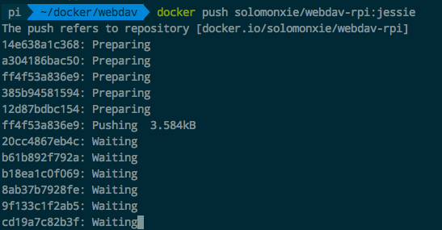
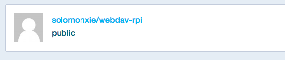

# Docker 创建镜像全程 [DRAFT]

## Dockerfile 编写镜像


## Docker build 生成镜像


## Docker push 提交镜像

必须要在本地的镜像名称规范化后才能提交，否则会被denied.
规范的镜像名称应该是：`<用户名>/<镜像名>:<Tag>`，比如`solomonxie/webdav-rpi:jessie`
如果创建时候没有规范，还可以用`docker tag`命令改：
```sh
$ docker tag <原镜像名> <用户名>/<新镜像名>:<Tag>
```

完成后，就可以准备登录提交了：
```sh
# 进入互动，输入用户密码后即可登录
$ docker login

# 提交镜像
$ docker push <用户名>/<镜像名>:<Tag>
```
然后就等待它慢慢上传就好了：


最后还可以在自己的`hub.docker.io`空间中查看这个镜像，然后填写相关的说明。



