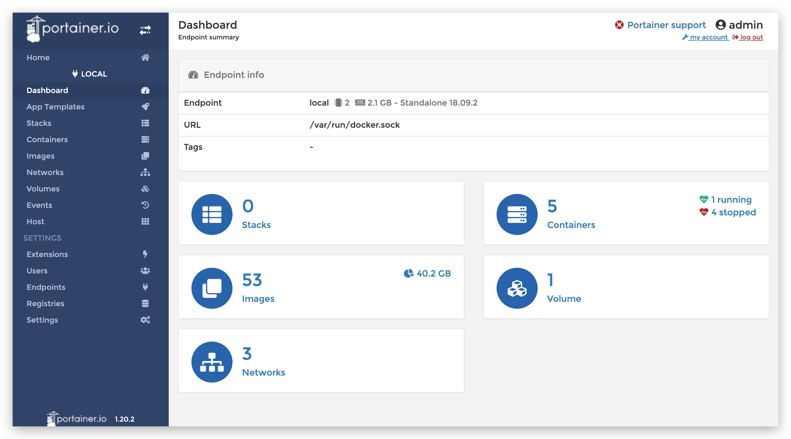

# Portainer: 极其便利的Docker管理GUI [DRAFT]

Official: https://www.portainer.io/

一切只需要：
```sh
$ docker volume create portainer_data
$ docker run -d -p 9000:9000 -v /var/run/docker.sock:/var/run/docker.sock -v portainer_data:/data portainer/portainer
```




