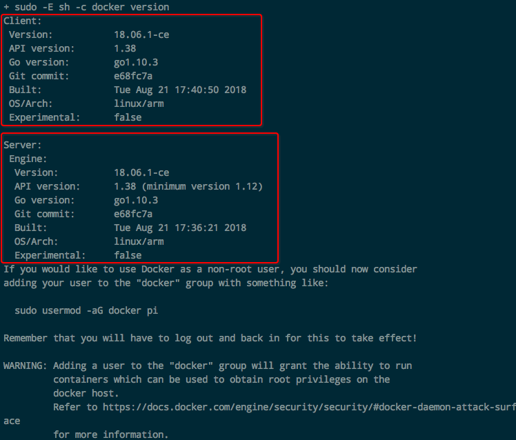
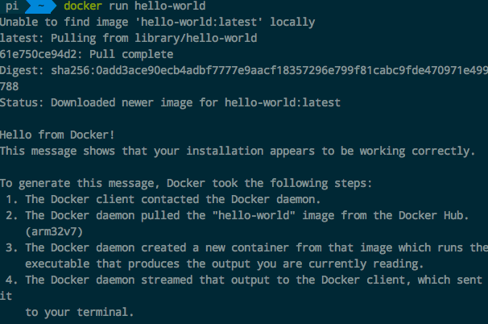
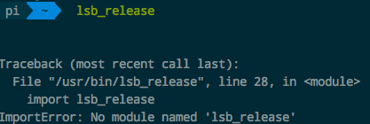
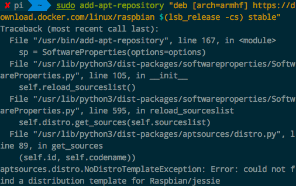

# ❖ 树莓派安装Docker

> 因为树莓派是ARM架构的，所以Docker的安装和使用也都有不同。需要讲的内容比较多，这里单挑出来。

树莓派是基于ARM架构的，和PC不同。所以即使树莓派上能做一些docker镜像，也不能在别的PC上运行。反过来别的PC上的docker镜像，也不能在树莓派上运行。
如果需要找树莓派专用的镜像，那就在`Dockerhub`上搜索`ARM`或`Rpi`相关就能找到了。
有一个叫[`Hypriot`](https://hub.docker.com/u/hypriot/)的仓库制作了非常多树莓派专用docker，可以参考下。

[树莓派参考：Get Docker CE for Debian](https://docs.docker.com/install/linux/docker-ce/debian/#os-requirements)
[参考：My home server powered by Pi and Docker](https://jordancrawford.kiwi/rpi-home-server/)

> 树莓派安装Docker，最难的在于正确的选择源和添加GPG-key，才能找到版本适合的docker并下载。这个过程是非常繁琐且很难有统一方案的。


## 官方版一键安装脚本
> 注意：官方的一键安装脚本很多人说不再支持了。但是目前位置，其实还是能支持的。

[参考：The easy way to set up Docker on a Raspberry Pi](https://medium.freecodecamp.org/the-easy-way-to-set-up-docker-on-a-raspberry-pi-7d24ced073ef)

开始执行之前，先说明：我之前很多次都不成功，找了很多相关解决方案都不行。直到。。。
直到我先`sudo apt-get update`并且最最最重要的是`sudo apt-get upgrade`，之后才行。
其实在upgrade时候就能看到，更新了很多系统依赖包，这也就解决了之前docker安装不成功的一切毛病了。

upgrade完成后，就开始正式安装了：

需要用到一个shell脚本，`get.docker.com`，整个网站就这一个脚本。下载并执行：
```sh
$ curl -fsSL get.docker.com -o get-docker.sh && sh get-docker.sh
```

完成后，会显示：


然后运行hello world试试：
```
$ sudo docker run hello-world
```
然后显示：



## 手动安装

准备工作：
```sh
#安装SSL相关，让apt通过HTTPS下载：
sudo apt-get install apt-transport-https ca-certificates curl gnupg2 software-properties-common

# 添加docker的GPG key
curl -fsSL https://download.docker.com/linux/debian/gpg | sudo apt-key add -
#检查key是否相符（9DC8 5822 9FC7 DD38 854A E2D8 8D81 803C 0EBF CD88）
sudo apt-key fingerprint 0EBFCD88

#添加docker的apt下载源
sudo echo "\ndeb-src [arch=amd64] https://download.docker.com/linux/debian wheezy stable\n" >> /etc/apt/sources.list

#更新源
sudo apt-get update
```


安装docker：
```sh
$ sudo apt-get install docker-ce
```


## 无需sudo执行docker

为了每次执行`docker`不需要总是输入`sudo`，我们需要为docker创建一个用户组，并授予权限才行：
```sh
# 创建docker用户组
sudo groupadd docker

# 把当前用户加入到docker用户组
sudo gpasswd -a $USER docker

# 更新当前用户组变动（就不用退出并重新登录了）
newgrp docker
```

## 安装docker-compose
可以通过把`docker compose`当作一个docker的container下载并运行：
```sh
docker run \
    -v /var/run/docker.sock:/var/run/docker.sock \
    -v "$PWD:/rootfs/$PWD" \
    -w="/rootfs/$PWD" \
    docker/compose:1.13.0 up

# 设置alias快捷键(`~/.zshrc`或`~/.bash_profile`)
alias docker-compose="'"'docker run \
    -v /var/run/docker.sock:/var/run/docker.sock \
    -v "$PWD:/rootfs/$PWD" \
    -w="/rootfs/$PWD" \
    docker/compose:1.13.0'"'"
```


## 常见错误问题


### `Python: No module name lsb_release`



先检查本机是否已经安装了`lsb_release`，或者重新安装一遍：
```sh
$ sudo apt-get install lsb-release
```

如果还是这个问题，那么就检查Python版本。如果是python3，那么很可能是版本不够，因为lsb_release需要最少python3.5。
解决这个问题，就把默认python设置回python2就好了。就是个ln建立快捷方式都事：
```sh
# 备份（python具体的位置根据自己情况定）
$ sudo mv /usr/bin/python /usr/bin/python_bak

# 更换
$ sudo ln -s /usr/bin/python2.7 /usr/bin/python
```

然后再试一下`$ lsb_release -cs`看看有没有显示`jessie`


### `无法添加源 add-apt-repository 报错找不到相关源`




