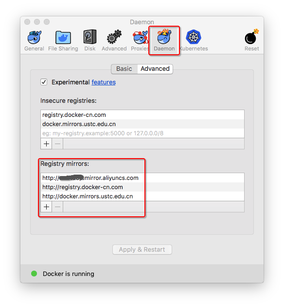
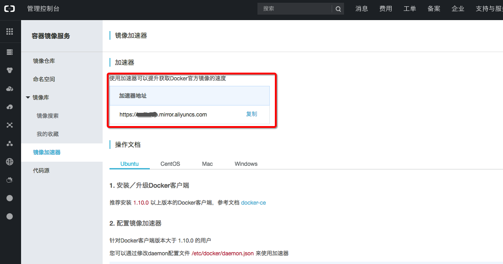

# Docker中国源
> Docker很多镜像动不动就1G或几百M，官方经常掉线。所以只能换国内源。


国内的镜像源有
- docker官方中国区 `https://registry.docker-cn.com`
- 网易 `http://hub-mirror.c.163.com`
- ustc `http://docker.mirrors.ustc.edu.cn`
- 阿里云 `http://<你的ID>.mirror.aliyuncs.com`

注意`registry-mirrors`千万不要用`https`，而是用`http`，否则会显示`No certs for egitstry.docker.com`，
`insecure-registries`不要任何`http`头，否则无法通过。

通用的方法就是编辑`/etc/docker/daemon.json`：
```json
{
  "registry-mirrors" : [
    "http://ovfftd6p.mirror.aliyuncs.com",
    "http://registry.docker-cn.com",
    "http://docker.mirrors.ustc.edu.cn",
    "http://hub-mirror.c.163.com"
  ],
  "insecure-registries" : [
    "registry.docker-cn.com",
    "docker.mirrors.ustc.edu.cn"
  ],
  "debug" : true,
  "experimental" : true
}
```

然后重启docker的daemon即可。




阿里源需要用自己的账号登录阿里云后台获得只有自己有的源地址，如下：



阿里源地址为：https://cr.console.aliyun.com/cn-qingdao/mirrors


