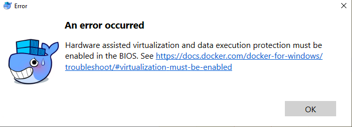

# Docker for Windows

用了两三天才把Docker在Windows上搞定。
首先：必须要Windows10最新版（2018以上）才行。最好不要用网上Ghost版本的镜像，因为即使是最新编的镜像也是用的老版本win10，更新时间还是花了我12小时以上还没更新完。索性直接到官网下载正式安装版。

- ISO安装方法就是，直接把iso文件拷贝到“老毛桃”U盘里，在WinPE系统中执行安装。
- 装好后，打开系统设置 -> 系统更新 -> 开发者选项 -> 开启开发者模式
- 打开控制面板 -> 程序 -> windows功能 -> 勾选开启`适用于Linux的子系统` (Windows Subsystem For Linux)和`Hpyer-V`和`Hypervisor`三项
- 打开Windows应用商店 -> 搜索Ubuntu -> 安装Ubuntu 16.04或喜欢的Linux系统
- 到Docker官网 -> 登录 -> 下载Docker for windows (500MB)
- 安装Docker -> 重启 -> 进入BIOS -> 开启Virtualization虚拟化相关的选项
- 进入系统 -> 打开桌面上的Docker应用（Daemon）-> 打开Ubuntu系统终端 -> 尝试Docker


[参考：Get started with Docker for Windows](https://docs.docker.com/docker-for-windows/)
[参考：Logs and troubleshooting](https://docs.docker.com/docker-for-windows/troubleshoot/)


## 提示错误：Hardware assisted virtualization and data execution protection must be enabled in the BIOS

[参考：Docker for Windows error: “Hardware assisted virtualization and data execution protection must be enabled in the BIOS” ](https://stackoverflow.com/questions/39684974/docker-for-windows-error-hardware-assisted-virtualization-and-data-execution-p)



用管理员权限打开Powershell，输入命令：
```powershell
# 开启Hyper-V
dism.exe /Online /Enable-Feature:Microsoft-Hyper-V /All
bcdedit /set hypervisorlaunchtype auto
```
重启。

如果还没用，就到控制面板`WIndows功能`里，取消HypyerV等，重启。然后再选中，然后再重新安装，再重启。

如果再再没用，那就是时候考虑放弃了（电脑太老了可能），然后使用Virtualbox方案——安装Docker toolbox。

