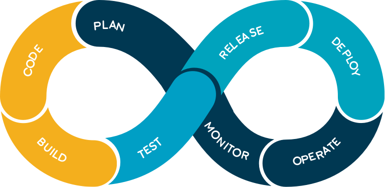
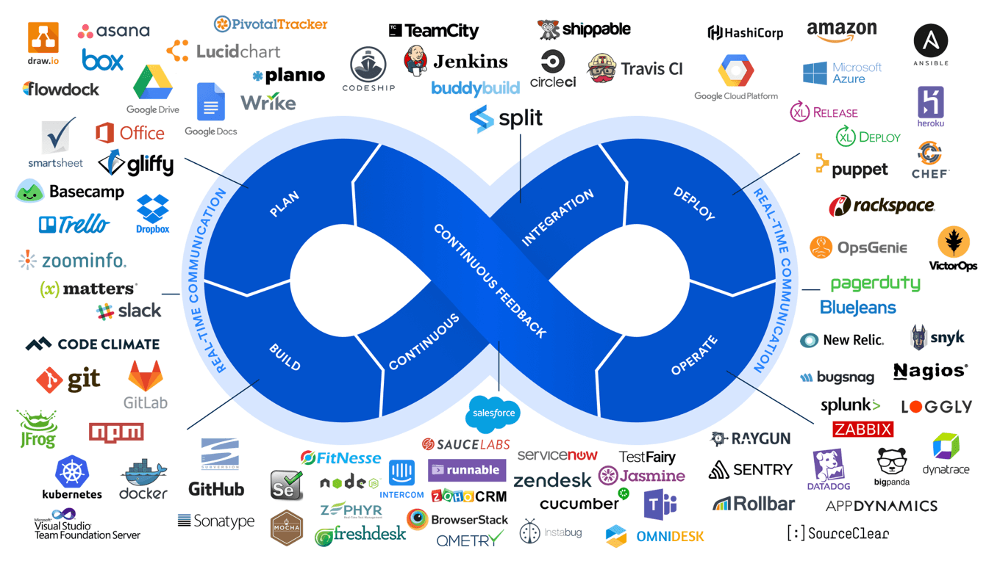

# ❖ 理解DevOps [DRAFT]

`DevOps`是个近些年的新词，它是一个职位，而不是一个的技术。
可以直接从字面上理解：把实现功能写代码的Developer开发人员和运维部署应用的Operations运维人员和在一起的职位。

> DevOps is the **NEW** Dev. 

也就是说，既然Ops部署上线一类的完成了自动化，Dev开发者就可以独自承担一个完整的上线流程了。这样的话好处在于，Dev了解自己刚刚写的代码也了解自己管理的功能模块，所以参与整个上线流程会非常顺手，出了问题也能很快找到问题源头。

## 为什么需要DevOps

要说DevOps，就不能不提把他推上高位的源头：微服务 Microservices。

微服务，或SOA，或PaaS，简而言之就是把原本的Monolithic单体化应用(百万代码量)拆分成成百上千的细分小功能应用。
用Git语言理解，就是把一个大Repo拆分成很多个小Repo。
用编程语言理解，就相当于函数式编程理念：把一个1000行代码的fucntion拆分成几十个专注单一功能的小function。

这样的细分虽然利用构建健壮可扩展性的应用，但相对的维护这些细粒模块的管理成本就上来了。
原本手动在命令行里敲命令来部署维护一个大应用，是没问题的。
但是让你手敲命令去部署几百个应用？开玩笑！

这就催生了DevOps，让重复的东西自动化，让电脑自己部署。

## DevOps Toolchains 新的工作流程

[参考Wiki： Toolchains - DevOps](https://www.wikiwand.com/en/DevOps)

以往的Dev，只要负责写代码就好了。剩下的QA、部署、上线、监控全都有别人来管。
但现在变身DevOps就不同了，需要负责一整个链条。具体如下：
- `Coding` – 代码开发，代码审核, Git版本管理，Git分支Merge管理
- `Building` – CI持续集成
- `Testing` – 保证所有测试通过
- `Packaging` – artifact repository, application pre-deployment staging
- `Releasing` – 部署上线
- `Configuring` – 架构配置，`Infrastructure as Code`管理
- `Monitoring` – 应用性能监控，终端用户体验

## 什么是CI/CD & CD

### DevOps Pipeline Circle

三大步骤：
- Continuous Integration: 将个人代码集成到项目并测试
- Continuous Delivery: 将feature分支进行自动测试
- Continuous Deployment: 将feature分支部署到master分支

### 理解持续集成CI

> 如果懂Git，所谓的CI就非常容易理解了。

用Git的语言来说，所谓的`集成`就是把feature分支merge到master分支上。一旦完成merge，就算完成集成。也就是把你新开发的一个小功能或小改动，集成到整个应用上。

要完成这个集成，就要运行一系列的测试，比如单元测试、功能测试、性能测试等。
一旦所有测试通过，就算集成完成。如果哪个测试失败了，那么就要再回去继续改代码。
在每次push的时候自动触发这一系列的测试并返回结果，这就叫`持续集成`。

每次改完代码，提交commits，然后push到remote远程主机，就会触发这个CI测试。只要测试完成，就意味着可以集成了，用git的语言说，就是可以merge到master分支了。
一旦merge到master分支，就意味着完成了集成。

### 理解持续交付CD

_"交付"_是要交付什么呢？
简单理解，就是交付一个Docker镜像。

交付给谁呢？
交付给Ops运维人员。这样他就能直接拿着镜像在各种主机、集群环境上部署了。

### 理解持续部署CD

部署什么呢？
就是自动检查新的Docker镜像，有了新的镜像后自动部署到主机、集群上，完成自动上线Release。

## 流程图

