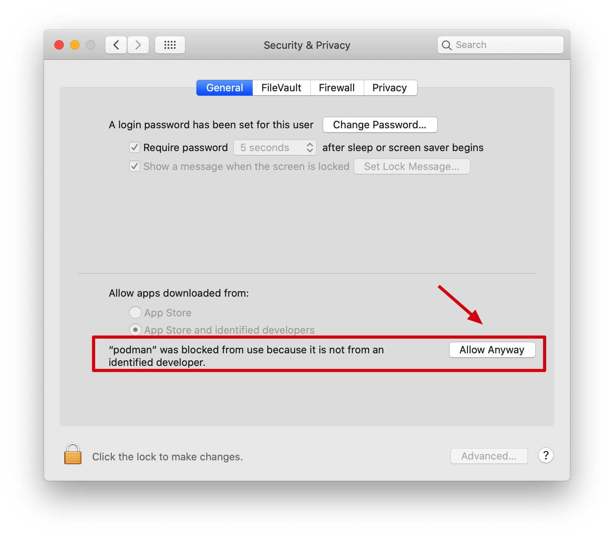

# Podman如何代替Docker [DRAFT]

随着近期Docker可能会由于国界问题被禁用，我们开始寻找靠谱的替代方案。目前最可靠、迁移成本最低的就是新起之秀 `Podman`。

## 安装

```sh
# MacOS (Catalina)
$ brew cask install podman
```

## 问题解决

### 问题1: “podman” cannot be opened because the developer cannot be verified.

Solution:
```
System Preferences > Security & Privacy > General -> Allow
```




### 问题2: Error: Get http://.../_ping: dial unix ///var/folders/.../podman/podman.sock: connect: no such file or directory

Solution: ?
