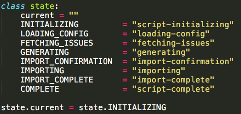
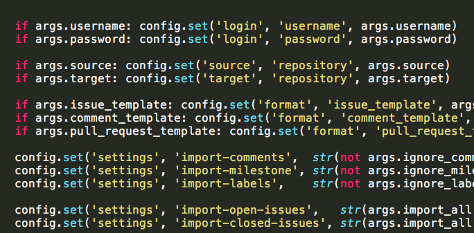
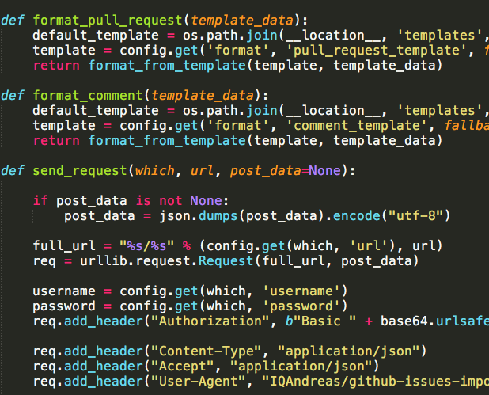

# Python代码之美
> 有时特别想摘抄一些别人漂亮的代码书写。在这里贴上吧。

### [`gh-issues-import.py`](https://github.com/IQAndreas/github-issues-import/blob/master/gh-issues-import.py)
代码整齐和常量名全大写

分隔有序，不用注释也可以清晰表面之间分别

简单函数和复杂函数的断行方式

