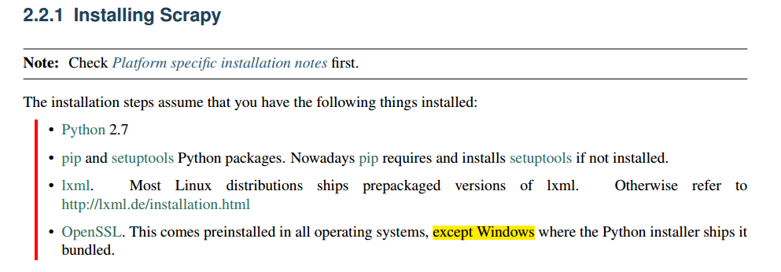
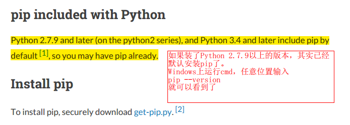
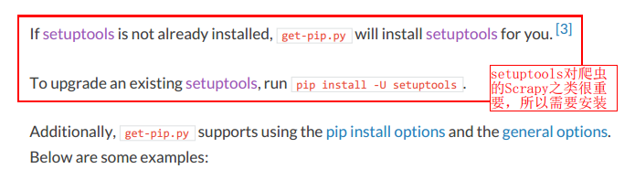
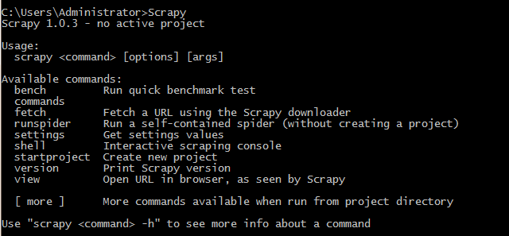

# Python Scrapy的准备工作

`原作于：Nov 27, 2015`

昨天稍微练习了下Python自带爬虫模块urllib2，感觉还行。
不过要是各种re正则表达式来匹配海量网页，效率也太低了。
所以今天试着安装了声誉不错的BeautifulSoup，感受了下便捷的节点搜索。
然后顺带着研究了下适合并行等复杂爬虫的大名鼎鼎的Scrapy。
好像安装之前需要先安装不少的东西。
官方文档里面是这样说的：

然后就开始安装Python必备的pip 了，在linux系统中这个都是自带的，想要Python什么模块的话，直接pip一句命令就安装好了，但是在windows里面还要各种去模块的官网上下载exe文件再安装。我也体会到了。
这次索性借这个把pip装上。
然后到了pip官网，阅读了下官方文档，发现其实巨简单——Python 2.7.9以上版本自带就安装了。
如下图：

也就是说，在windows的cmd命令行中输入pip，回车，就可以看到它已经安装好了。
不过，不知道为什么，突然360卫士就蹦出来一个木马病毒，杀掉后，pip就再也不能用了……
然后还是按照官网指示，安装get-pip.py来。然而还是一样。
但是换种方法，输入：python -m pip --version才可以运行。。。鬼才要在pip前输入这么长啊！
**然后又用easy_install来安装pip**，
cmd中输入
`easy_install pip`  
然后成功，可以随处运行pip了~~~
然后安装setuptools，用pip很简单：
`pip install setuptools`  
成功！
再回到Scrapy的documentation的安装列表：
`pip install lxml`  
`pip install pywin32`  
再按照[这篇教程](http://blog.csdn.net/pleasecallmewhy/article/details/19354723)安装了几个相应的模块：
`pip install twisted`  
`pip install pyOpenSSL`  
最后`pip install Scrapy`  
齐活！
然后在cmd中输入`Scrapy`回车，有反应的话，就完工了！

