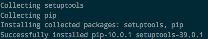

# 树莓派编译安装Python3.6

树莓派目前能用`sudo apt-get install`安装的默认最高是`Python3.4`，但是很多Python3.6+的新特性都无法使用，自己的项目也无法运行。所以需要把它升级。

目前无法简单安装，只能自己make编译。
**树莓派当前能稳定安装的是Python3.6.6，所以我们要编译安装这个版本。**

[参考：Install Python3 and GPIO to the Raspberry Pi](http://tinkerpi.com/tutorial/install-python3-and-gpio-to-the-raspberry-pi)
[参考：树莓派编译安装更新版本的Python](https://www.jianshu.com/p/a67442b9d233)

方法如下：
```sh
# 安装编译所需依赖包
sudo apt-get install build-essential tk-dev libncurses5-dev libncursesw5-dev libreadline6-dev libdb5.3-dev libgdbm-dev libsqlite3-dev libssl-dev libbz2-dev libexpat1-dev liblzma-dev zlib1g-dev

# 安装SSL依赖
sudo apt-get install libssl-dev


# 到官网下载Python3.6.6： https://www.python.org/downloads/source/
wget https://www.python.org/ftp/python/3.6.6/Python-3.6.6.tar.xz

# 解压
tar xf Python-3.6.6.tar.xz 

# 进入目录
cd Python-3.6.6

# 开始编译（时间漫长，需要等待，建议用&&把三句连在一起执行）
sudo  ./configure
sudo make
sudo make install

# 升级pip
sudo python3.6 -m pip install --upgrade pip
```

安装好Python3.6后，会显示：


如果安装不成功，则会显示错误。


为了方便输入命令（如python或python3），我们还要创建一个链接：
```sh
# 先查询本机刚装好的Python3.6的位置
$ which python3.6
/usr/local/bin/python3.6

# 把这个python3.6的链接放到/usr/bin中，可供直接输入命令
$ sudo ln -s /usr/local/bin/python3.6 /usr/bin/python

# 如果不能创建链接，遇到有重复，则查询`python`情况，然后互相变下名字解决
$ python -V
Python 2.7.9
$ sudo mv /usr/bin/python /usr/bin/python2
$ sudo ln -s /usr/local/bin/python3.6 /usr/bin/python
```


## 遇到问题 pip3报错/usr/bin/pip3: bad interpreter: /usr/bin/python3: no such file or directory
这个一般是原本的pip3和现在的python3.6不匹配的原因。
所以我们要找到现在和Python3.6配套的pip3.6，然后把它替换`/usr/bin/pip3`就可以了：

```sh
# 找到匹配的pip3
$ whereis pip3
pip3: /usr/bin/pip3 /usr/local/bin/pip3.6 /usr/local/bin/pip3 /usr/share/man/man1/pip3.1.gz

# 看到我们的pip3.6的位置，把它创建个链接
$ sudo ln -sf /usr/local/bin/pip3.6 /usr/bin/pip3

# OK了
```

## pip安装任何东西都显示subprocess.CalledProcessError: Command '('lsb_release', '-a')' returned non-zero exit status 1.

这个方法比较好用：
```sh
$ sudo rm /usr/bin/lsb_release
```
