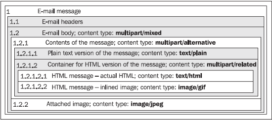
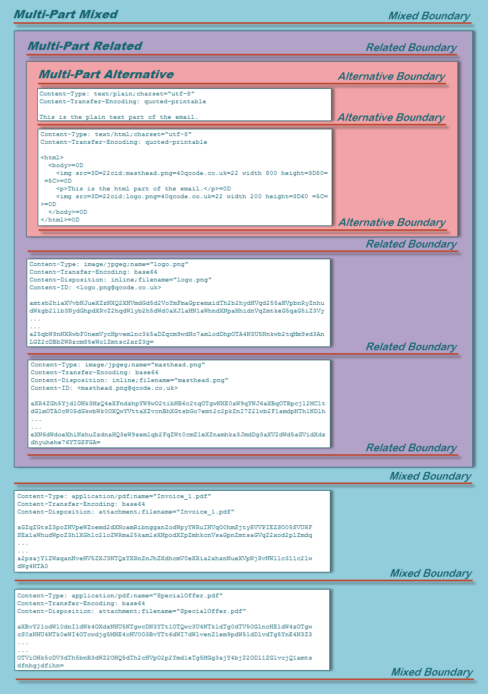

# ❖ Python解析邮件

> 邮件的解析是个大课题，远超一般人的预期。它远比发送邮件和接收邮件要复杂的多的多。
这就是为什么网上中文外文搜邮件的问题，绝大多数都是讲发送的而讲接收的很少。

发送邮件好说，接收和下载邮件也好说。关键是下载下来的邮件是一种比HTML还复杂的嵌套结构

## MIME邮件协议

[参考：阮一峰 - MIME笔记](http://www.ruanyifeng.com/blog/2008/06/mime.html)
[参考：MIME邮件的组织结构](https://blog.csdn.net/wl_xt/article/details/20048335)
[参考：Parsing email using Python part 2 of 2 : The content](http://blog.magiksys.net/parsing-email-using-python-content)
[参考：Mozilla - MIME types](https://developer.mozilla.org/en-US/docs/Web/HTTP/Basics_of_HTTP/MIME_types)

先不论Python，也不谈什么邮件发展历史，只论现在：
现在我们要达到通过编程来解析邮件，就绝对避不开这个问题：**`MIME邮件结构`**.

MIME是一整套的协议，就像HTTP协议、TCP协议之类的一样，都是解析邮件的一套规则。

所以我们想要解析一封邮件（把它拆成人能读懂的标题、收发件人、内容、附件等），就必须得理解这套协议。
**就算有现成的Python处理库也一样要懂了以后才能开始操作。**

了解MIME协议，其实主要就是了解`邮件的嵌套结构`。这个懂了就全懂了。

要知道，我们收到的一封邮件可能是以下这几种不同的结构类型：
- 简单的几句话，全是文字。 `(text/plain)`
- 非常漂亮的网页一样的页面。`(text/html)`
- 包括回复另一封邮件的层层嵌套的内容。`(multipart/mixed)`
- 带附件的内容，比如一张图片。`(multipart/mixed)` + `(image/jpeg)`

当然，这不是全部，只是有代表性的几种文档类型。最重要的是知道：
所有超出简单文字或网页HTML之外的，全都是`multiparts`。
最难理解的也是这个multiparts。

下面是最复杂的Multiparts邮件，包括了所有能包括的结构。其中每个**方块**都有自己的`Content Type`和`Body`。

简单点的结构图：




文字型结构图：
```
multipart/mixed
 |
 +-- multipart/related
 |    |
 |    +-- multipart/alternative
 |    |    |
 |    |    +-- text/plain
 |    |    +-- text/html
 |    |      
 |    +-- image/gif
 |
 +-- application/msword
```

详细一点的结构图：




这里是所有邮件能支持的`Content Type`文档类型：
- `text/plain`: 纯文本，文件扩展名.txt
- `text/html`: HTML文本，文件扩展名.htm和.html
- `image/jpeg`: jpeg格式的图片，文件扩展名.jpg
- `image/gif`: GIF格式的图片，文件扩展名.gif
- `audio/x-wave`: WAVE格式的音频，文件扩展名.wav
- `audio/mpeg`: MP3格式的音频，文件扩展名.mp3
- `video/mpeg`: MPEG格式的视频，文件扩展名.mpg
- `application/zip`: PK-ZIP格式的压缩文件，文件扩展名.zip


编程上需要明确的是：**要读取嵌套结构，必须用递归的方法。**


### Content-Disposition 附件的存在方式
对于附件，有两种存在方式：
- `inline`: 嵌入在文字里的，比如HTML格式邮件中显示的图片
- `attachment`: 是附在结尾的，单独的一部分

一般我们只需要处理attachment格式的附件，而inline的东西就让它保存在inline里吧。
邮件里面要获取这个部分的格式，需要找到这个参数：`Content-Disposition`。其它并拍的参数还要`Content-Type`和`Content-ID`等。

### Content-Transfer-Encoding 文本传输的编码方式
这个只针对`text/plain & text/html`类型的文本有用。
这个是每封邮件的必须数据，它必须要指出每段文本的`传输编码方式`，有的可以压缩传输(base64)，有的可以原文传输(8bit或7bit)，有的可以内置base64图片可直接打印(quoted-printable)。

正因为每封邮件都可能采用不同的传输编码策略，所以我们解析内容之前必须要判断是哪种方式才能正确解码为原文的内容。

目前常见的传输编码方式有：
- `8bit`或`7bit`：这个最简单，直接是原文，不需要转码。
- `base64`：内容**全文**用base64压缩，所以需要用`base64.b64decode()`库函数来解码。
- `quoted-printable`：另一种压缩方式，需要用`quopri.decodestring()`库函数来解码。

获取当前内容的传输编码方式的代码如下：
```py
encoding = part.get('Content-Transfer-Encoding')
```
其中`part`可以是库`email.message.Message`的实例或者其中multipart多部分中的sub-part，都可以。
