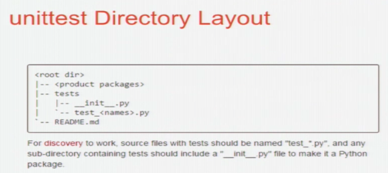
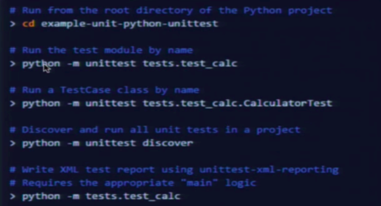

# ❖ Python Unit Test 单元测试 [DRAFT]

软件测试中分很多种，常见如下：
- 压力测试 Stress Test
- 系统测试 System Test
- 集成测试 Integration Test
- 单元测试 Unit Test

其中`Unit Test`单元测试是专门给软件开发时用的辅助减少bug的测试，也是我们最常用的。

单元测试中的`单元`一般都是极小极小的单元，小到不可再分割那种。比如测试一个计算平方的函数是否能够正确返回平方值。


## 项目结构




## 断言 Assertion

Python关键字`assert`用来判断一个表达式是否为`True`。如果True就没问题，如果False则立马抛出一个`AssertionException`的异常。

如：
```py
assert 1 == 1

assert 45 in [12, 34, 45]
```


## Test Case 编写测试用例

我们可以自己用`assert`关键字去手写全部测试逻辑，我们也可以直接用Python中内置的一个专门用来测试的类`TestCase`测试用例来完成大量的准备工作，我们只需要写测试函数即可。

`TestCase`中封装好了很多测试的流程和工具，而我们只需要自己定义一个类来继承它，然后简单写上每个测试函数即可自动完成所有工作。

`TestCase`中定义了一些hooks，即测试前和测试后分别执行的函数，它还定义了一些方便的assertion语句，如`assertIn`，`assertEqual`等。

一个标准的测试模块定义如下：
```py
import unittest

class MyTest(unittest.TestCase):
    
    # 重写父类方法：在测试开始前会执行此函数
    def setUp(self):
        pass

    # 重写父类的方法：在测试完成后会执行此函数
    def tearDown(self):
        pass

    # 具体的测试函数：规定以"test_"开头才会被执行
    def test_is_correct_number(self):
        # 具体的测试代码
        pass
```

注意：测试模块一般保存为`test_*.py`。

怎么执行测试呢？只要在命令行里直接执行即可：
```sh
$ python test_abc.py
```


## 编写测试函数


具体怎么写一个测试函数呢？

测试一个某个变量是否在某个列表中：
```py
import unittest

from someModule import myVariable, myList

class MyTest(unittest.TestCase):
    def test_is_variable_in_list(self):
        self.assertIn(myVariable, myList)
```
以上代码，如果`myVariable in myList`返回的true，则测试成功，否则失败，且assertion失败后的语句都不会被执行。


测试一个函数是否能正常返回正确的值：
```py
#...
def calculate_square(num):
    return num**2

class MyTest(unittest.TestCase):

    def test_calculate_square(self):
        result = calculate_square(4)
        self.assertEqual(result, 16)
```


## 运行测试




### 调用全部测试

在一个文件中编写多个测试用例class时后，有两种方式运行这个文件中的全部测试：
- 从命令行运行
- 在文件的`main()`中调用

命令行中调用方法为：
```sh
$ python -m unittest -q moduleName.className
```

文件中调用：
```py
if __name__ == '__main__':
    unittest.main( verbosity=2 )
```

### 调用某一个测试Class

假设我有一个测试用例：`class TestMyCase(unittest.TestCase)`。

如果只想调用当前文件里的一个测试class，那么就：
```py
if __name__ == '__main__':
    unittest.main( TestMyCase() )
```


## 数据库相关的单元测试

> 单元测试这东西，在加减乘除法上怎么都行，只是一旦涉及到数据库，一切都复杂了起来，光setUp就要费很大力气。

[参考：Reddit - Unit Testing a Function that writes/reads to database](https://www.reddit.com/r/learnpython/comments/4ivjo7/unit_testing_a_function_that_writesreads_to/)
[参考：How to Unit-Test Code That Interacts With a Database](https://www.xaprb.com/blog/2008/08/19/how-to-unit-test-code-that-interacts-with-a-database/)

参考文章中说的没错：`Don't mock anything!`

因为数据库分很多种，各种方案都会不太一样，也不会有`silver bullet`方案解决所有问题。所以下面我想分几种场景来讨论。

### Sqlite等轻量数据库测试


### MySQL测试


### Postgresql测试


### MongoDB测试


### Redis测试


## Mock 模拟
(略)
